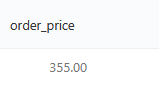
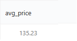
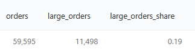
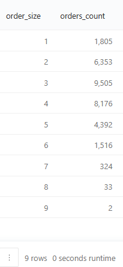
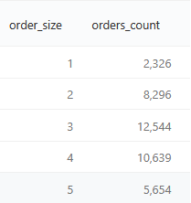

## Описание
В данном разделе будут применены базовые запросы SQL. Длинные результаты будут разделяться по 5 строк, если не указано иное (для экономии пространства).

#### 1. Сортировка данных, ORDER BY
Нам нужно определить 5 самых дорогих товаров в таблице `products`, которые доставляет наш сервис, и упорядочить их по убыванию цены.

Запрос:
``` 
SELECT name,
       price
FROM   products
ORDER BY price DESC LIMIT 5
```
Результат:


#### 2. Замена пустых значений, COALESCE
Нужно вывести id всех курьеров и их годы рождения, но не у всех курьеров указана дата рождения (в таблице это будет NULL). Вместо NULL значений нужно произвести замену на текстовое значение "unknown". Результат нужно отсортировать сначала по убыванию года рождения курьера, затем по возрастанию id курьера.

Запрос:
``` 
SELECT courier_id,
       COALESCE(CAST(DATE_PART('year', birth_date) AS VARCHAR), 'unknown') AS birth_year
FROM   couriers
ORDER BY birth_year DESC, courier_id
```

Результат:


#### 3. Пример арифметических функций в расчётных столбцах
Нужно рассчитать НДС (20%) каждого товара в таблице `products` и рассчитать цену без учёта НДС. Нужно вывести всю информацию о товарах, включая сумму налога и цену без его учёта. Колонки с суммой налога и ценой без НДС назвать соответственно `tax` и `price_before_tax`. Значения в этих колонках округлить до двух знаков после запятой. Результат нужно отсортиртировать сначала по убыванию цены товара без учёта НДС, затем по возрастанию id товара.

Запрос:
``` 
SELECT product_id,
       name,
       price,
       ROUND((price / 120) * 20, 2) AS tax,
       ROUND(price - ((price / 120) * 20), 2) AS price_before_tax
FROM   products
ORDER BY price_before_tax DESC, product_id
```

Результат:


#### 4. Фильтрация через WHERE
Нужно назначить скидку 20% на все товары из таблицы `products` и выбрать те товары, цена на которые с учётом скидки превышает 100 рублей. В результирующей таблице нужно вывести id товаров, их наименования, прежнюю цену и новую цену с учётом скидки. Колонку со старой ценой будет называться `old_price`, с новой — `new_price`.
Результат должен быть отсортирован по возрастанию id товара.

Запрос:
``` 
SELECT product_id,
       name,
       price AS old_price,
       price * 0.8 AS new_price
FROM   products
WHERE  price * 0.8 > 100
ORDER BY product_id
```

Результат:


#### 5. Дополнительная фильтрация через LIKE
Нужно составить запрос, который выбирает из таблицы `products` все чаи стоимостью больше 60 рублей и вычисляет для них цену со скидкой 25%.
Скидку в % нужно указать в отдельном столбце в формате текста, то есть вот так: «25%» (без кавычек). Столбцы со скидкой и новой ценой назовите соответственно `discount` и `new_price`.
Также необходимо любым известным способом избавиться от "чайного гриба".
Результат должен быть отсортирован по возрастанию id товара.

Запрос:
``` 
SELECT product_id,
       name,
       price,
       '25%' AS discount,
       price * 0.75 AS new_price
FROM   products
WHERE  name like '%чай%'
   and name != 'чайный гриб'
   and price > 60
ORDER BY product_id
```

Результат:


#### 6. Дополнительная фильтрация через IN и BETWEEN
Из таблицы `user_actions` нужно вывести всю информацию о действиях пользователей с id 170, 200 и 230 за период с 25 августа по 4 сентября 2022 года включительно. Результат нужно отсортировать по убыванию id заказа — то есть от самых поздних действий к самым первым.

Запрос:
``` 
SELECT user_id,
       order_id,
       action,
       time
FROM   user_actions
WHERE  user_id IN (170, 200, 230)
   AND time BETWEEN '2022-08-25'
   AND '2022-09-05'
ORDER BY order_id desc
```

Результат:


#### 7. Фильтрация по части даты
Из таблицы `user_actions` нужно получить id всех заказов, сделанных пользователями сервиса в августе 2022 года.
Результат нужно отсортировать по возрастанию id заказа.

Запрос:
``` 
SELECT order_id
FROM   user_actions
WHERE  action = 'create_order'
   AND date_part('month', time) = 8
   AND date_part('year', time) = 2022
ORDER BY order_id
```

Результат:


Задача посложнее: из таблицы `user_actions` получить информацию о всех отменах заказов, которые пользователи совершали в течение августа 2022 года по средам с 12:00 до 15:59.
Результат нужно отсортировать по убыванию id отменённых заказов.

Запрос:
``` 
SELECT user_id,
       order_id,
       action,
       time
FROM   user_actions
WHERE  action = 'cancel_order'
   AND date_part('year', time) = 2022
   AND date_part('month', time) = 8
   AND date_part('dow', time) = 3
   AND date_part('hour', time) >= 12
   AND date_part('hour', time) < 16
ORDER BY order_id DESC
```

Результат:


#### 8. Условная логика через CASE WHEN
Имеется список товаров, на которые распространяется НДС 10%:
```
'сахар', 'сухарики', 'сушки', 'семечки', 
'масло льняное', 'виноград', 'масло оливковое', 
'арбуз', 'батон', 'йогурт', 'сливки', 'гречка', 
'овсянка', 'макароны', 'баранина', 'апельсины', 
'бублики', 'хлеб', 'горох', 'сметана', 'рыба копченая', 
'мука', 'шпроты', 'сосиски', 'свинина', 'рис', 
'масло кунжутное', 'сгущенка', 'ананас', 'говядина', 
'соль', 'рыба вяленая', 'масло подсолнечное', 'яблоки', 
'груши', 'лепешка', 'молоко', 'курица', 'лаваш', 'вафли', 'мандарины'
```

Нужно вычислить НДС каждого товара в таблице `products` и рассчитать цену без учёта НДС. Однако теперь нужно учитывать, что для товаров из списка налог составляет 10%. Для остальных товаров НДС тот же — 20%.
Нужно вывести всю информацию о товарах, включая сумму налога и цену без его учёта. Колонки с суммой налога и ценой без НДС назвать соответственно `tax` и `price_before_tax`, с округлением значений до 2-х знаков после запятой.
Результат должен быть отсортирован по убыванию цены товара без учёта НДС, затем по возрастанию id товара.

Запрос:
``` 
SELECT product_id,
       name,
       price,
       CASE WHEN name IN ('сахар', 'сухарики', 'сушки', 'семечки', 'масло льняное', 'виноград', 'масло оливковое', 'арбуз', 'батон', 'йогурт', 'сливки', 'гречка', 'овсянка', 'макароны', 'баранина', 'апельсины', 'бублики', 'хлеб', 'горох', 'сметана', 'рыба копченая', 'мука', 'шпроты', 'сосиски', 'свинина', 'рис', 'масло кунжутное', 'сгущенка', 'ананас', 'говядина', 'соль', 'рыба вяленая', 'масло подсолнечное', 'яблоки', 'груши', 'лепешка', 'молоко', 'курица', 'лаваш', 'вафли', 'мандарины') 
       THEN ROUND((price / 110) * 10, 2)
       ELSE ROUND((price / 120) * 20, 2) 
       END AS tax,
       CASE WHEN name IN ('сахар', 'сухарики', 'сушки', 'семечки', 'масло льняное', 'виноград', 'масло оливковое', 'арбуз', 'батон', 'йогурт', 'сливки', 'гречка', 'овсянка', 'макароны', 'баранина', 'апельсины', 'бублики', 'хлеб', 'горох', 'сметана', 'рыба копченая', 'мука', 'шпроты', 'сосиски', 'свинина', 'рис', 'масло кунжутное', 'сгущенка', 'ананас', 'говядина', 'соль', 'рыба вяленая', 'масло подсолнечное', 'яблоки', 'груши', 'лепешка', 'молоко', 'курица', 'лаваш', 'вафли', 'мандарины') 
       THEN ROUND(price - (price / 110) * 10, 2)
       ELSE ROUND(price - (price / 120) * 20, 2) 
       END AS price_before_tax
FROM   products
ORDER BY price_before_tax DESC, product_id
```

Результат:


#### 9. Агрегация через SUM
Нужно посчитать стоимость заказа, в котором будут три пачки сухариков, две пачки чипсов и один энергетический напиток. Колонку с рассчитанной стоимостью заказа будет называться `order_price`.

Запрос:
``` 
SELECT SUM(CASE WHEN name = 'сухарики' then price * 3
                WHEN name = 'чипсы' then price * 2
                WHEN name = 'энергетический напиток' THEN price
                ELSE 0 END) AS order_price
FROM   products
```

Результат:



#### 10. Агрегация через AVG
Нужно рассчитать среднюю цену товаров в таблице `products`, в названиях которых присутствуют слова "чай" или "кофе". При этом надо исключить из расчёта товары, содержащие в названии "иван-чай" или "чайный гриб".
Среднюю цену нужно округлить до двух знаков после запятой. Получившийся столбец будет называться `avg_price`.

Запрос:
``` 
SELECT ROUND(AVG(price), 2) AS avg_price
FROM   products
WHERE  (name LIKE '%чай%'
    OR name LIKE '%кофе%')
   AND (name NOT LIKE '%иван-чай%'
   AND name NOT LIKE '%чайный гриб%')
```

Результат:



#### 11. Фильтрация через функцию FILTER
Нужно посчитать общее количество заказов в таблице `orders`, количество заказов с пятью и более товарами и найти долю заказов с пятью и более товарами в общем количестве заказов.
В результирующей таблице нужно отразить все три значения — поля будут называться соответственно `orders`, `large_orders`, `large_orders_share`.
Долю заказов с пятью и более товарами в общем количестве товаров нужно округлить до двух знаков после запятой.

Запрос:
``` 
SELECT COUNT(order_id) AS orders,
       COUNT(order_id) FILTER (WHERE array_length(product_ids, 1) >= 5) AS large_orders,
       ROUND(COUNT(order_id) FILTER (WHERE array_length(product_ids, 1) >= 5) :: DECIMAL / COUNT(orders),
             2) AS large_orders_share
FROM   orders
```

Результат:



#### 12. Группировка данных, GROUP BY
Нужно посчитать количество товаров в каждом заказе, применить к этим значениям группировку и рассчитать количество заказов в каждой группе за неделю с 29 августа по 4 сентября 2022 года включительно. Для расчётов подойдут данные из таблицы `orders`.
Результат нужно разделить на две колонки: размер заказа и число заказов такого размера за указанный период. Колонки назвать соответственно `order_size` и `orders_count`.
Результат нужно отсортировать по возрастанию размера заказа.

Запрос:
``` 
SELECT array_length(product_ids, 1) AS order_size,
       COUNT(order_id) AS orders_count
FROM   orders
WHERE  creation_time BETWEEN '2022-08-29'
   AND '2022-09-05'
GROUP BY order_size
ORDER BY order_size
```

Результат:



#### 13. Фильтрация после группировки через HAVING
Нужно посчитать количество товаров в каждом заказе, применить к этим значениям группировку и рассчитать количество заказов в каждой группе. Нужно учесть только заказы, оформленные по будням. В результат нужно включить только те размеры заказов, общее число которых превышает 2000. Для расчётов подойдут данные из таблицы `orders`.
В результат нужно включить две колонки: размер заказа и число заказов такого размера. Колонки назвать соответственно `order_size` и `orders_count`.
Результат нужно отсортировать по возрастанию размера заказа.

Запрос:
``` 
SELECT array_length(product_ids, 1) AS order_size,
       COUNT(order_id) AS orders_count
FROM   orders
WHERE  date_part('dow', creation_time) BETWEEN 1 AND 5
GROUP BY order_size HAVING COUNT(order_id) >= 2000
ORDER BY order_size
```

Результат:

