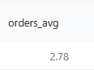
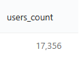
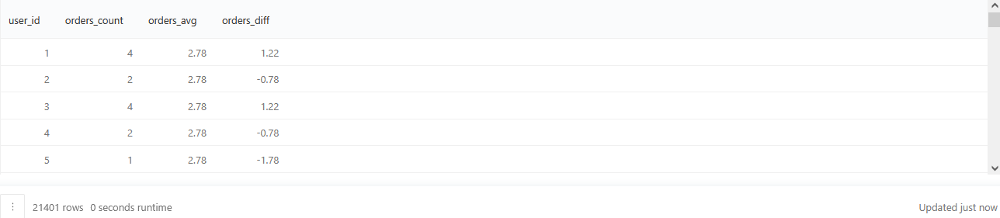
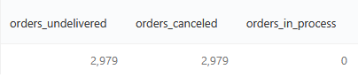
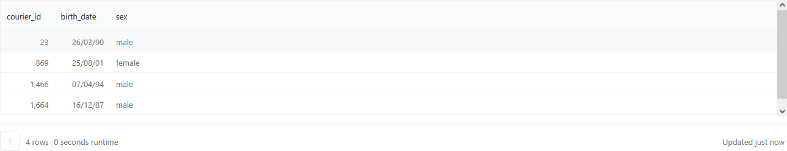
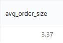
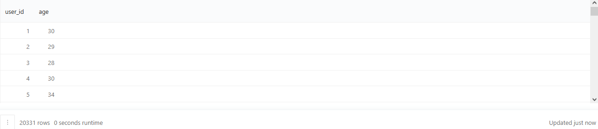
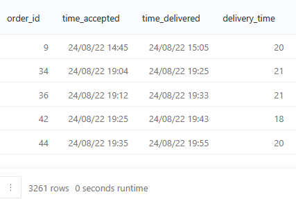
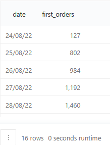
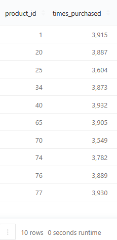

## Описание
В данном разделе будут показаны примеры с подзапросами (subqueries). Длинные результаты будут разделяться по 5 строк, если не указано иное (для экономии пространства).

#### 1. Среднее число заказов пользователей
Используя данные из таблицы `user_actions`, нужно рассчитать среднее число заказов всех пользователей сервиса.
Полученное среднее число заказов всех пользователей нужно округлить до двух знаков после запятой. Колонку с этим значением нужно назвать `orders_avg`.

Запрос:
``` 
SELECT ROUND(AVG(orders_count), 2) AS orders_avg
FROM   (SELECT user_id,
               COUNT(order_id) AS orders_count
        FROM   user_actions
        WHERE  action = 'create_order'
        GROUP BY user_id) AS t1
```
Результат:



#### 2. Включение подзапроса в WHERE
Нужно посчитать количество уникальных клиентов в таблице `user_actions`, сделавших за последнюю неделю хотя бы один заказ.
Полученную колонку с числом клиентов нужно назвать `users_count`. В качестве текущей даты, от которой откладывать неделю, нужно использовать последнюю дату в той же таблице `user_actions`.

Запрос:
``` 
SELECT COUNT(DISTINCT user_id) AS users_count
FROM   user_actions
WHERE  action = 'create_order'
   AND time >= (SELECT MAX(time)
             FROM   user_actions) - INTERVAL '1 week'
```
Результат:



#### 3. Табличное выражение
Используя данные из таблицы `user_actions`, нужно рассчитать, сколько заказов сделал каждый пользователь и отразить это в столбце `orders_count`.
В отдельном столбце `orders_avg` напротив каждого пользователя нужно указать среднее число заказов всех пользователей, округлив его до двух знаков после запятой.
Также для каждого пользователя нужно посчитать отклонение числа заказов от среднего значения (число заказов "минус" округлённое среднее значение) и назвать колонку `orders_diff`. 

Запрос:
``` 
WITH t1 AS (SELECT user_id,
                   COUNT(order_id) AS ord
            FROM   user_actions
            WHERE  action = 'create_order'
            GROUP BY user_id)
SELECT user_id,
       ord AS orders_count,
       (SELECT ROUND(AVG(ord), 2)
        FROM   t1) AS orders_avg, ord - (SELECT ROUND(AVG(ord), 2)
                                        FROM   t1) AS orders_diff
FROM   t1
GROUP BY user_id, orders_count
ORDER BY user_id
```

Результат:



#### 4. Подзапросы в условиях CASE WHEN
Нужно назначить скидку 15% на товары, цена которых превышает среднюю цену на все товары на 50 и более рублей, а также скидку 10% на товары, цена которых ниже средней на 50 и более рублей. Цену остальных товаров внутри диапазона (среднее - 50; среднее + 50) оставить без изменений. При расчёте средней цены, округлить её до двух знаков после запятой.
Также вывести информацию о всех товарах с указанием старой и новой цены. Колонку с новой ценой назвать `new_price`.
Результат должен быть отсортирован сначала по убыванию прежней цены в колонке `price`, затем по возрастанию id товара.

Запрос:
``` 
WITH avg_price AS (SELECT ROUND(AVG(price), 2) AS price
                   FROM   products)
SELECT product_id,
       name,
       price,
       CASE WHEN price >= (SELECT *
                           FROM avg_price) + 50 
            THEN price * 0.85 
            WHEN price <= (SELECT *
                           FROM avg_price) - 50 
            THEN price * 0.9 
            ELSE price 
            END AS new_price
FROM   products
ORDER BY price DESC, product_id
```

Результат:


#### 5. Подзапросы с применением FILTER
По таблицам `courier_actions` и `user_actions` нужно определить число недоставленных заказов и среди них посчитать количество отменённых заказов и количество заказов, которые не были отменены (и соответственно, пока ещё не были доставлены).
Колонку с недоставленными заказами нужно назвать `orders_undelivered`, колонку с отменёнными заказами назвать `orders_canceled`, колонку с заказами "в пути" назвать `orders_in_process`.

Запрос:
``` 
SELECT COUNT(distinct order_id) AS orders_undelivered,
       COUNT(order_id) FILTER (WHERE action = 'cancel_order') AS orders_canceled,
       COUNT(DISTINCT order_id) - COUNT(order_id) FILTER (WHERE action = 'cancel_order') AS orders_in_process
FROM   user_actions
WHERE  order_id IN (SELECT order_id
                    FROM   courier_actions
                    WHERE  order_id not in (SELECT order_id
                                            FROM   courier_actions
                                            WHERE  action = 'deliver_order'))
```

Результат:



#### 6. Подзапросы с применением DATE_PART
Из таблицы `couriers` нужно вывести всю информацию о курьерах, которые в сентябре 2022 года доставили 30 и более заказов. Результат должен быть отсортирован по возрастанию id курьера.

Запрос:
``` 
SELECT courier_id,
       birth_date,
       sex
FROM   couriers
WHERE  courier_id IN (SELECT courier_id
                      FROM   courier_actions
                      WHERE  DATE_PART('month', time) = 9
                         AND DATE_PART('year', time) = 2022
                         AND action = 'deliver_order'
                      GROUP BY courier_id having COUNT(DISTINCT order_id) >= 30)
ORDER BY courier_id
```

Результат:



#### 7. Расчёт среднего размера определённых заказов
Нужно рассчитать средний размер заказов, отменённых пользователями мужского пола.
Средний размер заказа нужно округлить до трёх знаков после запятой. Колонка будет называться `avg_order_size`.

Запрос:
``` 
SELECT ROUND(AVG(array_length(product_ids, 1)), 3) AS avg_order_size
FROM   orders
WHERE  order_id IN (SELECT order_id
                    FROM   user_actions
                    WHERE  action = 'cancel_order'
                       AND user_id IN (SELECT user_id
                                    FROM   users
                                    WHERE  sex = 'male'))
```

Результат:



#### 8. Расчёт возраста пользователей
Нужно посчитать возраст каждого пользователя в таблице `users`.
Возраст нужно измерить числом полных лет, относительно последней даты в таблице `user_actions`.
Для тех пользователей, у которых в таблице `users` не указана дата рождения, нужно указать среднее значение возраста всех остальных пользователей, округлённое до целого числа.
Колонка с возрастом будет называться `age`. В результат также нужно включить колонки с id пользователя и возрастом. Результат должен быть отсортирован по возрастанию id пользователя.

Запрос:
``` 
WITH users_age AS (SELECT user_id,
                          DATE_PART('year', AGE((SELECT MAX(time)
                                                 FROM   user_actions), birth_date)) AS age
                   FROM   users)
SELECT user_id,
       COALESCE(age, (SELECT ROUND(AVG(age))
               FROM   users_age)) :: integer AS age
FROM   users_age
ORDER BY user_id
```

Результат:



#### 9. Расчёт времени доставки
Для каждого заказа, в котором больше 5 товаров, нужно рассчитать время, затраченное на его доставку. 
В результат нужно включить id заказа, время принятия заказа курьером, время доставки заказа и время, затраченное на доставку. Новые колонки назвать соответственно `time_accepted`, `time_delivered` и `delivery_time`.
В расчётах нужно включить только неотменённые заказы. Время, затраченное на доставку, нужно выразить в минутах, округлив значения до целого числа. Результат нужно отсортировать по возрастанию id заказа.

Запрос:
``` 
SELECT order_id,
       MIN(time) AS time_accepted,
       MAX(time) AS time_delivered,
       (EXTRACT(EPOCH
FROM   MAX(time) - MIN(time)) / 60) :: integer AS delivery_time
FROM   courier_actions
WHERE  order_id IN (SELECT order_id
                    FROM   orders
                    WHERE  array_length(product_ids, 1) > 5)
   AND order_id NOT IN (SELECT order_id
                     FROM   user_actions
                     WHERE  action = 'cancel_order')
GROUP BY order_id
ORDER BY order_id
```

Результат:



#### 10. Расчёт первых заказов пользователей по датам
Для каждой даты в таблице `user_actions` нужно посчитать количество первых заказов, совершённых пользователями.
Первыми заказами будут считаться заказы, которые пользователи сделали в нашем сервисе впервые и не отменили.
В результат нужно включить две колонки: дату и количество первых заказов в эту дату. Колонку с датами назвать `date`, а колонку с первыми заказами — `first_orders`. Результат отсортировать по возрастанию даты.

Запрос:
``` 
SELECT first_order_date AS date,
       COUNT(user_id) AS first_orders
FROM   (SELECT user_id,
               MIN(time) :: date AS first_order_date
        FROM   user_actions
        WHERE  order_id NOT IN (SELECT order_id
                                FROM   user_actions
                                WHERE  action = 'cancel_order')
        GROUP BY user_id) t
GROUP BY first_order_date
ORDER BY date
```

Результат:



#### 10. Поиск популярных товаров
Нужно определить id 10 самых популярных товаров в таблице `orders`.
Самыми популярными товарами будем считать те, которые встречались в заказах чаще всего. Если товар встречается в одном заказе несколько раз (когда было куплено несколько единиц товара), это тоже учитывается при подсчёте. Учитывать нужно только неотменённые заказы.
В результат нужно вывести id товаров и то, сколько раз они встречались в заказах (то есть сколько раз были куплены). Новую колонку с количеством покупок товаров нужно назвать `times_purchased`. Результат нужно отсортировать по возрастанию id товара.

Запрос:
``` 
SELECT product_id,
       times_purchased
FROM   (SELECT UNNEST(product_ids) AS product_id,
               COUNT(*) AS times_purchased
        FROM   orders
        WHERE  order_id NOT IN (SELECT order_id
                                FROM   user_actions
                                WHERE  action = 'cancel_order')
        GROUP BY product_id
        ORDER BY times_purchased DESC LIMIT 10) t
ORDER BY product_id
```

Результат:

