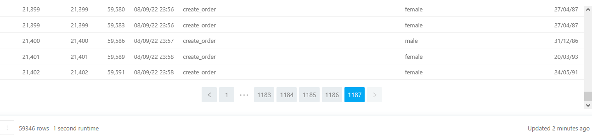
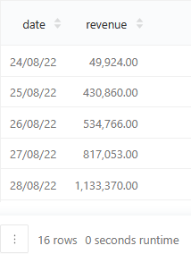

## Описание
В данном разделе будут показаны примеры с применением соединений таблиц (джойнов). Длинные результаты будут разделяться по 5 строк, если не указано иное (для экономии пространства).

#### 1. Внутреннее соединение, INNER JOIN
Нужно объединить таблицы `user_actions` и `users` по ключу `user_id`. В результат нужно включить две колонки с `user_id` из обеих таблиц. Эти две колонки назвать соответственно `user_id_left` и `user_id_right`. Также в результат включить колонки `order_id`, `time`, `action`, `sex`, `birth_date`. Получившуюся таблицу нужно отсортировать по возрастанию id пользователя (в любой из двух колонок с id).

Запрос:
``` 
SELECT user_actions.user_id AS user_id_left,
       users.user_id AS user_id_right,
       order_id,
       time,
       action,
       sex,
       birth_date
FROM   user_actions INNER JOIN users
        ON user_actions.user_id = users.user_id
ORDER BY user_actions.user_id
```

Результат:




#### 2. Левое внешнее соединение, LEFT JOIN
Нужно объединить таблицы `user_actions` и `users` с помощью LEFT JOIN по ключу `user_id`, добавить к запросу оператор `WHERE` и исключить `NULL` значения в колонке `user_id` из правой таблицы. Получившуюся таблицу отсортировать по возрастанию id пользователя в колонке из левой таблицы.

Запрос:
``` 
SELECT a.user_id as user_id_left,
       b.user_id as user_id_right,
       order_id,
       time,
       action,
       sex,
       birth_date
FROM   user_actions a
    LEFT JOIN users b USING (user_id)
WHERE  b.user_id IS NOT NULL
ORDER BY user_id_left
```

Результат:


#### 3. Полное внешнее соединение, FULL JOIN
Нужно объединить два следующих подзапроса с помощью FULL JOIN:

``` 
SELECT birth_date, COUNT(user_id) AS users_count
FROM users
WHERE birth_date IS NOT NULL
GROUP BY birth_date

SELECT birth_date, COUNT(courier_id) AS couriers_count
FROM couriers
WHERE birth_date IS NOT NULL
GROUP BY birth_date
```

В результат нужно включить две колонки с `birth_date` из обеих таблиц. Эти две колонки назвать соответственно `users_birth_date` и `couriers_birth_date`. Также нужно включить в результат колонки с числом пользователей и курьеров — `users_count` и `couriers_count`.
Получившуюся таблицу нужно отсортировать сначала по колонке `users_birth_date` по возрастанию, затем по колонке `couriers_birth_date` — тоже по возрастанию.

Запрос:
``` 
SELECT t1.birth_date AS users_birth_date,
       users_count,
       t2.birth_date AS couriers_birth_date,
       couriers_count
FROM   (SELECT birth_date,
               COUNT(user_id) AS users_count
        FROM   users
        WHERE  birth_date IS NOT NULL
        GROUP BY birth_date) t1 FULL JOIN (SELECT birth_date,
                                          COUNT(courier_id) AS couriers_count
                                   FROM   couriers
                                   WHERE  birth_date IS NOT NULL
                                   GROUP BY birth_date) t2
        ON t1.birth_date = t2.birth_date
ORDER BY users_birth_date, couriers_birth_date
```

Результат:


#### 4. Объединение множества, UNION
Нужно объединить два следующих запроса друг с другом так, чтобы на выходе получился набор уникальных дат из таблиц `users` и `couriers`:
``` 
SELECT birth_date
FROM users
WHERE birth_date IS NOT NULL

SELECT birth_date
FROM couriers
WHERE birth_date IS NOT NULL
```

Далее нужно поместить в подзапрос полученный после объединения набор дат и посчитать их количество. Колонку с числом дат нужно назвать `dates_count`.

Запрос:
``` 
SELECT COUNT(birth_date) AS dates_count
FROM   (SELECT birth_date
        FROM   users
        WHERE  birth_date IS NOT NULL
        UNION
        SELECT birth_date
        FROM   couriers
        WHERE  birth_date IS NOT NULL) t
```

Результат:


#### 5. Произведение двух таблиц, CROSS JOIN
Из таблицы `users` нужно отобрать id первых 100 пользователей и с помощью CROSS JOIN объедините их со всеми наименованиями товаров из таблицы `products`. Нужно вывести две колонки — id пользователя и наименование товара. Результат должен быть отсортирован сначала по возрастанию id пользователя, затем по имени товара — тоже по возрастанию.

Запрос:
``` 
SELECT user_id,
       name
FROM   (SELECT user_id
        FROM   users LIMIT 100) t1 
        CROSS JOIN (SELECT name
                    FROM   products) t2
ORDER BY user_id, name
```

Результат:


#### 6. Правое внешнее соединение, RIGHT JOIN
Нужно объединить таблицы user_actions и orders, оставив только уникальные неотменённые заказы. Нужно вывести id пользователей и заказов, а также список товаров в заказе. 
Результат отсортировать по id пользователя по возрастанию, затем по id заказа — тоже по возрастанию, а также установить лимит в 1000 записей.

Запрос:
``` 
SELECT t1.user_id,
       t2.order_id,
       t2.product_ids
FROM   (SELECT user_id,
               order_id
        FROM   user_actions
        WHERE  order_id NOT IN (SELECT order_id
                                FROM   user_actions
                                WHERE  action = 'cancel_order')) t1
        RIGHT JOIN (SELECT DISTINCT order_id,
                                    product_ids
                    FROM   orders) t2
        ON t1.order_id = t2.order_id
ORDER BY t1.user_id, t2.order_id LIMIT 1000
```

Результат:


#### 7. Соединение таблицы с самой собой, SELF JOIN
Нужно выяснить, какие пары товаров покупают вместе чаще всего.
Пары товаров нужно сформировать на основе таблицы с заказами, не учитывая отменённые заказы. В качестве результата вывести две колонки — колонку с парами наименований товаров и колонку со значениями, показывающими, сколько раз конкретная пара встретилась в заказах пользователей. Колонки назвать соответственно `pair` и `count_pair`.
Пары товаров должны быть представлены в виде списков из двух наименований. Пары товаров внутри списков должны быть отсортированы в порядке возрастания наименования. Результат нужно отсортировать сначала по убыванию частоты встречаемости пары товаров в заказах, затем по колонке `pair` — по возрастанию.

Запрос:
``` 
WITH main_table AS (SELECT DISTINCT order_id,
                                    product_id,
                                    name
                    FROM   (SELECT order_id,
                                   UNNEST(product_ids) AS product_id
                            FROM   orders
                            WHERE  order_id NOT IN (SELECT order_id
                                                    FROM   user_actions
                                                    WHERE  action = 'cancel_order')) t
                        LEFT JOIN products USING(product_id)
                    ORDER BY order_id, name)
SELECT pair,
       COUNT(order_id) AS count_pair
FROM   (SELECT DISTINCT a.order_id,
                        CASE WHEN a.name > b.name THEN string_to_array(concat(b.name, '+', a.name), '+')
                             ELSE string_to_array(concat(a.name, '+', b.name), '+') 
                             END AS pair
        FROM   main_table a JOIN main_table b
                ON a.order_id = b.order_id and
                   a.name != b.name) t
GROUP BY pair
ORDER BY count_pair desc, pair
```

Результат:


#### 8. Расчёт среднего количества товаров в заказе
Нужно рассчитать, сколько в среднем товаров заказывает каждый пользователь. В результат нужно вывести id пользователя и среднее количество товаров в заказе. Среднее значение нужно округлить до двух знаков после запятой. Колонку с посчитанными значениями назвать `avg_order_size`. Результат выполнения запроса нужно отсортировать по возрастанию id пользователя и ограничить до 1000 записей.

Запрос:
``` 
SELECT user_id,
       ROUND(AVG(array_length(product_ids, 1)), 2) AS avg_order_size
FROM   (SELECT user_id,
               order_id
        FROM   user_actions
        WHERE  order_id NOT IN (SELECT order_id
                                FROM   user_actions
                                WHERE  action = 'cancel_order')) t
        LEFT JOIN orders using(order_id)
GROUP BY user_id
ORDER BY user_id LIMIT 1000
```

Результат:


#### 9. Расчёт нескольких пользовательских метрик
На основе объединённой таблицы для каждого пользователя нужно рассчитать следующие показатели:
- общее число заказов — колонку нужно назвать `orders_count`
- среднее количество товаров в заказе — `avg_order_size`
- суммарную стоимость всех покупок — `sum_order_value`
- среднюю стоимость заказа — `avg_order_value`
- минимальную стоимость заказа — `min_order_value`
- максимальную стоимость заказа — `max_order_value`

Полученный результат нужно отсортировать по возрастанию id пользователя. В расчётах должны учитываться только неотменённые заказы. При расчёте средних значений, нужно производить округление до двух знаков после запятой. Нужно ограничить результат до 1000 записей.

Запрос:
``` 
SELECT user_id,
       COUNT(order_price) AS orders_count,
       ROUND(AVG(order_size), 2) AS avg_order_size,
       SUM(order_price) AS sum_order_value,
       ROUND(AVG(order_price), 2) AS avg_order_value,
       MIN(order_price) AS min_order_value,
       MAX(order_price) AS max_order_value
FROM   (SELECT user_id,
               order_id,
               array_length(product_ids, 1) AS order_size
        FROM   (SELECT user_id,
                       order_id
                FROM   user_actions
                WHERE  order_id NOT IN (SELECT order_id
                                        FROM   user_actions
                                        WHERE  action = 'cancel_order')) t1
            LEFT JOIN orders USING(order_id)) t2
    LEFT JOIN (SELECT order_id,
                      sum(price) as order_price
               FROM   (SELECT order_id,
                              product_ids,
                              UNNEST(product_ids) as product_id
                       FROM   orders
                       WHERE  order_id NOT IN (SELECT order_id
                                               FROM   user_actions
                                               WHERE  action = 'cancel_order')) t3
                   LEFT JOIN products USING(product_id)
               GROUP BY order_id) t4 USING (order_id)
GROUP BY user_id
ORDER BY user_id LIMIT 1000
```

Результат:


#### 10. Расчёт ежедневной выручки
По данным таблиц `orders`, `products` и `user_actions` нужно рассчитать ежедневную выручку сервиса. Под выручкой будем понимать стоимость всех реализованных товаров, содержащихся в заказах.
Колонку с датой нужно назвать `date`, а колонку со значением выручки — `revenue`. В расчётах нужно учитывать только неотменённые заказы. Результат отсортировать по возрастанию даты.

Запрос:
``` 
SELECT date,
       SUM(price) :: decimal AS revenue
FROM   (SELECT order_id,
               creation_time :: date AS date,
               UNNEST(product_ids) AS product_id
        FROM   orders
        WHERE  order_id NOT IN (SELECT order_id
                                FROM   user_actions
                                WHERE  action = 'cancel_order')) t1
    LEFT JOIN products USING(product_id)
GROUP BY date
ORDER BY date
```

Результат:



#### 11. Расчёт доли отменённых заказов в разрезе пола
Нужно посчитать среднее значение `cancel_rate` для каждого пола, округлив его до трёх знаков после запятой. Колонку с посчитанным средним значением нужно назвать `avg_cancel_rate`.
Нужно помнить про отсутствие информации о поле некоторых пользователей после `JOIN`, так как не все пользователи из таблицы `user_action` есть в таблице `users`. Для этой группы тоже нужно посчитать `cancel_rate` и в результирующей таблице для пустого значения в колонке с полом указать `unknown`. Результат нужно отсортировать по колонке с полом пользователя по возрастанию.

Запрос:
``` 
SELECT COALESCE(sex, 'unknown') AS sex,
       ROUND(AVG(cancel_rate), 3) AS avg_cancel_rate
FROM   (SELECT user_id,
               ROUND(COUNT(DISTINCT order_id) FILTER (WHERE action = 'cancel_order') :: decimal / 
               COUNT(DISTINCT order_id), 2) AS cancel_rate
        FROM   user_actions
        GROUP BY user_id
        ORDER BY user_id) t1
    LEFT JOIN users USING(user_id)
GROUP BY sex
ORDER BY sex
```

Результат:


#### 12. Замена списка id на список имён
Нужно произвести замену списков с id товаров из таблицы `orders` на списки с наименованиями товаров. Наименования нужно взять из таблицы `products`. Колонку с новыми списками наименований назвать `product_names`, результат ограничить до 1000 записей. 

Запрос:
``` 
SELECT order_id,
       ARRAY_AGG(name) AS product_names
FROM   (SELECT order_id,
               UNNEST(product_ids) AS product_id
        FROM   orders) t1
    LEFT JOIN products USING(product_id)
GROUP BY order_id LIMIT 1000
```

Результат:


#### 13. Поиск самых больших заказов
Нужно выяснить, кто заказывал и доставлял самые большие заказы. Самыми большими считайте заказы с наибольшим числом товаров.
В результате должны быть id заказа, id пользователя и id курьера. Также в отдельных колонках нужно указать возраст пользователя и возраст курьера. Возраст измерить числом полных лет и считать его относительно последней даты в таблице `user_actions` — как для пользователей, так и для курьеров. Колонки с возрастом назвать `user_age` и `courier_age`. Результат должен быть отсортирован по возрастанию id заказа.

Запрос:
``` 
WITH order_id_large_size AS (SELECT order_id
                             FROM   orders
                             WHERE  array_length(product_ids, 1) = 
                                (SELECT MAX(array_length(product_ids, 1))
                                 FROM   orders))
SELECT DISTINCT order_id,
                user_id,
                DATE_PART('year', AGE(
                            (SELECT MAX(time)
                             FROM   user_actions), users.birth_date)) :: integer AS user_age, 
                courier_id, 
                DATE_PART('year', AGE(
                            (SELECT MAX(time)
                             FROM   user_actions), couriers.birth_date)) :: integer AS courier_age
FROM   (SELECT order_id,
               user_id
        FROM   user_actions
        WHERE  order_id in (SELECT *
                            FROM   order_id_large_size)) t1
    LEFT JOIN (SELECT order_id,
                      courier_id
               FROM   courier_actions
               WHERE  order_id in (SELECT *
                                   FROM   order_id_large_size)) t2 USING(order_id)
    LEFT JOIN users USING(user_id)
    LEFT JOIN couriers USING(courier_id)
ORDER BY order_id
```

Результат:

