## Описание
В данном разделе будут показаны примеры с применением оконных функций. Длинные результаты будут разделяться по 5 строк, если не указано иное (для экономии пространства).

#### 1. Ранжирование - RANK, DENSE_RANK, ROW_NUMBER
Нужно применить оконные функции к таблице `products` и с помощью ранжирующих функций упорядочить все товары по цене — от самых дорогих к самым дешёвым. В результате в таблице должны быть следующие колонки:
- Колонка `product_number` с порядковым номером товара (функция `ROW_NUMBER`).
- Колонка `product_rank` с рангом товара с пропусками рангов (функция `RANK`).
- Колонка `product_dense_rank` с рангом товара без пропусков рангов (функция `DENSE_RANK`).

Запрос:
``` 
SELECT product_id,
       name,
       price,
       ROW_NUMBER() OVER(ORDER BY price DESC) AS product_number,
       RANK() OVER(ORDER BY price DESC) AS product_rank,
       DENSE_RANK() OVER(ORDER BY price DESC) AS product_dense_rank
FROM   products
```

Результат:

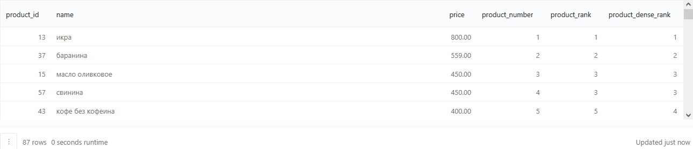

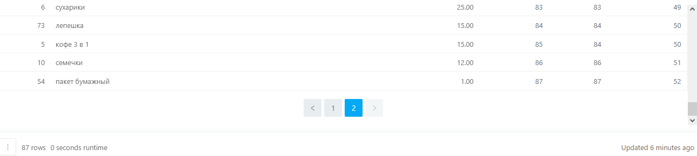

#### 2. Агрегация
Применив оконную функцию к таблице `products` и с помощью агрегирующей функции в отдельной колонке для каждой записи нужно указать цену самого дорогого товара. Колонку с этим значением нужно назвать `max_price`.
Затем для каждого товара нужно посчитать долю его цены в стоимости самого дорогого товара — поделив одну колонку на другую. Полученные доли нужно округлить до двух знаков после запятой. Колонку с долями назвать `share_of_max`.
В результат включить всю информацию о товарах, включая значения в новых колонках. Результат должен быть отсортирован сначала по убыванию цены товара, затем по возрастанию id товара.

Запрос:
``` 
SELECT product_id,
       name,
       price,
       MAX(price) OVER(ORDER BY price DESC) AS max_price,
       ROUND(price / MAX(price) OVER(ORDER BY price DESC), 2) AS share_of_max
FROM   products
ORDER BY price DESC, product_id
```

Результат:

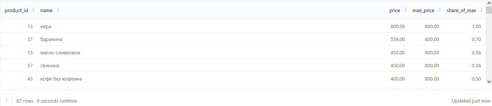

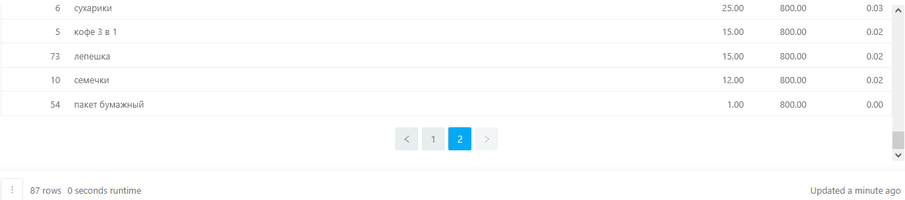

#### 3. Накопительная сумма числа заказов
На основе таблицы `orders` нужно сформировать запрос, который вернёт таблицу с общим числом заказов по дням. При подсчёте числа заказов не учитываются отменённые заказы (их можно определить по таблице `user_actions`). Колонка с днями будет называться `date`, а колонка с числом заказов — `orders_count`.
Затем нужно поместить полученную таблицу в подзапрос и применить к ней оконную функцию в паре с агрегирующей функцией `SUM` для расчёта накопительной суммы числа заказов. Колонку с накопительной суммой назвать `orders_count_cumulative`. В результате такой операции значение накопительной суммы для последнего дня должно получиться равным общему числу заказов за весь период. Сортировку результирующей таблицы делать не нужно.

Запрос:
``` 
SELECT date,
       orders_count,
       SUM(orders_count) OVER (ORDER BY date) :: integer AS orders_count_cumulative
FROM   (SELECT DATE(creation_time) AS date,
               COUNT(order_id) AS orders_count
        FROM   orders
        WHERE  order_id NOT IN (SELECT order_id
                                FROM   user_actions
                                WHERE  action = 'cancel_order')
        GROUP BY date) t
```

Результат:

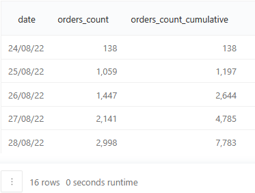

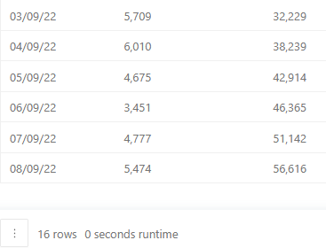

#### 4. Партиции - PARTITION BY
Для каждого пользователя в таблице `user_actions` нужно посчитать порядковый номер каждого заказа.
Для этого нужно применить оконную функцию `ROW_NUMBER` к id пользователей для деления на партиции, а время заказа для сортировки внутри патриции (не учитывая отменённые заказы)
Новую колонку с порядковым номером заказа нужно назвать `order_number`. Результат должен быть отсортирован сначала по возрастанию id пользователя, затем по возрастанию порядкового номера заказа, с ограничением до 1000 записей.

Запрос:
``` 
SELECT user_id,
       order_id,
       time,
       ROW_NUMBER() OVER (PARTITION BY user_id
                          ORDER BY time) AS order_number
FROM   user_actions
WHERE  order_id NOT IN (SELECT order_id
                        FROM   user_actions
                        WHERE  action = 'cancel_order')
ORDER BY user_id, order_number LIMIT 1000
```

Результат:

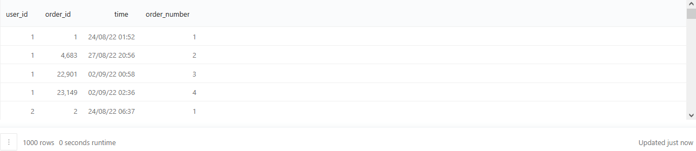

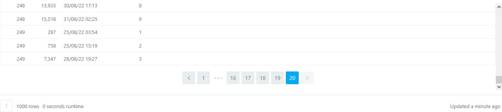

#### 5. Функции смещения - LAG и LEAD
Нужно дополнить запрос из предыдущей задачи и с помощью оконной функции для каждого заказа каждого пользователя посчитать, сколько времени прошло с момента предыдущего заказа.
Для этого сначала в отдельном столбце с помощью `LAG` нужно сделать смещение по столбцу `time` на одно значение назад. Столбец со смещёнными значениями будет называться `time_lag`. Затем нужно отнять от каждого значения в колонке `time` новое значение со смещением (либо использовать функцию `AGE`). Колонка с полученным интервалом будет называться `time_diff`. 
Отменённые заказы не учитывать. Также нужно оставить в запросе порядковый номер каждого заказа, рассчитанный в прошлой задаче. Результат должен быть отсортирован сначала по возрастанию id пользователя, затем по возрастанию порядкового номера заказа, а также ограничен 1000-ю записями.

Запрос:
``` 
SELECT user_id,
       order_id,
       time,
       ROW_NUMBER() OVER (PARTITION BY user_id
                          ORDER BY time) AS order_number,
       LAG(time, 1) OVER (PARTITION BY user_id
                          ORDER BY time) AS time_lag,
       time - LAG(time, 1) OVER (PARTITION BY user_id
                                 ORDER BY time) AS time_diff
FROM   user_actions
WHERE  order_id NOT IN (SELECT order_id
                        FROM   user_actions
                        WHERE  action = 'cancel_order')
ORDER BY user_id, order_number LIMIT 1000
```

Результат:

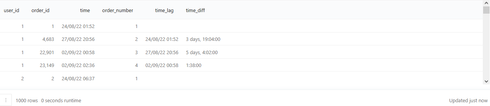

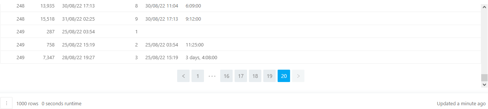

#### 6. Скользящее среднее через ROWS BETWEEN
На основе таблицы `orders` нужно сформировать новую таблицу с общим числом заказов по дням, не учитывая отменённые заказы. Колонку с числом заказов нужно назвать `orders_count`.
Затем нужно поместить полученную таблицу в подзапрос и применить к ней оконную функцию в паре с агрегирующей функцией `AVG` для расчёта скользящего среднего числа заказов. Скользящее среднее для каждой записи нужно считать по трём предыдущим дням. Полученные значения скользящего среднего нужно округлить до двух знаков после запятой. Колонку с рассчитанным показателем назвать `moving_avg`. Сортировку результирующей таблицы делать не нужно.

Запрос:
``` 
SELECT date,
       orders_count,
       ROUND(AVG(orders_count) OVER (
        ORDER BY date ROWS BETWEEN 3 PRECEDING AND 1 PRECEDING), 2) AS moving_avg
FROM   (SELECT date(creation_time) AS date,
               COUNT(order_id) AS orders_count
        FROM   orders
        WHERE  order_id NOT IN (SELECT order_id
                                FROM   user_actions
                                WHERE  action = 'cancel_order')
        GROUP BY date) t
```

Результат:

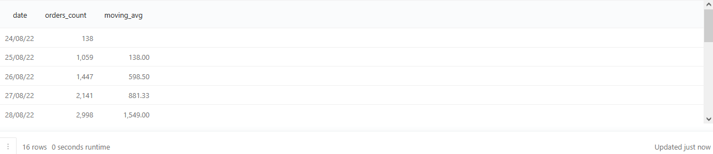

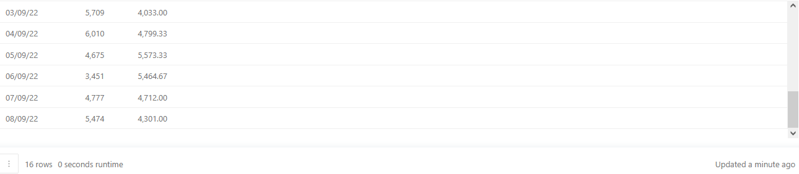

#### 7. Расчёт первых и повторных заказов по датам
По данным таблицы `user_actions` нужно посчитать число первых и повторных заказов на каждую дату.
Для этого сначала с помощью оконных функций и оператора `CASE` сформировать таблицу, в которой напротив каждого заказа будет стоять отметка "Первый" или "Повторный". Для каждого пользователя первым заказом будет тот, который был сделан раньше всего. Все остальные заказы должны попасть, соответственно, в категорию "Повторный". Затем на каждую дату нужно посчитать число заказов каждой категории.
Колонка с типом заказа будет называться `order_type`, колонка с датой — `date`, колонка с числом заказов — `orders_count`. В расчётах должны быть учтены только неотменённые заказы, а результат отсортирован сначала по возрастанию даты, затем по возрастанию значений в колонке с типом заказа.

Запрос:
``` 
SELECT date :: date,
       order_type,
       COUNT(order_type) AS orders_count
FROM   (SELECT time :: date AS date,
               CASE WHEN MIN(time) OVER (PARTITION BY user_id
                                         ORDER BY time) = MIN(time) THEN 'Первый'
                    ELSE 'Повторный' END AS order_type
        FROM   user_actions
        WHERE  order_id NOT IN (SELECT order_id
                                FROM   user_actions
                                WHERE  action = 'cancel_order')
        GROUP BY time, user_id) AS t
GROUP BY date, order_type
ORDER BY date, order_type
```

Результат:

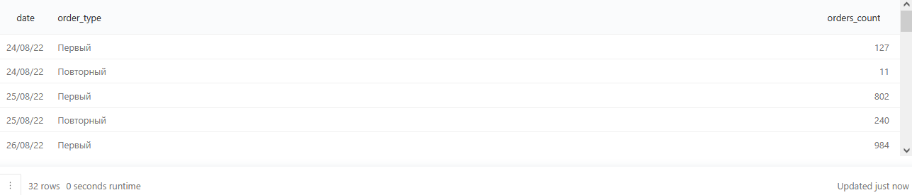

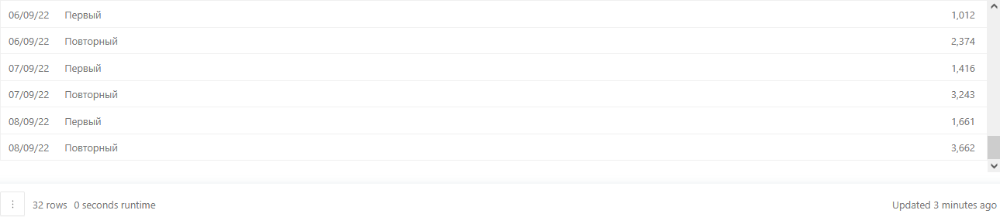

#### 8. Фильтрация в оконной функции c помощью FILTER
Нужно применить оконную функцию к таблице `products` и с помощью агрегирующей функции в отдельной колонке для каждой записи проставить среднюю цену всех товаров (назвать `avg_price`).
Затем с помощью оконной функции и оператора `FILTER` в отдельной колонке рассчитать среднюю цену товаров без учёта самого дорогого. Колонку с этим средним значением назвать `avg_price_filtered`. Полученные средние значения в колонках `avg_price` и `avg_price_filtered` округлить до двух знаков после запятой.
В результат нужно включить всю информацию о товарах, включая значения в новых колонках. Также нужно отсортировать результат сначала по убыванию цены товара, затем по возрастанию id товара.

Запрос:
``` 
SELECT product_id,
       name,
       price,
       ROUND(AVG(price) OVER (), 2) AS avg_price,
       ROUND(AVG(price) FILTER (WHERE price != 
                                (SELECT max(price)
                                 FROM   products))
OVER (), 2) AS avg_price_filtered
FROM   products
ORDER BY price DESC, product_id
```

Результат:

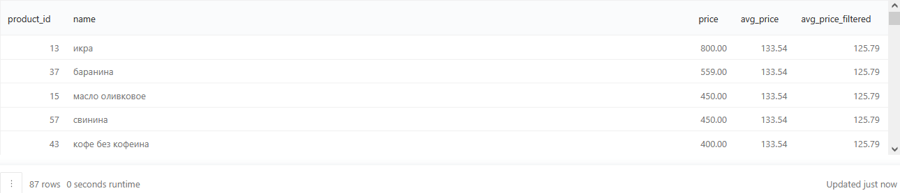

#### 9. Отбор топ 10% курьеров по количеству доставленных заказов
Из таблицы `courier_actions` нужно отобрать топ 10% курьеров по количеству доставленных за всё время заказов. В результате нужно вывести id курьеров, количество доставленных заказов и порядковый номер курьера в соответствии с числом доставленных заказов.
У курьера, доставившего наибольшее число заказов, порядковый номер должен быть равен 1, а у курьера с наименьшим числом заказов — числу, равному десяти процентам от общего количества курьеров в таблице `courier_actions`.
При расчёте номера последнего курьера нужно округлить значение до целого числа.
Колонки с количеством доставленных заказов и порядковым номером будут называться соответственно `orders_count` и `courier_rank`. Результат должен быть отсортирован по возрастанию порядкового номера курьера.

Запрос:
``` 
WITH courier_count AS (SELECT COUNT(DISTINCT courier_id)
                       FROM   courier_actions)
SELECT courier_id,
       orders_count,
       courier_rank
FROM   (SELECT courier_id,
               COUNT(DISTINCT order_id) AS orders_count,
               ROW_NUMBER() OVER (ORDER BY COUNT(DISTINCT order_id) DESC, courier_id) AS courier_rank
        FROM   courier_actions
        WHERE  action = 'deliver_order'
        GROUP BY courier_id) AS t1
WHERE  courier_rank <= ROUND((SELECT *
                              FROM   courier_count) * 0.1)
```

Результат:

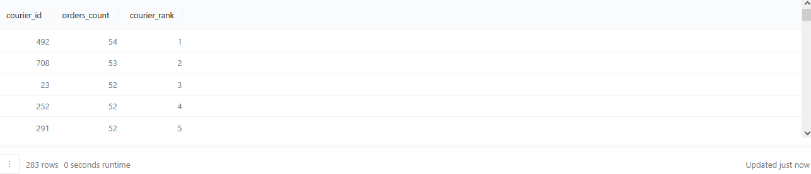

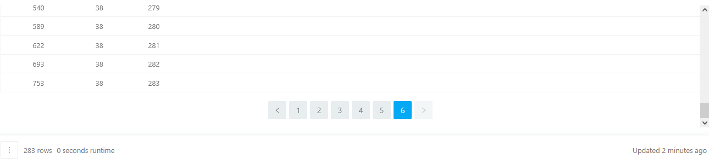

#### 10. Доли стоимости заказов в выручке
На основе информации в таблицах `orders` и `products` нужно рассчитать стоимость каждого заказа, ежедневную выручку сервиса и долю стоимости каждого заказа в ежедневной выручке, выраженную в процентах. В результат нужно включить следующие колонки: id заказа, время создания заказа, стоимость заказа, выручку за день, в который был совершён заказ, а также долю стоимости заказа в выручке за день, выраженную в процентах.
При проведении расчётов отменённые заказы не учитывать.
Результат нужно отсортировать сначала по убыванию даты совершения заказа (именно даты, а не времени), потом по убыванию доли заказа в выручке за день, затем по возрастанию id заказа.

Запрос:
``` 
WITH t1 AS (SELECT order_id,
                   SUM(price) AS order_price,
                   creation_time
            FROM   (SELECT order_id,
                           creation_time,
                           UNNEST(product_ids) AS product_id
                    FROM   orders
                    WHERE  order_id NOT IN (SELECT order_id
                                            FROM   user_actions
                                            WHERE  action = 'cancel_order')) t2 JOIN products USING(product_id)
            GROUP BY order_id, creation_time)

SELECT order_id,
       order_price,
       creation_time,
       SUM(order_price) OVER (PARTITION BY creation_time :: date) AS daily_revenue,
       ROUND(order_price / SUM(order_price) OVER 
       (PARTITION BY creation_time :: date) * 100, 3) AS percentage_of_daily_revenue
FROM   t1
ORDER BY creation_time :: date DESC, percentage_of_daily_revenue DESC, order_id
```

Результат:

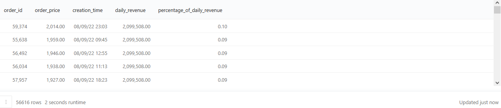

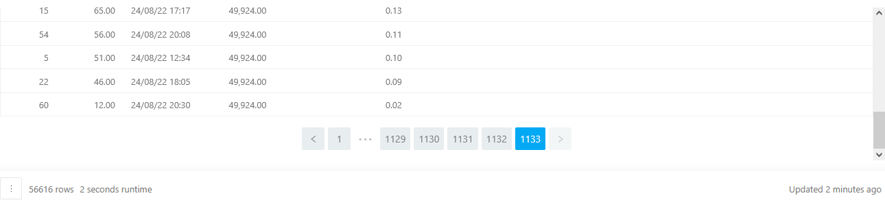

#### 11. Расчёт ежедневного прироста выручки
На основе данных в таблицах `orders` и `products` нужно рассчитать ежедневную выручку сервиса и отразите её в колонке `daily_revenue`. Затем с помощью оконных функций и функций смещения посчитать ежедневный прирост выручки. Прирост выручки нужно отразить как в абсолютных значениях, так и в % относительно предыдущего дня. Колонку с абсолютным приростом нужно назвать `revenue_growth_abs`, а колонку с относительным — `revenue_growth_percentage`.
Для самого первого дня прирост будет равным 0 в обеих колонках. При проведении расчётов отменённые заказы не учитывать. Результат нужно отстортировать по колонке с датами по возрастанию.

Запрос:
``` 
WITH daily_revenues AS (SELECT creation_time :: date AS date,
                               SUM(price) AS daily_revenue
                        FROM   (SELECT order_id,
                                       creation_time,
                                       UNNEST(product_ids) AS product_id
                                FROM   orders
                                WHERE  order_id NOT IN (SELECT order_id
                                                        FROM   user_actions
                                                        WHERE  action = 'cancel_order')) t1 
                                                        JOIN products USING(product_id)
                        GROUP BY creation_time :: date)
SELECT date,
       daily_revenue,
       COALESCE(daily_revenue - LAG(daily_revenue) OVER(
          ORDER BY date), 0) AS revenue_growth_abs,
       COALESCE(ROUND((daily_revenue - LAG(daily_revenue) OVER(
          ORDER BY date)) :: numeric / LAG(daily_revenue) OVER(
             ORDER BY date) * 100, 2), 0) AS revenue_growth_percentage
FROM   daily_revenues
ORDER BY date
```

Результат:

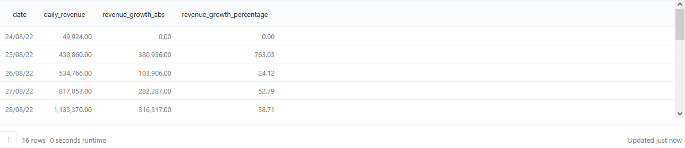

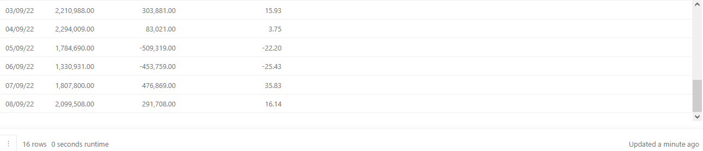

#### 12. Расчёт медианной стоимости заказов
С помощью оконной функции нужно рассчитать медианную стоимость всех заказов из таблицы `orders`, без учёта отменённых заказов. В качестве результата должно быть одно число. Колонку с ним будет называться `median_price`.

Запрос:
``` 
WITH main_table AS
  (SELECT order_price,
          ROW_NUMBER() OVER (
             ORDER BY order_price) AS row_number,
             COUNT(*) OVER() AS total_rows
   FROM
     (SELECT SUM(price) AS order_price
      FROM
        (SELECT order_id,
                product_ids,
                UNNEST(product_ids) AS product_id
         FROM   orders
         WHERE  order_id NOT IN
                (SELECT order_id
                 FROM   user_actions
                 WHERE  action='cancel_order') ) t3
      LEFT JOIN products USING(product_id)
      GROUP BY order_id) t1)
SELECT AVG(order_price) AS median_price
FROM main_table
WHERE row_number BETWEEN total_rows / 2.0 AND total_rows / 2.0 + 1
```

Результат:

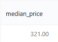