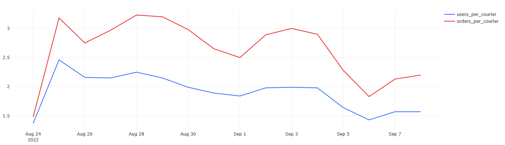

## Описание
В данном разделе будут показаны примеры построения графиков и добавления их в дашборд в Redash.

#### 1. Динамика числа пользователей и курьеров
Для каждого дня, представленного в таблицах `user_actions` и `courier_actions`, нужно рассчитать следующие показатели:
- Число новых пользователей.
- Число новых курьеров.
- Общее число пользователей на текущий день.
- Общее число курьеров на текущий день.

Колонки с показателями будут называться соответственно `new_users`, `new_couriers`, `total_users`, `total_couriers`. Колонку с датами нужно назвать `date`. Показатели должны быть выражены целыми числами. Результат должен быть отсортирован по возрастанию даты.

Запрос:
``` 
WITH t1 AS (SELECT date,
                   new_users,
                   new_couriers
            FROM   (SELECT COUNT(user_id) AS new_users,
                           date
                    FROM   (SELECT user_id,
                                   MIN(time)::date AS date
                            FROM   user_actions
                            GROUP BY user_id) AS users_info
                    GROUP BY date
                    ORDER BY date) AS users_fin
                INNER JOIN (SELECT COUNT(courier_id) AS new_couriers,
                                   date
                            FROM   (SELECT courier_id,
                                           MIN(time)::date AS date
                                    FROM   courier_actions
                                    GROUP BY courier_id) AS couriers_info
                            GROUP BY date
                            ORDER BY date) AS couriers_fin USING(date))
SELECT date,
       new_users,
       new_couriers,
       (SUM(new_users) OVER (ORDER BY date))::varchar AS total_users,
       (SUM(new_couriers) OVER (ORDER BY date))::varchar AS total_couriers
FROM   t1
```

Результат:


#### 2. Прирост числа пользователей и курьеров
Теперь нужно дополнить запрос из предыдущего задания и для каждого дня, представленного в таблицах `user_actions` и `courier_actions`, дополнительно рассчитайте следующие показатели:
- Прирост числа новых пользователей.
- Прирост числа новых курьеров.
- Прирост общего числа пользователей.
- Прирост общего числа курьеров.

Колонки с новыми показателями нужно назвать соответственно `new_users_change`, `new_couriers_change`, `total_users_growth`, `total_couriers_growth`. Колонку с датами назвать `date`.
Все показатели прироста должны быть выражены в процентах относительно значений в предыдущий день, с округлением до двух знаков после запятой. Результирующая таблица должна быть отсортирована по возрастанию даты.

Запрос:
``` 
WITH t1 AS (SELECT date,
                   new_users,
                   new_couriers
            FROM   (SELECT COUNT(user_id) AS new_users,
                           date
                    FROM   (SELECT user_id,
                                   MIN(time)::date AS date
                            FROM   user_actions
                            GROUP BY user_id) AS users_info
                    GROUP BY date
                    ORDER BY date) AS users_fin
                INNER JOIN (SELECT COUNT(courier_id) AS new_couriers,
                                   date
                            FROM   (SELECT courier_id,
                                           MIN(time)::date AS date
                                    FROM   courier_actions
                                    GROUP BY courier_id) AS couriers_info
                            GROUP BY date
                            ORDER BY date) AS couriers_fin USING(date))
SELECT date,
       new_users,
       new_couriers,
       total_users,
       total_couriers,
       ROUND(new_users_change, 2) AS new_users_change,
       ROUND(new_couriers_change, 2) AS new_couriers_change,
       ROUND((total_users - LAG(total_users) OVER (ORDER BY date)::decimal) / 
          LAG(total_users) OVER (ORDER BY date) * 100, 2) AS total_users_growth,
       ROUND((total_couriers - LAG(total_couriers) OVER (ORDER BY date)::decimal) / 
          LAG(total_couriers) OVER (ORDER BY date) * 100, 2) AS total_couriers_growth
FROM   (SELECT date,
               new_users,
               new_couriers,
               (SUM(new_users) OVER (ORDER BY date))::integer AS total_users,
               (SUM(new_couriers) OVER (ORDER BY date))::integer AS total_couriers,
               (new_users - (LAG(new_users) OVER (ORDER BY date)::decimal)) / 
                  LAG(new_users) OVER (ORDER BY date) * 100 AS new_users_change,
               (new_couriers - (LAG(new_couriers) OVER (ORDER BY date)::decimal)) / 
                  LAG(new_couriers) OVER (ORDER BY date) * 100 AS new_couriers_change
        FROM   t1) t2
```

Результат:


#### 3. Платящие пользователи и активные курьеры
Для каждого дня, представленного в таблицах `user_actions` и `courier_actions`, нужно посчитать следующие показатели:
- Число платящих пользователей.
- Число активных курьеров.
- Долю платящих пользователей в общем числе пользователей на текущий день.
- Долю активных курьеров в общем числе курьеров на текущий день.

Колонки с показателями должны называться соответственно `paying_users`, `active_couriers`, `paying_users_share`, `active_couriers_share`, а колонка с датами - `date`. Абсолютные показатели должны быть целочисленными, а доли - выражены в процентах (с округлением до двух знаков после запятой). Результат должен быть отсортирован по возрастанию даты.

Запрос:
``` 
SELECT date,
       paying_users,
       active_couriers,
       ROUND(100 * paying_users::decimal / total_users, 2) AS paying_users_share,
       ROUND(100 * active_couriers::decimal / total_couriers, 2) AS active_couriers_share
FROM   (SELECT start_date AS date,
               new_users,
               new_couriers,
               (SUM(new_users) OVER (ORDER BY start_date))::int AS total_users,
               (SUM(new_couriers) OVER (ORDER BY start_date))::int AS total_couriers
        FROM   (SELECT start_date,
                       COUNT(courier_id) AS new_couriers
                FROM   (SELECT courier_id,
                               min(time::date) AS start_date
                        FROM   courier_actions
                        GROUP BY courier_id) t1
                GROUP BY start_date) t2
            LEFT JOIN (SELECT start_date,
                              COUNT(user_id) AS new_users
                       FROM   (SELECT user_id,
                                      min(time::date) AS start_date
                               FROM   user_actions
                               GROUP BY user_id) t3
                       GROUP BY start_date) t4 USING(start_date)) t5
    LEFT JOIN (SELECT time::date AS date,
                      COUNT(distinct courier_id) AS active_couriers
               FROM   courier_actions
               WHERE  order_id NOT IN (SELECT order_id
                                       FROM   user_actions
                                       WHERE  action = 'cancel_order')
               GROUP BY date) t6 USING(date)
    LEFT JOIN (SELECT time::date AS date,
                      COUNT(distinct user_id) AS paying_users
               FROM   user_actions
               WHERE  order_id NOT IN (SELECT order_id
                                       FROM   user_actions
                                       WHERE  action = 'cancel_order')
               GROUP BY date) t7 USING(date)
```

Результат:


#### 4. Доли одиночных заказов и постоянных пользователей
Для каждого дня, представленного в таблице `user_actions`, нужно рассчитать следующие показатели:
- Долю пользователей, сделавших в этот день всего один заказ, в общем количестве платящих пользователей.
- Долю пользователей, сделавших в этот день несколько заказов, в общем количестве платящих пользователей.

Колонки с показателями нужно назвать соответственно `single_order_users_share`, `several_orders_users_share`, а колонку с датами - `date`. Все показатели с долями необходимо выразить в процентах (с округлением до двух знаков после запятой). Результат должен быть отсортирован по возрастанию даты.

Запрос:
``` 
SELECT date,
       ROUND(100 * single_order_users::decimal / 
              paying_users, 2) AS single_order_users_share,
       100 - ROUND(100 * single_order_users::decimal / 
              paying_users, 2) AS several_orders_users_share
FROM   (SELECT time::date AS date,
               COUNT(distinct user_id) AS paying_users
        FROM   user_actions
        WHERE  order_id NOT IN (SELECT order_id
                                FROM   user_actions
                                WHERE  action = 'cancel_order')
        GROUP BY date) t1
    LEFT JOIN (SELECT date,
                      COUNT(user_id) AS single_order_users
               FROM   (SELECT time::date AS date,
                              user_id,
                              COUNT(distinct order_id) AS user_orders
                       FROM   user_actions
                       WHERE  order_id NOT IN (SELECT order_id
                                               FROM   user_actions
                                               WHERE  action = 'cancel_order')
                       GROUP BY date, user_id having COUNT(DISTINCT order_id) = 1) t2
               GROUP BY date) t3 USING(date)
ORDER BY date
```

Результат:


#### 5. Заказы новых пользователей
Для каждого дня, представленного в таблице `user_actions`, нужно рассчитать следующие показатели:
1) Общее число заказов.
2) Число первых заказов (заказов, сделанных пользователями впервые).
3) Число заказов новых пользователей (заказов, сделанных пользователями в тот же день, когда они впервые воспользовались сервисом).
4) Долю первых заказов в общем числе заказов (долю п.2 в п.1).
5) Долю заказов новых пользователей в общем числе заказов (долю п.3 в п.1).

Колонки с показателями нужно назвать соответственно `orders`, `first_orders`, `new_users_orders`, `first_orders_share`, `new_users_orders_share`, а колонку с датами - `date`. Количество заказов нужно выразить в целых числах. Доли нужно выразить в процентах, с округлением до двух знаков после запятой. Результат должен быть отсортирован по возрастанию даты.

Запрос:
``` 
SELECT date,
       orders,
       first_orders,
       new_users_orders::int,
       ROUND(100 * first_orders::decimal / orders, 2) AS first_orders_share,
       ROUND(100 * new_users_orders::decimal / orders, 2) AS new_users_orders_share
FROM   (SELECT creation_time::date AS date,
               COUNT(distinct order_id) AS orders
        FROM   orders
        WHERE  order_id NOT IN (SELECT order_id
                                FROM   user_actions
                                WHERE  action = 'cancel_order')
           AND order_id in (SELECT order_id
                         FROM   courier_actions
                         WHERE  action = 'deliver_order')
        GROUP BY date) t5
    LEFT JOIN (SELECT first_order_date AS date,
                      COUNT(user_id) AS first_orders
               FROM   (SELECT user_id,
                              min(time::date) AS first_order_date
                       FROM   user_actions
                       WHERE  order_id NOT IN (SELECT order_id
                                               FROM   user_actions
                                               WHERE  action = 'cancel_order')
                       GROUP BY user_id) t4
               GROUP BY first_order_date) t7 USING(date)
    LEFT JOIN (SELECT start_date AS date,
                      SUM(orders) AS new_users_orders
               FROM   (SELECT t1.user_id,
                              t1.start_date,
                              COALESCE(t2.orders, 0) AS orders
                       FROM   (SELECT user_id,
                                      min(time::date) AS start_date
                               FROM   user_actions
                               GROUP BY user_id) t1
                           LEFT JOIN (SELECT user_id,
                                             time::date AS date,
                                             COUNT(distinct order_id) AS orders
                                      FROM   user_actions
                                      WHERE  order_id NOT IN (SELECT order_id
                                                              FROM   user_actions
                                                              WHERE  action = 'cancel_order')
                                      GROUP BY user_id, date) t2
                               ON t1.user_id = t2.user_id AND
                                  t1.start_date = t2.date) t3
               GROUP BY start_date) t6 USING(date)
ORDER BY date
```

Результат:


#### 6. Нагрузка на курьеров
На основе данных в таблицах `user_actions`, `courier_actions` и `orders` для каждого дня нужно рассчитать следующие показатели:
- Число платящих пользователей на одного активного курьера.
- Число заказов на одного активного курьера.

Колонки с показателями нужно назвать соответственно `users_per_courier` и `orders_per_courier`. Колонку с датами назвать `date`. Показатели нужно округлять до двух знаков после запятой. Результирующая таблица должна быть отсортирована по возрастанию даты.

Запрос:
``` 
WITH t1 AS (SELECT time::date AS date,
                   COUNT(DISTINCT user_id) AS count_user
            FROM   user_actions
            WHERE  order_id NOT IN (SELECT order_id
                                    FROM   user_actions
                                    WHERE  action = 'cancel_order')
            GROUP BY date), 
     t2 AS (SELECT time::date AS date,
                   COUNT(DISTINCT courier_id) AS count_courier
            FROM   courier_actions
            WHERE  order_id NOT IN (SELECT order_id
                                    FROM   user_actions
                                    WHERE  action = 'cancel_order')
            GROUP BY date), 
     t3 AS (SELECT creation_time::date AS date,
                   count(distinct order_id) AS count_order
            FROM   orders
            WHERE  order_id NOT IN (SELECT order_id
                                    FROM   user_actions
                                    WHERE  action = 'cancel_order')
            GROUP BY date)
SELECT date,
       ROUND(count_user / count_courier::decimal, 2) AS users_per_courier,
       ROUND(count_order / count_courier::decimal, 2) AS orders_per_courier
FROM   t1
       LEFT JOIN t2 USING(date)
       LEFT JOIN t3 USING(date)
ORDER BY date
```

Результат:




#### 7. Среднее время доставки заказов
На основе данных в таблице `courier_actions` для каждого дня нужно рассчитать, за сколько минут в среднем курьеры доставляли свои заказы.
Колонку с показателем нужно назвать `minutes_to_deliver`, а колонку с датами - `date`. При расчёте среднего времени доставки нужно округлить количество минут до целых значений. Учитывать нужно только доставленные заказы, отменённые заказы не учитываются. Результирующая таблица должна быть отсортирована по возрастанию даты.

Запрос:
``` 
SELECT date,
       AVG(delivery_time)::integer AS minutes_to_deliver
FROM   (SELECT courier_id,
               order_id,
               action,
               time::date AS date,
               EXTRACT(EPOCH
                  FROM time - LAG(time, 1)
                  OVER (
                     PARTITION BY order_id
                     ORDER BY time)) / 60 :: decimal AS delivery_time
        FROM   courier_actions
        WHERE  order_id NOT IN (SELECT order_id
                                FROM   user_actions
                                WHERE  action = 'cancel_order')) AS t1       
GROUP BY date
ORDER BY date
```

Результат:


#### 8. Нагрузка на сервис и доля отменённых заказов
На основе данных в таблице orders для каждого часа в сутках рассчитайте следующие показатели:
- Число успешных (доставленных) заказов.
- Число отменённых заказов.
- Долю отменённых заказов в общем числе заказов (cancel rate).

Колонки с показателями нужно назвать соответственно `successful_orders`, `canceled_orders`, `cancel_rate`. Колонку с часом оформления заказа назвать `hour`. При расчёте доли отменённых заказов нужно округлить значения до трёх знаков после запятой. Результирующая таблица должна быть отсортирована по возрастанию колонки с часом оформления заказа.

Запрос:
``` 
WITH t1 AS (SELECT hour,
                   COUNT(order_id) AS successful_orders
            FROM   (SELECT date_part('hour', creation_time)::int AS hour,
                           order_id,
                           action
                    FROM   orders JOIN user_actions USING(order_id)
                    WHERE  order_id NOT IN (SELECT order_id
                                            FROM   user_actions
                                            WHERE  action = 'cancel_order')) t
            GROUP BY hour
            ORDER BY hour)

SELECT hour,
       successful_orders,
       COUNT(order_id) FILTER(WHERE action = 'cancel_order') AS canceled_orders,
       ROUND((COUNT(order_id) FILTER(WHERE action = 'cancel_order'))::decimal / 
          (COUNT(order_id) filter (WHERE action = 'create_order')), 3) AS cancel_rate
FROM   (SELECT DATE_PART('hour', creation_time)::int AS hour,
               order_id,
               action
        FROM   orders JOIN user_actions USING(order_id)) t2 
    JOIN t1 USING(hour)
GROUP BY hour, successful_orders
ORDER BY hour
```

Результат:


#### 9. Готовый дашборд


