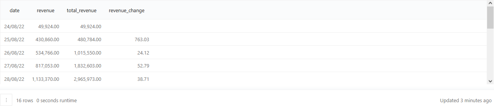
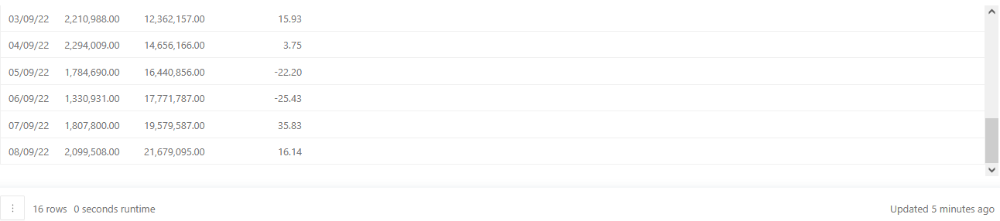
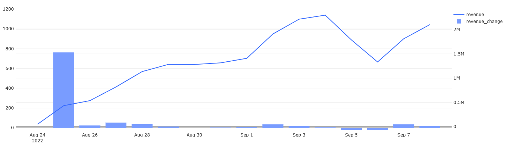
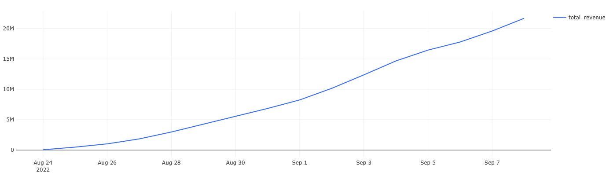

## Описание
В данном разделе будут показаны примеры расчёта основных продуктовых метрик продукта с последующим составлением дашборда в Redash.

#### 1. Динамика выручки
Для каждого дня в таблице `orders` нужно рассчитать следующие показатели:
- Выручку, полученную в этот день.
- Суммарную выручку на текущий день.
- Прирост выручки, полученной в этот день, относительно значения выручки за предыдущий день.

Колонки с показателями нужно назвать соответственно `revenue`, `total_revenue`, `revenue_change`. Колонку с датами назвать `date`. Прирост выручки нужно рассчитать в процентах и округлить значения до двух знаков после запятой. Результат должен быть отсортирован по возрастанию даты.

Запрос:
``` 
WITH orders_price AS (
    SELECT date,
           order_id,
           SUM(price) AS order_price
    FROM   (SELECT creation_time::date AS date,
                    order_id,
                    UNNEST(product_ids) AS product_id
            FROM   orders
            WHERE  order_id NOT IN (SELECT order_id
                                    FROM   user_actions
                                    WHERE  action = 'cancel_order')) t1
       LEFT JOIN products USING(product_id)
    GROUP BY date, order_id)

SELECT date,
       revenue,
       SUM(revenue) OVER(ORDER BY date) AS total_revenue,
       ROUND((revenue - LAG(revenue, 1) OVER(ORDER BY date))::decimal / 
          LAG(revenue, 1) OVER(ORDER BY date) * 100, 2) AS revenue_change
FROM   (SELECT date,
               SUM(order_price) AS revenue
        FROM   orders_price
        GROUP BY date) t2
ORDER BY date
```

Результат:







