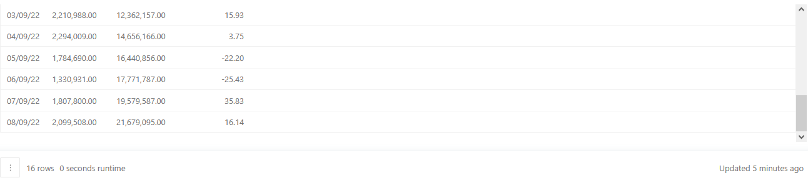
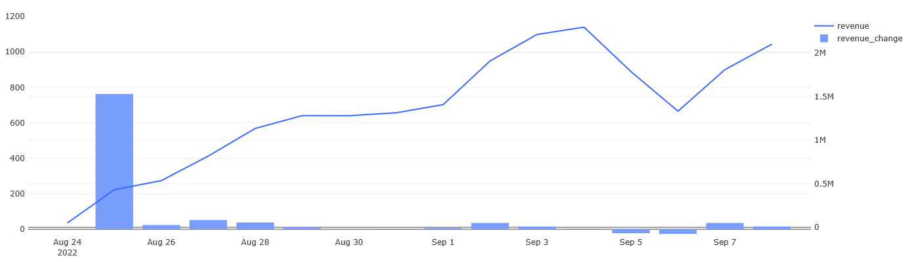
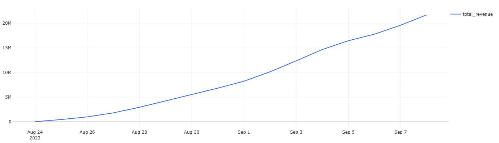
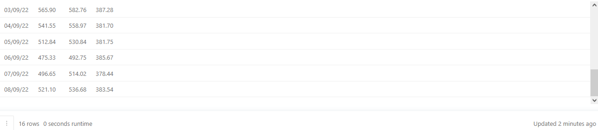

## Описание
В данном разделе будут показаны примеры расчёта основных продуктовых метрик продукта с последующим составлением дашборда в Redash.

#### 1. Динамика выручки
Для каждого дня в таблице `orders` нужно рассчитать следующие показатели:
- Выручку, полученную в этот день.
- Суммарную выручку на текущий день.
- Прирост выручки, полученной в этот день, относительно значения выручки за предыдущий день.

Колонки с показателями нужно назвать соответственно `revenue`, `total_revenue`, `revenue_change`. Колонку с датами назвать `date`. Прирост выручки нужно рассчитать в процентах и округлить значения до двух знаков после запятой. Результат должен быть отсортирован по возрастанию даты.

Запрос:
``` 
WITH orders_price AS (
    SELECT date,
           order_id,
           SUM(price) AS order_price
    FROM   (SELECT creation_time::date AS date,
                    order_id,
                    UNNEST(product_ids) AS product_id
            FROM   orders
            WHERE  order_id NOT IN (SELECT order_id
                                    FROM   user_actions
                                    WHERE  action = 'cancel_order')) t1
       LEFT JOIN products USING(product_id)
    GROUP BY date, order_id)

SELECT date,
       revenue,
       SUM(revenue) OVER(ORDER BY date) AS total_revenue,
       ROUND((revenue - LAG(revenue, 1) OVER(ORDER BY date))::decimal / 
          LAG(revenue, 1) OVER(ORDER BY date) * 100, 2) AS revenue_change
FROM   (SELECT date,
               SUM(order_price) AS revenue
        FROM   orders_price
        GROUP BY date) t2
ORDER BY date
```

Результат:








#### 2. Средняя выручка с пользователя
Для каждого дня в таблицах `orders` и `user_actions` нужно рассчитать следующие показатели:
- Выручку на пользователя (ARPU) за текущий день.
- Выручку на платящего пользователя (ARPPU) за текущий день.
- Выручку с заказа, или средний чек (AOV) за текущий день.

Колонки с показателями нужно назвать соответственно `arpu`, `arppu`, `aov`, а колонку с датами - `date`. 
При расчёте всех показателей нужно округлять значения до двух знаков после запятой.
Результат должен быть отсортирован по возрастанию даты. 

Запрос:
``` 
SELECT date,
       ROUND(revenue::decimal / users, 2) AS arpu,
       ROUND(revenue::decimal / paying_users, 2) AS arppu,
       ROUND(revenue::decimal / orders, 2) AS aov
FROM   (SELECT creation_time::date AS date,
               COUNT(DISTINCT order_id) AS orders,
               SUM(price) AS revenue
        FROM   (SELECT order_id,
                       creation_time,
                       UNNEST(product_ids) AS product_id
                FROM   orders
                WHERE  order_id NOT IN (SELECT order_id
                                        FROM   user_actions
                                        WHERE  action = 'cancel_order')) t1
            LEFT JOIN products USING(product_id)
        GROUP BY date) t2
    LEFT JOIN (SELECT time::date AS date,
                      COUNT(DISTINCT user_id) AS users
               FROM   user_actions
               GROUP BY date) t3 USING(date)
    LEFT JOIN (SELECT time::date AS date,
                      COUNT(DISTINCT user_id) AS paying_users
               FROM   user_actions
               WHERE  order_id NOT IN (SELECT order_id
                                       FROM   user_actions
                                       WHERE  action = 'cancel_order')
               GROUP BY date) t4 USING(date)
ORDER BY date
```

Результат:





#### 3. Накопленная выручка с пользователя
По таблицам `orders` и `user_actions` для каждого дня рассчитайте следующие показатели:
- Накопленную выручку на пользователя (Running ARPU).
- Накопленную выручку на платящего пользователя (Running ARPPU).
- Накопленную выручку с заказа, или средний чек (Running AOV).

Колонки с показателями нужно назвать соответственно `running_arpu`, `running_arppu`, `running_aov`, а колонку с датами - `date`. 
При расчёте всех показателей нужно округлять значения до двух знаков после запятой.
Результат должен быть отсортирован по возрастанию даты. 

Запрос:
``` 
WITH t1 AS (
        SELECT order_id,
                   date,
                   product_id,
                   price,
                   user_id
        FROM   (SELECT order_id,
                       creation_time::date AS date,
                       unnest(product_ids) AS product_id,
                       user_id
                FROM   orders
                LEFT JOIN user_actions USING(order_id)) t3
        LEFT JOIN products USING(product_id)),

     revenue_table AS (
        SELECT date,
               sum(price) AS revenue_per_day
        FROM   t1
        WHERE  order_id NOT IN (SELECT order_id
                                FROM   user_actions
                                WHERE  action = 'cancel_order')
        GROUP BY date), 

     all_users_table AS (
        SELECT start_date AS date,
               COUNT(DISTINCT user_id) AS all_users_per_day
        FROM   (SELECT user_id,
                       MIN(time::date) AS start_date
                FROM   user_actions
                GROUP BY user_id) t4
        GROUP BY date), 

     paying_users_table AS (
        SELECT start_date AS date,
               COUNT(DISTINCT user_id) AS paying_users_per_day
        FROM   (SELECT user_id,
                       MIN(time::date) AS start_date
                FROM   user_actions
                WHERE  order_id NOT IN (SELECT order_id
                                        FROM   user_actions
                                        WHERE  action = 'cancel_order')
                GROUP BY user_id) t5
        GROUP BY date), 
                                       
     orders_table AS (
        SELECT date,
               COUNT(distinct order_id) AS all_orders_per_day
        FROM   t1
        WHERE  order_id NOT IN (SELECT order_id
                                FROM   user_actions
                                WHERE  action = 'cancel_order')
        GROUP BY date), 
                                 
     t2 AS (
        SELECT date,
               SUM(revenue_per_day) OVER(ORDER BY date) AS rev,
               SUM(all_users_per_day) OVER(ORDER BY date) AS all_users,
               SUM(paying_users_per_day) OVER(ORDER BY date) AS paying_users,
               SUM(all_orders_per_day) OVER(ORDER BY date) AS ord
        FROM   revenue_table 
          JOIN all_users_table USING(date) 
          JOIN paying_users_table USING(date) 
          JOIN orders_table USING(date)
        ORDER BY date)

SELECT date,
       round(rev::decimal / all_users, 2) AS running_arpu,
       round(rev::decimal / paying_users, 2) AS running_arppu,
       round(rev::decimal / ord, 2) AS running_aov
FROM   t2
```

Результат:


#### 4. Выручка с пользователя по дням недели
Для каждого дня недели в таблицах `orders` и `user_actions` нужно рассчитать следующие показатели:
- Выручку на пользователя (ARPU).
- Выручку на платящего пользователя (ARPPU).
- Выручку на заказ (AOV).

При расчётах нужно учитывать данные только за период с 26 августа 2022 года по 8 сентября 2022 года включительно — так, чтобы в анализ попало одинаковое количество всех дней недели (ровно по два дня).
В результирующую таблицу нужно включить как наименования дней недели (например, Monday), так и порядковый номер дня недели (от 1 до 7, где 1 — это Monday, 7 — это Sunday).
Колонки с показателями нужно назвать соответственно `arpu`, `arppu`, `aov`. Колонку с наименованием дня недели назвать `weekday`, а колонку с порядковым номером дня недели - `weekday_number`.
При расчёте всех показателей нужно округлить значения до двух знаков после запятой.
Результат должен быть отсортирован по возрастанию порядкового номера дня недели.

Запрос:
``` 
SELECT weekday,
       t1.weekday_number AS weekday_number,
       ROUND(revenue::decimal / users, 2) AS arpu,
       ROUND(revenue::decimal / paying_users, 2) AS arppu,
       ROUND(revenue::decimal / orders, 2) AS aov
FROM   (SELECT TO_CHAR(creation_time, 'Day') AS weekday,
               MAX(DATE_PART('isodow', creation_time)) AS weekday_number,
               COUNT(DISTINCT order_id) AS orders,
               SUM(price) AS revenue
        FROM   (SELECT order_id,
                       creation_time,
                       UNNEST(product_ids) AS product_id
                FROM   orders
                WHERE  order_id NOT IN (SELECT order_id
                                        FROM   user_actions
                                        WHERE  action = 'cancel_order')
                   AND creation_time >= '2022-08-26'
                   AND creation_time < '2022-09-09') t4
             LEFT JOIN products USING(product_id)
        GROUP BY weekday) t1
     LEFT JOIN (SELECT TO_CHAR(time, 'Day') AS weekday,
                       MAX(DATE_PART('isodow', time)) AS weekday_number,
                       COUNT(DISTINCT user_id) AS users
                FROM   user_actions
                WHERE  time >= '2022-08-26'
                   AND time < '2022-09-09'
                GROUP BY weekday) t2 USING(weekday)
    LEFT JOIN (SELECT TO_CHAR(time, 'Day') AS weekday,
                      MAX(DATE_PART('isodow', time)) AS weekday_number,
                      COUNT(DISTINCT user_id) AS paying_users
               FROM   user_actions
               WHERE  order_id NOT IN (SELECT order_id
                                       FROM   user_actions
                                       WHERE  action = 'cancel_order')
                  AND time >= '2022-08-26'
                  AND time < '2022-09-09'
               GROUP BY weekday) t3 USING(weekday)
ORDER BY weekday_number
```

Результат:


#### 5. Доли выручки новых и старых пользователей по дням
Для каждого дня в таблицах orders и user_actions рассчитайте следующие показатели:
- Выручку, полученную в этот день.
- Выручку с заказов новых пользователей, полученную в этот день.
- Долю выручки с заказов новых пользователей в общей выручке, полученной за этот день.
- Долю выручки с заказов остальных пользователей в общей выручке, полученной за этот день.

Колонки с показателями нужно назвать соответственно `revenue`, `new_users_revenue`, `new_users_revenue_share`, `old_users_revenue_share`, а колонку с датами - `date`. 
Все показатели долей необходимо выразить в процентах. При их расчёте нужно округлить значения до двух знаков после запятой. Результат должен быть отсортирован по возрастанию даты.

Запрос:
``` 
WITH orders_table AS (
        SELECT order_id,
               date,
               SUM(price) AS order_price
        FROM   (SELECT order_id,
                       date,
                       price
                FROM   (SELECT order_id,
                               creation_time::date AS date,
                               UNNEST(product_ids) AS product_id
                        FROM   orders) t1 
                  JOIN products USING(product_id)) t2
        GROUP BY order_id, date), 
                      
     revenue_table AS (
        SELECT date,
               SUM(order_price) AS revenue
        FROM   orders_table
        WHERE  order_id NOT IN (SELECT order_id
                                FROM   user_actions
                                WHERE  action = 'cancel_order')
        GROUP BY date), 
                                            
     users_order_price AS (
        SELECT user_id,
               order_id,
               action,
               time::date AS date,
               order_price
        FROM   user_actions 
          JOIN orders_table USING(order_id)
        WHERE  order_id NOT IN (SELECT order_id
                                FROM   user_actions
                                WHERE  action = 'cancel_order')), 
                                                              
     new_users AS (
        SELECT user_id,
               MIN(time::date) AS date
        FROM   user_actions
        GROUP BY user_id), 
                                                
     new_users_revenue_table AS (
        SELECT date,
               SUM(order_price) AS new_users_revenue
        FROM   (SELECT nu.user_id,
                       nu.date,
                       uop.order_price
                FROM   new_users AS nu 
                  JOIN users_order_price AS uop
                    ON nu.user_id = uop.user_id 
                   AND nu.date = uop.date) t3
        GROUP BY date)

SELECT date,
       revenue,
       new_users_revenue,
       ROUND(new_users_revenue::decimal / revenue * 100, 2) AS new_users_revenue_share,
       ROUND((revenue - new_users_revenue::decimal) / 
              revenue * 100, 2) as old_users_revenue_share
FROM   revenue_table 
  JOIN new_users_revenue_table USING(date)
ORDER BY date
```

Результат:


#### 6. Выручка по товарам
Для каждого товара, представленного в таблице `products`, за весь период времени в таблице `orders` нужно рассчитать следующие показатели:
- Суммарную выручку, полученную от продажи этого товара за весь период.
- Долю выручки от продажи этого товара в общей выручке, полученной за весь период.

Колонки с показателями нужно назвать соответственно `revenue` и `share_in_revenue`. Колонку с наименованиями товаров назвать `product_name`.
Долю выручки с каждого товара необходимо выразить в процентах (с округлением до двух знаков после запятой).
Товары, округлённая доля которых в выручке составляет менее 0.5%, нужно объединить в общую группу с названием "ДРУГОЕ" (без кавычек), просуммировав округлённые доли этих товаров.
Результат должен быть отсортирован по убыванию выручки от продажи товара.

Запрос:
``` 
WITH t1 AS (
        SELECT name AS product_name,
               SUM(price) AS revenue
        FROM   (SELECT product_id,
                       name,
                       price
                FROM   (SELECT unnest(product_ids) AS product_id
                        FROM   orders
                        WHERE  order_id NOT IN (SELECT order_id
                                                FROM   user_actions
                                                WHERE  action = 'cancel_order')) t2
                LEFT JOIN products USING(product_id)) t3
        GROUP BY name), 
            
     t4 AS (
        SELECT CASE WHEN 
                  ROUND(revenue::decimal / SUM(revenue) OVER() *100, 2) >= 0.5 
                  THEN product_name
                  ELSE 'ДРУГОЕ' 
                  END AS product_name,
               revenue,
               ROUND(revenue::decimal / SUM(revenue) OVER() * 100, 2) AS share_in_revenue
        FROM   t1)
SELECT product_name,
       SUM(revenue) AS revenue,
       SUM(share_in_revenue) AS share_in_revenue
FROM   t4
GROUP BY product_name
ORDER BY revenue DESC
```

Результат:


#### 7. Готовый дашборд


#### 8. Выводы
Подытожим результаты расчётов:
1. Выручка показывает стабильный рост, однако её динамика резко падает после первого дня работы приложения (вполне обычная ситуация на запуске). С другой стороны, динамика выручки не сильно уходит в минус, что говорит о стабильных продажах. Стоит проводить замеры и сравнение метрик регулярно (еженедельно или ежемесячно), чтобы успеть принять меры, когда неизбежно начнутся "проседания".
2. Небольшая разница между ARPU и ARPPU показывает невысокую долю "бесплатных" пользователей, что хорошо. Однако средний чек (AOV) остаётся на одном уровне, можно попробовать поднять его специальными предложениями или скидками. Накопительные ARPU и ARPPU показывают плавный рост, без резких скачков, что хорошо, т. к. это показывает не слишком большое влияние сезонности.
3. Выручка с пользователей по дням недели показывает небольшой скачок продаж в выходные, что логично. Будет хорошей стратегией показывать рекламу или рассылать уведомления о спецпредложениях в пятницу, чтобы простимулировать продажи.
4. Доля постоянных пользователей со временем растёт, вытесняя собой новых пользователей, и на вторую неделю работы приложения держится в пределах 60%. Это неплохой показатель, т. к. без новых пользователей ни один сервис не сможет расти, а без постоянных пользователей сервис будет испытывать резкие скачки по выручке и сильно зависеть от маркетинга.
5. Структура выручки по товарам показывает, что наибольшую долю составляют мясные продовольственные товары (например, свинина, курица и говядина), возможно стоит сделать на них акцент в рекламе. С другой стороны, на втором месте по доле выручки находится группа "Другое", то есть большое скопление различных товаров с низкой долей, нужно дополнительно изучить их (например провести ABC анализ) и пересмотреть ассортимент.

