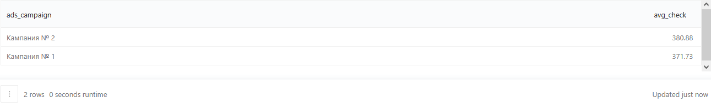

## Описание
В данном разделе будут показаны примеры расчёта основных маркетинговых метрик с последующим составлением дашборда в Redash.

#### 1. Затраты на привлечение - CAC (Customer Acquisition Cost)
Представим ситуацию: к нам обратились маркетологи с просьбой сравнить две рекламные кампании.
В рекламной кампании № 1 о нашем приложении рассказал известный блогер на Youtube-канале о кулинарии. На эту интеграцию суммарно потратили 250 тысяч рублей. В результате этой кампании 1 сентября в приложении зарегистрировался 171 человек.

В рамках рекламной кампании № 2 пользователям показывали таргетированную рекламу в социальных сетях. На это тоже суммарно потратили 250 тысяч рублей, и в результате 1 сентября у нас появилось 236 новых пользователей.
Как нам оценить, какой из каналов привлечения сработал лучше? На первый взгляд, вторая кампания показала себя лучше, поскольку нам удалось привлечь больше людей за те же деньги. Но не будем торопиться с выводами — давайте сначала проведём более подробный анализ и рассчитаем CAC для двух рекламных кампаний.

На основе таблицы `user_actions` нужно рассчитать метрику CAC для двух рекламных кампаний.

Список id пользователей, пришедших после рекламной кампании № 1:
``` 
8631, 8632, 8638, 8643, 8657, 8673, 8706, 8707, 8715, 8723, 8732, 8739, 8741, 
8750, 8751, 8752, 8770, 8774, 8788, 8791, 8804, 8810, 8815, 8828, 8830, 8845, 
8853, 8859, 8867, 8869, 8876, 8879, 8883, 8896, 8909, 8911, 8933, 8940, 8972, 
8976, 8988, 8990, 9002, 9004, 9009, 9019, 9020, 9035, 9036, 9061, 9069, 9071, 
9075, 9081, 9085, 9089, 9108, 9113, 9144, 9145, 9146, 9162, 9165, 9167, 9175, 
9180, 9182, 9197, 9198, 9210, 9223, 9251, 9257, 9278, 9287, 9291, 9313, 9317, 
9321, 9334, 9351, 9391, 9398, 9414, 9420, 9422, 9431, 9450, 9451, 9454, 9472, 
9476, 9478, 9491, 9494, 9505, 9512, 9518, 9524, 9526, 9528, 9531, 9535, 9550, 
9559, 9561, 9562, 9599, 9603, 9605, 9611, 9612, 9615, 9625, 9633, 9652, 9654, 
9655, 9660, 9662, 9667, 9677, 9679, 9689, 9695, 9720, 9726, 9739, 9740, 9762, 
9778, 9786, 9794, 9804, 9810, 9813, 9818, 9828, 9831, 9836, 9838, 9845, 9871, 
9887, 9891, 9896, 9897, 9916, 9945, 9960, 9963, 9965, 9968, 9971, 9993, 9998, 
9999, 10001, 10013, 10016, 10023, 10030, 10051, 10057, 10064, 10082, 10103, 
10105, 10122, 10134, 10135
```

Список id пользователей, пришедших после рекламной кампании № 2:
``` 
8629, 8630, 8644, 8646, 8650, 8655, 8659, 8660, 8663, 8665, 8670, 8675, 8680, 8681, 
8682, 8683, 8694, 8697, 8700, 8704, 8712, 8713, 8719, 8729, 8733, 8742, 8748, 8754, 
8771, 8794, 8795, 8798, 8803, 8805, 8806, 8812, 8814, 8825, 8827, 8838, 8849, 8851, 
8854, 8855, 8870, 8878, 8882, 8886, 8890, 8893, 8900, 8902, 8913, 8916, 8923, 8929, 
8935, 8942, 8943, 8949, 8953, 8955, 8966, 8968, 8971, 8973, 8980, 8995, 8999, 9000, 
9007, 9013, 9041, 9042, 9047, 9064, 9068, 9077, 9082, 9083, 9095, 9103, 9109, 9117, 
9123, 9127, 9131, 9137, 9140, 9149, 9161, 9179, 9181, 9183, 9185, 9190, 9196, 9203, 
9207, 9226, 9227, 9229, 9230, 9231, 9250, 9255, 9259, 9267, 9273, 9281, 9282, 9289, 
9292, 9303, 9310, 9312, 9315, 9327, 9333, 9335, 9337, 9343, 9356, 9368, 9370, 9383, 
9392, 9404, 9410, 9421, 9428, 9432, 9437, 9468, 9479, 9483, 9485, 9492, 9495, 9497, 
9498, 9500, 9510, 9527, 9529, 9530, 9538, 9539, 9545, 9557, 9558, 9560, 9564, 9567, 
9570, 9591, 9596, 9598, 9616, 9631, 9634, 9635, 9636, 9658, 9666, 9672, 9684, 9692, 
9700, 9704, 9706, 9711, 9719, 9727, 9735, 9741, 9744, 9749, 9752, 9753, 9755, 9757, 
9764, 9783, 9784, 9788, 9790, 9808, 9820, 9839, 9841, 9843, 9853, 9855, 9859, 9863, 
9877, 9879, 9880, 9882, 9883, 9885, 9901, 9904, 9908, 9910, 9912, 9920, 9929, 9930, 
9935, 9939, 9958, 9959, 9961, 9983, 10027, 10033, 10038, 10045, 10047, 10048, 10058, 
10059, 10067, 10069, 10073, 10075, 10078, 10079, 10081, 10092, 10106, 10110, 10113, 10131
```

Колонка с наименованиями кампаний будет называться `ads_campaign`, а колонка со значением метрики — `cac`.
Кампании будут называться, соответственно, "Кампания 1" и "Кампания 2".
Полученные значения метрики нужно округлить до двух знаков после запятой.
Результат должен быть отсортирован по убыванию значения метрики.

Запрос:
``` 
SELECT CONCAT('Кампания № ', ads_campaign) AS ads_campaign,
       ROUND(250000::decimal / COUNT(DISTINCT user_id), 2) AS cac
FROM   (SELECT CASE WHEN user_id IN (8631, 8632, 8638, 8643, 8657, 8673, 8706, 8707, 8715,
                                     8723, 8732, 8739, 8741, 8750, 8751, 8752, 8770, 8774,
                                     8788, 8791, 8804, 8810, 8815, 8828, 8830, 8845, 8853,
                                     8859, 8867, 8869, 8876, 8879, 8883, 8896, 8909, 8911,
                                     8933, 8940, 8972, 8976, 8988, 8990, 9002, 9004, 9009,
                                     9019, 9020, 9035, 9036, 9061, 9069, 9071, 9075, 9081,
                                     9085, 9089, 9108, 9113, 9144, 9145, 9146, 9162, 9165,
                                     9167, 9175, 9180, 9182, 9197, 9198, 9210, 9223, 9251,
                                     9257, 9278, 9287, 9291, 9313, 9317, 9321, 9334, 9351,
                                     9391, 9398, 9414, 9420, 9422, 9431, 9450, 9451, 9454,
                                     9472, 9476, 9478, 9491, 9494, 9505, 9512, 9518, 9524,
                                     9526, 9528, 9531, 9535, 9550, 9559, 9561, 9562, 9599,
                                     9603, 9605, 9611, 9612, 9615, 9625, 9633, 9652, 9654,
                                     9655, 9660, 9662, 9667, 9677, 9679, 9689, 9695, 9720,
                                     9726, 9739, 9740, 9762, 9778, 9786, 9794, 9804, 9810,
                                     9813, 9818, 9828, 9831, 9836, 9838, 9845, 9871, 9887,
                                     9891, 9896, 9897, 9916, 9945, 9960, 9963, 9965, 9968,
                                     9971, 9993, 9998, 9999, 10001, 10013, 10016, 10023, 10030,
                                     10051, 10057, 10064, 10082, 10103, 10105, 10122, 10134,
                                     10135) THEN 1
                    WHEN user_id IN (8629, 8630, 8644, 8646, 8650, 8655, 8659, 8660, 8663, 8665, 8670,
                                     8675, 8680, 8681, 8682, 8683, 8694, 8697, 8700, 8704,
                                     8712, 8713, 8719, 8729, 8733, 8742, 8748, 8754, 8771,
                                     8794, 8795, 8798, 8803, 8805, 8806, 8812, 8814, 8825,
                                     8827, 8838, 8849, 8851, 8854, 8855, 8870, 8878, 8882,
                                     8886, 8890, 8893, 8900, 8902, 8913, 8916, 8923, 8929,
                                     8935, 8942, 8943, 8949, 8953, 8955, 8966, 8968, 8971,
                                     8973, 8980, 8995, 8999, 9000, 9007, 9013, 9041, 9042,
                                     9047, 9064, 9068, 9077, 9082, 9083, 9095, 9103, 9109,
                                     9117, 9123, 9127, 9131, 9137, 9140, 9149, 9161, 9179,
                                     9181, 9183, 9185, 9190, 9196, 9203, 9207, 9226, 9227,
                                     9229, 9230, 9231, 9250, 9255, 9259, 9267, 9273, 9281,
                                     9282, 9289, 9292, 9303, 9310, 9312, 9315, 9327, 9333,
                                     9335, 9337, 9343, 9356, 9368, 9370, 9383, 9392, 9404,
                                     9410, 9421, 9428, 9432, 9437, 9468, 9479, 9483, 9485,
                                     9492, 9495, 9497, 9498, 9500, 9510, 9527, 9529, 9530,
                                     9538, 9539, 9545, 9557, 9558, 9560, 9564, 9567, 9570,
                                     9591, 9596, 9598, 9616, 9631, 9634, 9635, 9636, 9658,
                                     9666, 9672, 9684, 9692, 9700, 9704, 9706, 9711, 9719,
                                     9727, 9735, 9741, 9744, 9749, 9752, 9753, 9755, 9757,
                                     9764, 9783, 9784, 9788, 9790, 9808, 9820, 9839, 9841,
                                     9843, 9853, 9855, 9859, 9863, 9877, 9879, 9880, 9882,
                                     9883, 9885, 9901, 9904, 9908, 9910, 9912, 9920, 9929,
                                     9930, 9935, 9939, 9958, 9959, 9961, 9983, 10027, 10033,
                                     10038, 10045, 10047, 10048, 10058, 10059, 10067, 10069,
                                     10073, 10075, 10078, 10079, 10081, 10092, 10106, 10110,
                                     10113, 10131) THEN 2
                    ELSE 0 
                    END AS ads_campaign,
               order_id,
               time::date AS date,
               user_id
        FROM   user_actions
        WHERE  order_id NOT IN (SELECT order_id
                                FROM   user_actions
                                WHERE  action = 'cancel_order')) case_ads_group
WHERE ads_campaign IN (1, 2)
GROUP BY ads_campaign
ORDER BY cac DESC
```

Результат:


#### 2. Рентабельность инвестиций - ROI (Return on Investment)
Отлично, CAC мы рассчитали, но можем ли мы теперь утверждать, что вторая рекламная кампания лучше только потому, что позволяет привлекать платящих пользователей за меньшие деньги?

Нет, делать такие выводы рано — давайте оценим ещё один показатель, который отражает рентабельность инвестиций и показывает, насколько выгодным является тот или иной проект или продукт. Эта метрика называется ROI (Return on Investment), в маркетинге её часто применяют для подсчёта окупаемости рекламных кампаний.
Нужно рассчитать ROI для каждого рекламного канала.

Колонка с наименованиями кампаний будет называться `ads_campaign`, а колонка со значением метрики — `roi`.
Полученные значения метрики необходимо выразить в процентах и округлить до двух знаков после запятой.
Результат должен быть отсортирован по убыванию значения метрики.

Запрос:
``` 
SELECT CONCAT('Кампания № ', ads_campaign) AS ads_campaign,
       ROUND((SUM(price) - 250000.0) / 250000.0 * 100, 2) AS roi
FROM   (SELECT ads_campaign,
               user_id,
               order_id,
               product_id,
               price
        FROM   (SELECT ads_campaign,
                       user_id,
                       order_id
                FROM   (SELECT user_id,
                               order_id,
                               CASE WHEN user_id IN (8631, 8632, 8638, 8643, 8657, 8673, 8706, 8707, 8715, 8723, 8732,
                                                     8739, 8741, 8750, 8751, 8752, 8770, 8774, 8788, 8791,
                                                     8804, 8810, 8815, 8828, 8830, 8845, 8853, 8859, 8867,
                                                     8869, 8876, 8879, 8883, 8896, 8909, 8911, 8933, 8940,
                                                     8972, 8976, 8988, 8990, 9002, 9004, 9009, 9019, 9020,
                                                     9035, 9036, 9061, 9069, 9071, 9075, 9081, 9085, 9089,
                                                     9108, 9113, 9144, 9145, 9146, 9162, 9165, 9167, 9175,
                                                     9180, 9182, 9197, 9198, 9210, 9223, 9251, 9257, 9278,
                                                     9287, 9291, 9313, 9317, 9321, 9334, 9351, 9391, 9398,
                                                     9414, 9420, 9422, 9431, 9450, 9451, 9454, 9472, 9476,
                                                     9478, 9491, 9494, 9505, 9512, 9518, 9524, 9526, 9528,
                                                     9531, 9535, 9550, 9559, 9561, 9562, 9599, 9603, 9605,
                                                     9611, 9612, 9615, 9625, 9633, 9652, 9654, 9655, 9660,
                                                     9662, 9667, 9677, 9679, 9689, 9695, 9720, 9726, 9739,
                                                     9740, 9762, 9778, 9786, 9794, 9804, 9810, 9813, 9818,
                                                     9828, 9831, 9836, 9838, 9845, 9871, 9887, 9891, 9896,
                                                     9897, 9916, 9945, 9960, 9963, 9965, 9968, 9971, 9993,
                                                     9998, 9999, 10001, 10013, 10016, 10023, 10030, 10051,
                                                     10057, 10064, 10082, 10103, 10105, 10122, 10134, 10135) THEN 1
                                    WHEN user_id IN (8629, 8630, 8644, 8646, 8650, 8655, 8659, 8660, 8663, 8665, 8670,
                                                     8675, 8680, 8681, 8682, 8683, 8694, 8697, 8700, 8704,
                                                     8712, 8713, 8719, 8729, 8733, 8742, 8748, 8754, 8771,
                                                     8794, 8795, 8798, 8803, 8805, 8806, 8812, 8814, 8825,
                                                     8827, 8838, 8849, 8851, 8854, 8855, 8870, 8878, 8882,
                                                     8886, 8890, 8893, 8900, 8902, 8913, 8916, 8923, 8929,
                                                     8935, 8942, 8943, 8949, 8953, 8955, 8966, 8968, 8971,
                                                     8973, 8980, 8995, 8999, 9000, 9007, 9013, 9041, 9042,
                                                     9047, 9064, 9068, 9077, 9082, 9083, 9095, 9103, 9109,
                                                     9117, 9123, 9127, 9131, 9137, 9140, 9149, 9161, 9179,
                                                     9181, 9183, 9185, 9190, 9196, 9203, 9207, 9226, 9227,
                                                     9229, 9230, 9231, 9250, 9255, 9259, 9267, 9273, 9281,
                                                     9282, 9289, 9292, 9303, 9310, 9312, 9315, 9327, 9333,
                                                     9335, 9337, 9343, 9356, 9368, 9370, 9383, 9392, 9404,
                                                     9410, 9421, 9428, 9432, 9437, 9468, 9479, 9483, 9485,
                                                     9492, 9495, 9497, 9498, 9500, 9510, 9527, 9529, 9530,
                                                     9538, 9539, 9545, 9557, 9558, 9560, 9564, 9567, 9570,
                                                     9591, 9596, 9598, 9616, 9631, 9634, 9635, 9636, 9658,
                                                     9666, 9672, 9684, 9692, 9700, 9704, 9706, 9711, 9719,
                                                     9727, 9735, 9741, 9744, 9749, 9752, 9753, 9755, 9757,
                                                     9764, 9783, 9784, 9788, 9790, 9808, 9820, 9839, 9841,
                                                     9843, 9853, 9855, 9859, 9863, 9877, 9879, 9880, 9882,
                                                     9883, 9885, 9901, 9904, 9908, 9910, 9912, 9920, 9929,
                                                     9930, 9935, 9939, 9958, 9959, 9961, 9983, 10027, 10033,
                                                     10038, 10045, 10047, 10048, 10058, 10059, 10067, 10069,
                                                     10073, 10075, 10078, 10079, 10081, 10092, 10106, 10110,
                                                     10113, 10131) THEN 2
                                    ELSE 0 
                                    END AS ads_campaign,
                               COUNT(action) FILTER(WHERE action = 'cancel_order') OVER(
                                  PARTITION BY order_id) AS is_canceled
                        FROM   user_actions) t1
                WHERE  ads_campaign IN (1, 2)
                   AND is_canceled = 0) t2
            LEFT JOIN (SELECT order_id,
                              UNNEST(product_ids) AS product_id
                       FROM   orders) t3 USING(order_id)
            LEFT JOIN products USING(product_id)) t4
GROUP BY ads_campaign
ORDER BY roi DESC
```

Результат:


#### 3. Средняя стоимость заказа привлечённых пользователей
Итак, мы выяснили, что первая рекламная кампания позволяет привлекать более качественных лидов. Но причина этих различий пока не совсем ясна. Почему пользователи из первого рекламного канала приносят нам больше денег? Может быть, у них выше средний чек? 

Давайте проведём более детальный анализ, чтобы выяснить, чем отличаются два рекламных канала с точки зрения пользовательских метрик.

Для каждой рекламной кампании нужно посчитать среднюю стоимость заказа привлечённых пользователей за первую неделю использования приложения с 1 по 7 сентября 2022 года.

Колонка с наименованиями будет называться `ads_campaign`, а колонка со значением метрики — `avg_check`.
Полученные значения метрики необходимо округлить до двух знаков после запятой.
Результат должен быть отсортирован по убыванию значения метрики.

Запрос:
``` 
SELECT CONCAT('Кампания № ', ads_campaign) AS ads_campaign,
       ROUND(AVG(user_avg_check), 2) AS avg_check
FROM   (SELECT ads_campaign,
               user_id,
               ROUND(AVG(order_price), 2) AS user_avg_check
        FROM   (SELECT ads_campaign,
                       user_id,
                       order_id,
                       SUM(price) AS order_price
                FROM   (SELECT ads_campaign,
                               user_id,
                               order_id,
                               product_id,
                               price
                        FROM   (SELECT ads_campaign,
                                       user_id,
                                       order_id
                                FROM   (SELECT user_id,
                                               order_id,
                                               time,
                                               CASE WHEN user_id IN (8631, 8632, 8638, 8643, 8657, 8673, 8706, 8707, 8715, 8723, 8732,
                                                                     8739, 8741, 8750, 8751, 8752, 8770, 8774, 8788, 8791,
                                                                     8804, 8810, 8815, 8828, 8830, 8845, 8853, 8859, 8867,
                                                                     8869, 8876, 8879, 8883, 8896, 8909, 8911, 8933, 8940,
                                                                     8972, 8976, 8988, 8990, 9002, 9004, 9009, 9019, 9020,
                                                                     9035, 9036, 9061, 9069, 9071, 9075, 9081, 9085, 9089,
                                                                     9108, 9113, 9144, 9145, 9146, 9162, 9165, 9167, 9175,
                                                                     9180, 9182, 9197, 9198, 9210, 9223, 9251, 9257, 9278,
                                                                     9287, 9291, 9313, 9317, 9321, 9334, 9351, 9391, 9398,
                                                                     9414, 9420, 9422, 9431, 9450, 9451, 9454, 9472, 9476,
                                                                     9478, 9491, 9494, 9505, 9512, 9518, 9524, 9526, 9528,
                                                                     9531, 9535, 9550, 9559, 9561, 9562, 9599, 9603, 9605,
                                                                     9611, 9612, 9615, 9625, 9633, 9652, 9654, 9655, 9660,
                                                                     9662, 9667, 9677, 9679, 9689, 9695, 9720, 9726, 9739,
                                                                     9740, 9762, 9778, 9786, 9794, 9804, 9810, 9813, 9818,
                                                                     9828, 9831, 9836, 9838, 9845, 9871, 9887, 9891, 9896,
                                                                     9897, 9916, 9945, 9960, 9963, 9965, 9968, 9971, 9993,
                                                                     9998, 9999, 10001, 10013, 10016, 10023, 10030, 10051,
                                                                     10057, 10064, 10082, 10103, 10105, 10122, 10134, 10135) THEN 1
                                                    WHEN user_id IN (8629, 8630, 8644, 8646, 8650, 8655, 8659, 8660, 8663, 8665, 8670,
                                                                     8675, 8680, 8681, 8682, 8683, 8694, 8697, 8700, 8704,
                                                                     8712, 8713, 8719, 8729, 8733, 8742, 8748, 8754, 8771,
                                                                     8794, 8795, 8798, 8803, 8805, 8806, 8812, 8814, 8825,
                                                                     8827, 8838, 8849, 8851, 8854, 8855, 8870, 8878, 8882,
                                                                     8886, 8890, 8893, 8900, 8902, 8913, 8916, 8923, 8929,
                                                                     8935, 8942, 8943, 8949, 8953, 8955, 8966, 8968, 8971,
                                                                     8973, 8980, 8995, 8999, 9000, 9007, 9013, 9041, 9042,
                                                                     9047, 9064, 9068, 9077, 9082, 9083, 9095, 9103, 9109,
                                                                     9117, 9123, 9127, 9131, 9137, 9140, 9149, 9161, 9179,
                                                                     9181, 9183, 9185, 9190, 9196, 9203, 9207, 9226, 9227,
                                                                     9229, 9230, 9231, 9250, 9255, 9259, 9267, 9273, 9281,
                                                                     9282, 9289, 9292, 9303, 9310, 9312, 9315, 9327, 9333,
                                                                     9335, 9337, 9343, 9356, 9368, 9370, 9383, 9392, 9404,
                                                                     9410, 9421, 9428, 9432, 9437, 9468, 9479, 9483, 9485,
                                                                     9492, 9495, 9497, 9498, 9500, 9510, 9527, 9529, 9530,
                                                                     9538, 9539, 9545, 9557, 9558, 9560, 9564, 9567, 9570,
                                                                     9591, 9596, 9598, 9616, 9631, 9634, 9635, 9636, 9658,
                                                                     9666, 9672, 9684, 9692, 9700, 9704, 9706, 9711, 9719,
                                                                     9727, 9735, 9741, 9744, 9749, 9752, 9753, 9755, 9757,
                                                                     9764, 9783, 9784, 9788, 9790, 9808, 9820, 9839, 9841,
                                                                     9843, 9853, 9855, 9859, 9863, 9877, 9879, 9880, 9882,
                                                                     9883, 9885, 9901, 9904, 9908, 9910, 9912, 9920, 9929,
                                                                     9930, 9935, 9939, 9958, 9959, 9961, 9983, 10027, 10033,
                                                                     10038, 10045, 10047, 10048, 10058, 10059, 10067, 10069,
                                                                     10073, 10075, 10078, 10079, 10081, 10092, 10106, 10110,
                                                                     10113, 10131) THEN 2
                                                    ELSE 0 
                                                    END AS ads_campaign,
                                               COUNT(action) FILTER(WHERE action = 'cancel_order') OVER(
                                                  PARTITION BY order_id) AS is_canceled
                                        FROM   user_actions) t1
                                WHERE  ads_campaign IN (1, 2)
                                   AND is_canceled = 0
                                   AND time::date >= '2022-09-01'
                                   AND time::date < '2022-09-08') t2
                            LEFT JOIN (SELECT order_id,
                                              UNNEST(product_ids) AS product_id
                                       FROM   orders) t3 USING(order_id)
                            LEFT JOIN products USING(product_id)) t4
                GROUP BY ads_campaign, user_id, order_id) t5
        GROUP BY ads_campaign, user_id) t6
GROUP BY ads_campaign
ORDER BY avg_check DESC
```

Результат:




#### 4. Коэффициент удержания клиентов - Retention rate
Средний чек мы посчитали, но ответа на наш вопрос не получили. В чём же тогда может быть дело? Давайте обратим внимание на ещё один важный показатель — Retention rate.

На основе данных в таблице `user_actions` нужно рассчитать показатель дневного Retention для всех пользователей, разбив их на когорты по дате первого взаимодействия с нашим приложением.

В результат нужно включить четыре колонки: месяц первого взаимодействия, дату первого взаимодействия, количество дней, прошедших с даты первого взаимодействия (порядковый номер дня начиная с 0), и само значение Retention.
Колонки со значениями будут называться соответственно `start_month`, `start_date`, `day_number`, `retention`.
Метрику необходимо выразить в виде доли, округлив полученные значения до двух знаков после запятой.
Месяц первого взаимодействия нужно указать в виде даты, округлённой до первого числа месяца.
Результат должен быть отсортирован сначала по возрастанию даты первого взаимодействия, затем по возрастанию порядкового номера дня.

Запрос:
``` 
SELECT date_trunc('month', start_date)::date AS start_month,
       start_date,
       dt - start_date AS day_number,
       ROUND((COUNT(DISTINCT user_id)::decimal / MAX(COUNT(DISTINCT user_id)) OVER(
          PARTITION BY start_date)), 2) AS retention
FROM   (SELECT time::date AS dt,
               user_id,
               MIN(time::date) OVER(PARTITION BY user_id) AS start_date
        FROM   user_actions) t
GROUP BY start_date, t.dt
ORDER BY start_date, day_number
```

Результат:


#### 5. Retention rate по рекламным кампаниям
А теперь вернёмся к анализу рекламных кампаний и посчитаем Retention для двух групп пользователей. Возможно, дело именно в том, что один из каналов привёл более активных и заинтересованных пользователей.

Для каждой рекламной кампании посчитайте Retention 1-го и 7-го дня у привлечённых пользователей. 

В результат нужно включить четыре колонки: колонку с наименованиями кампаний, дату первого взаимодействия с приложением, количество дней, прошедших с даты первого взаимодействия (порядковый номер), и само значение Retention.
Колонки со значениями будут называться соответственно `ads_campaign`, `start_date`, `day_number`, `retention`.
Метрику необходимо выразить в виде доли, округлив полученные значения до двух знаков после запятой.
Результат должен быть отсортирован сначала по наименованию кампании (по возрастанию), затем по возрастанию порядкового номера дня.
В результат должны попасть следующие дни: нулевой, первый и седьмой.

Запрос:
``` 
SELECT CONCAT('Кампания № ', ads_campaign) AS ads_campaign,
       start_date,
       day_number,
       ROUND(users::decimal / MAX(users) OVER(
          PARTITION BY ads_campaign, start_date), 2) AS retention
FROM   (SELECT ads_campaign,
               start_date,
               date - start_date AS day_number,
               count(distinct user_id) AS users
        FROM   (SELECT ads_campaign,
                       user_id,
                       date,
                       MIN(date) OVER(
                          PARTITION BY ads_campaign, user_id) AS start_date
                FROM   (SELECT user_id,
                               time::date AS date,
                               CASE WHEN user_id IN (8631, 8632, 8638, 8643, 8657, 8673, 8706, 8707, 8715, 8723, 8732,
                                                     8739, 8741, 8750, 8751, 8752, 8770, 8774, 8788, 8791,
                                                     8804, 8810, 8815, 8828, 8830, 8845, 8853, 8859, 8867,
                                                     8869, 8876, 8879, 8883, 8896, 8909, 8911, 8933, 8940,
                                                     8972, 8976, 8988, 8990, 9002, 9004, 9009, 9019, 9020,
                                                     9035, 9036, 9061, 9069, 9071, 9075, 9081, 9085, 9089,
                                                     9108, 9113, 9144, 9145, 9146, 9162, 9165, 9167, 9175,
                                                     9180, 9182, 9197, 9198, 9210, 9223, 9251, 9257, 9278,
                                                     9287, 9291, 9313, 9317, 9321, 9334, 9351, 9391, 9398,
                                                     9414, 9420, 9422, 9431, 9450, 9451, 9454, 9472, 9476,
                                                     9478, 9491, 9494, 9505, 9512, 9518, 9524, 9526, 9528,
                                                     9531, 9535, 9550, 9559, 9561, 9562, 9599, 9603, 9605,
                                                     9611, 9612, 9615, 9625, 9633, 9652, 9654, 9655, 9660,
                                                     9662, 9667, 9677, 9679, 9689, 9695, 9720, 9726, 9739,
                                                     9740, 9762, 9778, 9786, 9794, 9804, 9810, 9813, 9818,
                                                     9828, 9831, 9836, 9838, 9845, 9871, 9887, 9891, 9896,
                                                     9897, 9916, 9945, 9960, 9963, 9965, 9968, 9971, 9993,
                                                     9998, 9999, 10001, 10013, 10016, 10023, 10030, 10051,
                                                     10057, 10064, 10082, 10103, 10105, 10122, 10134, 10135) THEN 1
                                    WHEN user_id IN (8629, 8630, 8644, 8646, 8650, 8655, 8659, 8660, 8663, 8665, 8670,
                                                     8675, 8680, 8681, 8682, 8683, 8694, 8697, 8700, 8704,
                                                     8712, 8713, 8719, 8729, 8733, 8742, 8748, 8754, 8771,
                                                     8794, 8795, 8798, 8803, 8805, 8806, 8812, 8814, 8825,
                                                     8827, 8838, 8849, 8851, 8854, 8855, 8870, 8878, 8882,
                                                     8886, 8890, 8893, 8900, 8902, 8913, 8916, 8923, 8929,
                                                     8935, 8942, 8943, 8949, 8953, 8955, 8966, 8968, 8971,
                                                     8973, 8980, 8995, 8999, 9000, 9007, 9013, 9041, 9042,
                                                     9047, 9064, 9068, 9077, 9082, 9083, 9095, 9103, 9109,
                                                     9117, 9123, 9127, 9131, 9137, 9140, 9149, 9161, 9179,
                                                     9181, 9183, 9185, 9190, 9196, 9203, 9207, 9226, 9227,
                                                     9229, 9230, 9231, 9250, 9255, 9259, 9267, 9273, 9281,
                                                     9282, 9289, 9292, 9303, 9310, 9312, 9315, 9327, 9333,
                                                     9335, 9337, 9343, 9356, 9368, 9370, 9383, 9392, 9404,
                                                     9410, 9421, 9428, 9432, 9437, 9468, 9479, 9483, 9485,
                                                     9492, 9495, 9497, 9498, 9500, 9510, 9527, 9529, 9530,
                                                     9538, 9539, 9545, 9557, 9558, 9560, 9564, 9567, 9570,
                                                     9591, 9596, 9598, 9616, 9631, 9634, 9635, 9636, 9658,
                                                     9666, 9672, 9684, 9692, 9700, 9704, 9706, 9711, 9719,
                                                     9727, 9735, 9741, 9744, 9749, 9752, 9753, 9755, 9757,
                                                     9764, 9783, 9784, 9788, 9790, 9808, 9820, 9839, 9841,
                                                     9843, 9853, 9855, 9859, 9863, 9877, 9879, 9880, 9882,
                                                     9883, 9885, 9901, 9904, 9908, 9910, 9912, 9920, 9929,
                                                     9930, 9935, 9939, 9958, 9959, 9961, 9983, 10027, 10033,
                                                     10038, 10045, 10047, 10048, 10058, 10059, 10067, 10069,
                                                     10073, 10075, 10078, 10079, 10081, 10092, 10106, 10110,
                                                     10113, 10131) THEN 2
                                    ELSE 0 
                                    END AS ads_campaign
                        FROM   user_actions) t1
                WHERE  ads_campaign IN (1, 2)) t2
        GROUP BY ads_campaign, start_date, date) t3
WHERE  day_number IN (0, 1, 7)
```

Результат:


#### 6. Сравнение накопительного ARPPU и CAC
И напоследок давайте выясним, на какой день доход от заказов покупателей, пришедших после первой рекламной кампании, превысил расходы на их привлечение. Для этого рассчитаем накопительный ARPPU и сравним его с уже посчитанной ранее метрикой CAC. Сделаем это для двух кампаний, чтобы точно убедиться, что в случае второй рекламной кампании затраты мы пока не окупили.

Суть расчёта накопительного ARPPU заключается в том, что для каждого дня число покупателей в когорте будет оставаться неизменным, а полученный от их заказов доход — расти. В результате накопительный ARPPU будет постепенно увеличиваться и в какой-то момент превысит сумму изначальных затрат на привлечение одного покупателя.

Для каждой рекламной кампании для каждого дня нужно посчитать две метрики:

1. Накопительный ARPPU.
2. Затраты на привлечение одного покупателя (CAC).

Колонка с наименованиями кампаний будет называться `ads_campaign`, колонка с днями — `day`, а колонки со значениями метрик — `cumulative_arppu` и `cac`.
Значения метрики CAC должно быть одинаковым для всех дней (это необходимо для наглядной визуализации).
Полученные значения метрик необходимо округлить до двух знаков после запятой.
Результат должен быть отсортирован сначала по наименованию кампании (по возрастанию), затем по наименованию дня (также по возрастанию).

Запрос:
``` 
WITH main_table AS (SELECT ads_campaign,
                           user_id,
                           order_id,
                           time,
                           product_id,
                           price
                    FROM   (SELECT ads_campaign,
                                   user_id,
                                   order_id,
                                   time
                            FROM   (SELECT user_id,
                                           order_id,
                                           time,
                                           CASE WHEN user_id IN (8631, 8632, 8638, 8643, 8657, 8673, 8706, 8707, 8715, 8723, 8732,
                                                                 8739, 8741, 8750, 8751, 8752, 8770, 8774, 8788, 8791,
                                                                 8804, 8810, 8815, 8828, 8830, 8845, 8853, 8859, 8867,
                                                                 8869, 8876, 8879, 8883, 8896, 8909, 8911, 8933, 8940,
                                                                 8972, 8976, 8988, 8990, 9002, 9004, 9009, 9019, 9020,
                                                                 9035, 9036, 9061, 9069, 9071, 9075, 9081, 9085, 9089,
                                                                 9108, 9113, 9144, 9145, 9146, 9162, 9165, 9167, 9175,
                                                                 9180, 9182, 9197, 9198, 9210, 9223, 9251, 9257, 9278,
                                                                 9287, 9291, 9313, 9317, 9321, 9334, 9351, 9391, 9398,
                                                                 9414, 9420, 9422, 9431, 9450, 9451, 9454, 9472, 9476,
                                                                 9478, 9491, 9494, 9505, 9512, 9518, 9524, 9526, 9528,
                                                                 9531, 9535, 9550, 9559, 9561, 9562, 9599, 9603, 9605,
                                                                 9611, 9612, 9615, 9625, 9633, 9652, 9654, 9655, 9660,
                                                                 9662, 9667, 9677, 9679, 9689, 9695, 9720, 9726, 9739,
                                                                 9740, 9762, 9778, 9786, 9794, 9804, 9810, 9813, 9818,
                                                                 9828, 9831, 9836, 9838, 9845, 9871, 9887, 9891, 9896,
                                                                 9897, 9916, 9945, 9960, 9963, 9965, 9968, 9971, 9993,
                                                                 9998, 9999, 10001, 10013, 10016, 10023, 10030, 10051,
                                                                 10057, 10064, 10082, 10103, 10105, 10122, 10134, 10135) THEN 1
                                                WHEN user_id IN (8629, 8630, 8644, 8646, 8650, 8655, 8659, 8660, 8663, 8665, 8670,
                                                                 8675, 8680, 8681, 8682, 8683, 8694, 8697, 8700, 8704,
                                                                 8712, 8713, 8719, 8729, 8733, 8742, 8748, 8754, 8771,
                                                                 8794, 8795, 8798, 8803, 8805, 8806, 8812, 8814, 8825,
                                                                 8827, 8838, 8849, 8851, 8854, 8855, 8870, 8878, 8882,
                                                                 8886, 8890, 8893, 8900, 8902, 8913, 8916, 8923, 8929,
                                                                 8935, 8942, 8943, 8949, 8953, 8955, 8966, 8968, 8971,
                                                                 8973, 8980, 8995, 8999, 9000, 9007, 9013, 9041, 9042,
                                                                 9047, 9064, 9068, 9077, 9082, 9083, 9095, 9103, 9109,
                                                                 9117, 9123, 9127, 9131, 9137, 9140, 9149, 9161, 9179,
                                                                 9181, 9183, 9185, 9190, 9196, 9203, 9207, 9226, 9227,
                                                                 9229, 9230, 9231, 9250, 9255, 9259, 9267, 9273, 9281,
                                                                 9282, 9289, 9292, 9303, 9310, 9312, 9315, 9327, 9333,
                                                                 9335, 9337, 9343, 9356, 9368, 9370, 9383, 9392, 9404,
                                                                 9410, 9421, 9428, 9432, 9437, 9468, 9479, 9483, 9485,
                                                                 9492, 9495, 9497, 9498, 9500, 9510, 9527, 9529, 9530,
                                                                 9538, 9539, 9545, 9557, 9558, 9560, 9564, 9567, 9570,
                                                                 9591, 9596, 9598, 9616, 9631, 9634, 9635, 9636, 9658,
                                                                 9666, 9672, 9684, 9692, 9700, 9704, 9706, 9711, 9719,
                                                                 9727, 9735, 9741, 9744, 9749, 9752, 9753, 9755, 9757,
                                                                 9764, 9783, 9784, 9788, 9790, 9808, 9820, 9839, 9841,
                                                                 9843, 9853, 9855, 9859, 9863, 9877, 9879, 9880, 9882,
                                                                 9883, 9885, 9901, 9904, 9908, 9910, 9912, 9920, 9929,
                                                                 9930, 9935, 9939, 9958, 9959, 9961, 9983, 10027, 10033,
                                                                 10038, 10045, 10047, 10048, 10058, 10059, 10067, 10069,
                                                                 10073, 10075, 10078, 10079, 10081, 10092, 10106, 10110,
                                                                 10113, 10131) THEN 2
                                                ELSE 0 
                                                END AS ads_campaign,
                                           COUNT(action) FILTER(WHERE action = 'cancel_order') OVER(
                                              PARTITION BY order_id) AS is_canceled
                                    FROM   user_actions) t1
                            WHERE  ads_campaign IN (1, 2)
                               AND is_canceled = 0) t2
                        LEFT JOIN (SELECT order_id,
                                          UNNEST(product_ids) AS product_id
                                   FROM   orders) t3 USING(order_id)
                        LEFT JOIN products USING(product_id))
SELECT CONCAT('Кампания № ', ads_campaign) AS ads_campaign,
       CONCAT('Day ', row_number() OVER(
          PARTITION BY ads_campaign ORDER BY date) - 1) AS day,
       ROUND(SUM(revenue) OVER(
          PARTITION BY ads_campaignORDER BY date) / paying_users::decimal, 2) AS cumulative_arppu,
       cac
FROM   (SELECT ads_campaign,
               time::date AS date,
               SUM(price) AS revenue
        FROM   main_table
        GROUP BY ads_campaign, time::date) t1
    LEFT JOIN (SELECT ads_campaign,
                      COUNT(DISTINCT user_id) AS paying_users,
                      ROUND(250000.0 / COUNT(DISTINCT user_id), 2) AS cac
               FROM   main_table
               GROUP BY ads_campaign) t2 USING(ads_campaign)
```

Для построения графиков нужно разделить этот запрос на два, добавив в конце: 
```
WHERE ads_campaign = '1'
-- 1 заменить на 2 для второй кампании
```
Результат:


Кампания №1:


Кампания №2:


#### 7. Готовый дашборд


#### 8. Выводы
Подытожим результаты расчётов:
1. На первый взгляд, CAC у Кампании №2 ниже, а значит она должна быть эффективнее Кампании №1, но такой вывод ошибочен, т. к. не отражает окупаемости.
2. Средний чек почти не имеет разницы у пользователей от разных рекламных кампаний, а значит ни одна из них не привлекла более "ценных" пользователей (лидов).
3. И вот уже после расчёта ROI и Retention rate становится понятно, что Кампания №1 оказалась успешнее Кампании №2, так как лучше удержала привлечённых пользователей и покрыла свои затраты на проведение.