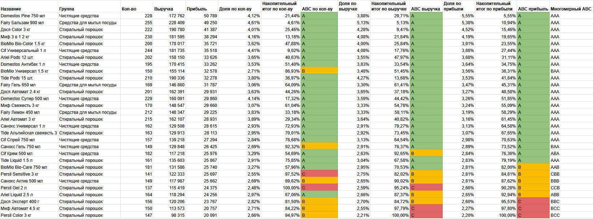

## Описание
Учебная практика ABC/XYZ анализа товаров в условном универмаге (данные сгенерированы). В качестве инструмента будет использоваться Google Sheets (то же самое можно сделать и в Microsoft Excel).

## ABC анализ

### Шаг 1 - знакомство с данными
Ссылка на таблицу: [ABC-анализ товаров](https://docs.google.com/spreadsheets/d/1DnzNj7_R0t7i9WGvGnz2XpRccWvZky0n7IT8cUlJxS0/edit?usp=sharing)

На листе "Source data" представлены изначальные данные, с которыми мы будем работать. У нас имеется несколько товарных групп в отделе чистящих и моющих средств с конкретными наименованиями товаров, кол-вом продаж, а также выручкой и прибылью (в рублях или тысячах рублей, как кому удобнее).


### Шаг 2 - расчёт ABC по кол-ву проданных товаров
Считаем доли по кол-ву проданных товаров (делим ячейку кол-ва на сумму столбца), называем столбец "Доля по кол-ву", производим сортировку по этому столбцу по убыванию. После этого считаем накопительный итог долей по кол-ву и выводим в отдельный столбец (суммируем ячейку доли по кол-ву с предыдущей в столбце накопительного итога, что должно в конце привести к итогу в 100%).


В ABC анализе применяется распределение Парето: в первые 80% входят самые продаваемые товары (категория А), в следующие 15% входят менее продаваемые товары (категория B), а в последние 5% - наименее продаваемые товары (категория C).

Создаём столбец "ABC кол-во" и применяем к нему следующую формулу:

``` 
=IF(H3<0,8;"A";IF(H3<0,95;"B";"C"))
```

После этого растягиваем формулу до конца и применяем условное форматирование для наглядности:


### Шаг 3 - расчёт ABC по выручке
Проделываем все те же действия, что и на предыдущем шаге, но применительно к столбцу "Выручка". Получаем следующий результат:


Распределение Парето здесь следующее: в первые 80% входят товары с самой большой выручкой (категория А), в следующие 15% входят товары с меньшей выручкой (категория B), а в последние 5% - товары с самой низкой долей выручки (категория C).

### Шаг 4 - расчёт ABC по прибыли
Ещё раз проделываем те же действия применительно к столбцу "Прибыль" и получаем следующий результат:


### Шаг 5 - многомерный ABC анализ
Копируем значения из предыдущих таблиц (не формулы!) в итоговую таблицу (на листе "ABC готовая таблица"), сортируем таблицу по столбцу "Доля по прибыли", после чего добавляем столбец "Многомерный ABC", значения в который конкатенируем из других ABC столбцов:

``` 
=I3&L3&O3
```

Получаем вот такую таблицу:



После чего на основе данной таблицы формируем сводную таблицу на новом листе ("ABC сводная таблица"), в строки добавляем столбец "Многомерный ABC" и его же в значения:


Также можно для наглядности добавить диаграмму в дополнение к сводной таблице:


### Выводы по ABC анализу
1. Наблюдается большая доля товаров категории ААА, что отлично, так как они приносят стабильную прибыль. Можно попробовать немного поднять на них цену и понаблюдать, понизятся ли их показатели продаж или же прибыль увеличится дополнительно.
2. Товары категорий BAA/ABA/AAB можно попробовать продвинуть в AAA, например, переместив их на более видные места для покупателей или договорившись о скидке с поставщиками.
3. Товары категорий BCC, CCB, CBB нужно перепроверить, возможно, они просто занимают место и имеют низкий спрос, поэтому их можно будет изъять с полок и заменить новыми позициями (сыграет фактор новизны).
4. После внесения изменений нужно проводить ABC анализ регулярно (еженедельно или ежемесячно), чтобы отследить влияние изменений и откатить их, если это понизило категорию. Нужно стремиться, чтобы как можно больше товаров подтягивались до группы ААА.
5. В дополнение к ABC анализу крайне желательно проводить XYZ анализ, если есть данные о продажах по датам и складских остатках. Вполне может быть, что товары из слабых категорий являются таковыми из-за недостаточных запасов на складах, несмотря на хороший спрос.

## XYZ анализ по прибыли

Теперь попробуем провести XYZ анализ с теми же товарами в разрезе приносимой ими прибыли по месяцам в течение года, затем сопоставить результат с ABC анализом.

### Шаг 1 - исходные данные
Ссылка на таблицу: [XYZ-анализ товаров](https://docs.google.com/spreadsheets/d/111NM2aarqhha3ggo3wnhRbUzq94ObRHhqRwFhluetfc/edit?usp=sharing)

У нас имеется таблица с теми же товарами (на листе "Source data"), но уже с данными по прибыли по месяцам в течение года (с округлением до целых чисел). Нам нужно выяснить, насколько колеблется прибыль в зависимости от месяца, дабы выявить стабильность спроса на конкретные товары. Затем товары можно будет распределить на XYZ категории.


### Шаг 2 - расчёт XYZ по коэффициенту вариации прибыли
Создаём столбец "Коэффициент вариации" и считаем его для каждого товара по следующей формуле:

``` 
=STDEV(D3:O3)/AVERAGE(D3:O3)
```

Применяем следующее распределение: в категорию X попадают товары с коэффициентом 0-10% (прибыль колеблется незначительно), в категорию Y попадают товары с коэффициентом 10-25% (прибыль колеблется вплоть до четверти от среднего значения), а в категорию Z - ттовары с коэффицентом вариативности более 25% (прибыль колеблется значительно, спрос непредсказуем). Выводим категории в отдельный столбец и применяем условное форматирование для наглядности, получаем следующую таблицу (лист "XYZ готовая таблица"):


### Шаг 3 - сводная XYZ таблица
Создаём сводную таблицу и добавляем гистограмму (лист "XYZ сводная таблица"):


### Шаг 4 - матрица из ABC и XYZ
Теперь попробуем распределить наши товары одновременно по ABC и ХYZ категориям, взяв ABC по прибыли из предыдущего [документа](https://docs.google.com/spreadsheets/d/1DnzNj7_R0t7i9WGvGnz2XpRccWvZky0n7IT8cUlJxS0/edit?usp=sharing), применяем сортировку и получаем следующую таблицу (на листе "ABC+XYZ таблица"):


На основе этой таблицы формируем матрицу (на листе "ABC+XYZ матрица"):


### Выводы по ABC+XYZ анализу
1. Два товара в категории AX - самые ценные, т. к. приносят больше всего прибыли и спрос на них не колеблется в течение года, поэтому они всегда должны быть в наличии.
2. Большинство товаров находятся в категории AY - это крепкие середнячки, которые могут перейти в категорию выше, если простимулировать их продажи (например, расположив на более видных местах в магазине на уровне глаз).
3. Есть 3 товара в категории BY - они требуют дополнительного анализа, т. к. спрос на них может колебаться по разным причинам (например, в зависимости от рекламных кампаний производителя).
4. Остальные товары попали в категории BZ, CY, CZ - спрос на них непредсказуем, а вклад в прибыль невысокий, это потенциальные кандидаты на выбывание из ассортимента магазина.

Конечно же, нельзя называть данный анализ исчерпывающим и точным, т. к. в исходных данных не были представлены доступность товара на складах и регулярность поставок, что тоже может оказать значительное влияние на распределение.