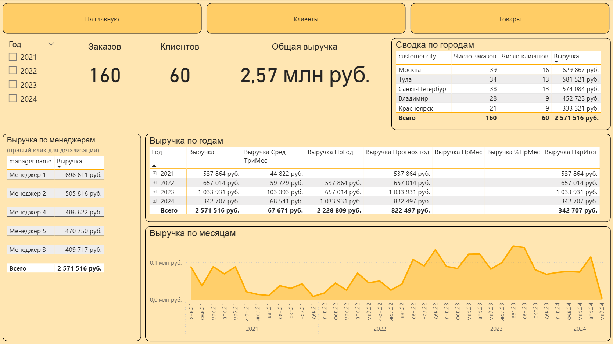

### Введение
Учебная практика по Power BI.

Контекст: в данном проекте представлен отчёт о деятельности условной компании за несколько лет (2021-2024 гг., все данные сгенерированы). В первую очередь нужно отобразить показатели выручки по годам, городам, клиентам и менеджерам.

Описание исходной таблицы с данными (находится в папке `data`):
|Столбец|Описание|Формат данных|
|---|---|---|
|`order.id`|Идентификатор заказа (повторяется, т. к. каждый товар в заказе представлен отдельной строкой)|Целое число|
|`order.date.create`|Дата создания заказа|Дата|
|`order.date.close`|Дата закрытия (выполнения) заказа|Дата|
|`manager.id`|Идентификатор менеджера|Целое число|
|`manager.name`|Имя менеджера|Текст|
|`customer.id`|Идентификатор клиента|Целое число|
|`customer.name`|Имя клиента|Текст|
|`customer.birthday`|День рождения клиента|Дата|
|`customer.city`|Город клиента|Текст|
|`items.id`|Идентификатор товара|Целое число|
|`items.quantity`|Количество товара|Целое число|
|`items.cost`|Цена товара (в рублях)|Целое число|
|`order.sum`|Сумма (цена товара, помноженная на кол-во товара)|Целое число|

### Выгрузка данных в модель
С помощью Power Query исходная таблица была разделена на несколько новых (проведена нормализация): 

- Заказы
- Менеджеры
- Клиенты
- Товары

А также созданы вспомогательные виртуальные таблицы (в самом Power BI):

- Календарь (т. к. в таблице есть дни рождения, они будут смешиваться с датами заказов, если использовать быстрое создание календаря)
- Корзина (для составления часто встречающихся в одном заказе пар товаров)

Итоговая модель:

### Страница отчёта о выручке

На данной странице представлены сведения о деятельности компании, относящиеся к выручке:

- Фильтр по году (если не выбран год, отображаются данные за всё время)
- Ключевые показатели: кол-во заказов, кол-во клиентов, общая выручка
- Таблица по городам клиентов (даёт представление о том, какие города приносят больше всего выручки)
- Таблица выручки по менеджерам (показывает, какой вклад в выручку внёс каждый менеджер компании; отдельно ниже будет представлена страница с детализацией по конкретному менеджеру)
- Таблица выручки по годам с различными мерами, такими как скользящее среднее за три месяца, выручка за прошлый год, прогнозируемая выручка до конца года, выручка за прошлый месяц (если раскрыть год), выручка в процентном соотношении к предыдущему месяцу (если раскрыть год), выручка с нарастающим итогом (за год, если раскрыть)
- График выручки по месяцам (изменяется при выборе года или месяца в отчёте)

### Детализация по менеджеру

Если в таблице "Выручка по менеджерам" кликнуть правой кнопкой мыши по менеджеру, можно перейти на страницу детализации:

Здесь представлены следующие элементы:

- Фильтр по году
- Ключевые показатели: выручка, процент выручки к общей, число обслуженных клиентов, число закрытых заказов
- График выручки менеджера по месяцам
- Таблица работы менеджера по городам (позволяет понять, в каком городе менеджер привлёк больше всего выручки и клиентов)
- Таблица клиентов менеджера (позволяет узнать, сколько выручки принесли клиенты, с которыми работал менеджер)

### Страница отчёта о клиентах

На данной странице представлены сведения, относящиеся к клиентам компании:

- Фильтр по году
- Ключевые показатели (нужно выбрать год для корректного отображения): число активных клиентов, число новых клиентов, число постоянных клиентов, процент клиентов с несколькими заказами
- Таблица выручки и числа заказов по городам клиентов (даёт представление о том, какие города в среднем принесли больше выручки и заказов на клиента)
- Таблица выручки и заказов по клиентам (показывает, какие клиенты принесли больше всего выручки и чаще оформляли заказы)
- Таблица динамики клиентов (показывает, как с годами изменялось кол-во активных, новых и постоянных клиентов)
- График динамики активных клиентов по месяцам

### Страница отчёта о товарах

На данной странице представлены сведения о товарах:

- Фильтр по году
- Ключевые показатели: кол-во суммарно проданных товаров, кол-во уникальных позиций товаров, общая выручка от продажи товаров
- Таблица топ-5 товаров по выручке, куда также включен дополнительный столбец, показывающий процент попадания товара в первый заказ клиента
- Таблица выручки и числа заказов по товарам (позволяет в целом посмотреть, сколько выручки принёс каждый товар и насколько часто его выбирали)
- Таблица пар товаров (показывает, какие пары товаров чаще всего встречаются в заказах клиентов)