### Выгрузить датасет в PostgreSQL

1. Используя терминал, переходим в папку `postgres_churn_db_container`
2. Запускаем контейнер PostgreSQL в Docker следующей командой в терминале:
   ```
   docker-compose up -d
   ```

Есть 2 варианта импорта нашего CSV датасета в БД:

**Вариант 1** - вручную создать таблицу (через DBeaver или pgAdmin), затем python скриптом перенести данные в уже подготовленную таблицу, после чего вручную создать представления (views). Если вместо Postgres использовать Microsoft SQL Server, то в нём есть встроенный интструмент импорта, что убирает надобность в импорте через скрипт, однако не все пользуются решением от Microsoft и предпочитают open-source решения (коим является Postgres).

**Вариант 2** - перенести данные из CSV файла только через python скрипт (например, с помощью библиотек `sqlaclhemy` или `duckdb`). Такой вариант предпочтительнее, т. к. убирает ручной ввод всех запросов (как в предыдущем варианте). Этим вариантом мы и воспользуемся.

3. Запускаем через терминал виртуальное окружение python командой:
   ```
   .venv\Scripts\activate 
   ```
   
4. Через терминал переходим в папку `scripts` и запускаем скрипт переноса данных в БД командой:
   ```
   py import_from_csv_to_postgres.py
   ```
   Также этот скрипт создаёт следующие схемы для БД:
      - **stg** - сырые данные из датасета
      - **prod** - обработанные данные
      - **dm** - схема для витрин данных, туда мы поместим представления для PowerBI

5. После успешного переноса подключаемся к БД через DBeaver или pgAdmin, чтобы проверить данные в таблице (имя пользователя и пароль - postgres)
   
   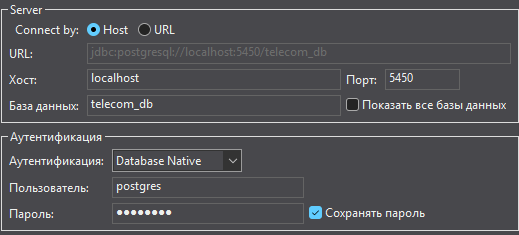

   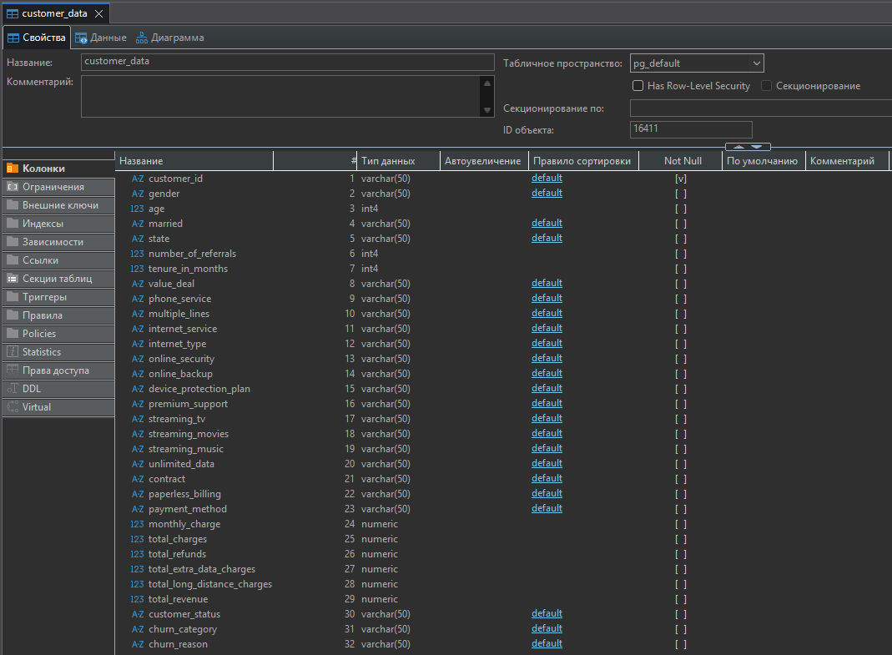

   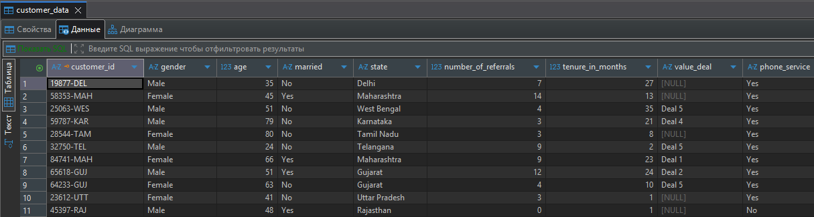

### Провести очистку и подготовку данных в виде представлений (views) для передачи в PowerBI

Заранее скажу, что в датасете нет аномальных или битых значений, только пропуски, что сильно упрощает задачу. Вы можете провести разведочный анализ (EDA) самостоятельно, выгрузив датасет в датафрейм pandas или средствами SQL после импорта датасета в Postgres.

Нужно заменить пропуски, т. к. для машинного обучения пропуски недопустимы. Если хотите пропустить этот этап, то просто запустите скрипт `refine_data_and_create_views_in_postgres.py` и переходите к следующему разделу.

Альтернативно можно было бы обработать данные ещё на этапе датафрейма в скрипте `import_from_csv_to_postgres.py` и передать в Postgres уже готовые данные, но мы сделаем это через SQL.

Итак, начнём:

1. Сначала проверим наличие и количество `NULL` значений в столбцах
   ```
   SELECT 
      SUM(CASE WHEN customer_id IS NULL THEN 1 ELSE 0 END) AS customer_id_null_count,
      SUM(CASE WHEN gender IS NULL THEN 1 ELSE 0 END) AS gender_null_count,
      SUM(CASE WHEN age IS NULL THEN 1 ELSE 0 END) AS age_null_count,
      SUM(CASE WHEN married IS NULL THEN 1 ELSE 0 END) AS married_null_count,
      SUM(CASE WHEN state IS NULL THEN 1 ELSE 0 END) AS state_null_count,
      SUM(CASE WHEN number_of_Referrals IS NULL THEN 1 ELSE 0 END) AS number_of_referrals_null_count,
      SUM(CASE WHEN tenure_in_months IS NULL THEN 1 ELSE 0 END) AS tenure_in_months_null_count,
      SUM(CASE WHEN value_deal IS NULL THEN 1 ELSE 0 END) AS value_deal_null_count,
      SUM(CASE WHEN phone_service IS NULL THEN 1 ELSE 0 END) AS phone_service_null_count,
      SUM(CASE WHEN multiple_lines IS NULL THEN 1 ELSE 0 END) AS multiple_lines_null_count,
      SUM(CASE WHEN internet_service IS NULL THEN 1 ELSE 0 END) AS internet_service_null_count,
      SUM(CASE WHEN internet_type IS NULL THEN 1 ELSE 0 END) AS internet_type_null_count,
      SUM(CASE WHEN online_security IS NULL THEN 1 ELSE 0 END) AS online_security_null_count,
      SUM(CASE WHEN online_backup IS NULL THEN 1 ELSE 0 END) AS online_backup_null_count,
      SUM(CASE WHEN device_protection_plan IS NULL THEN 1 ELSE 0 END) AS device_protection_plan_null_count,
      SUM(CASE WHEN premium_support IS NULL THEN 1 ELSE 0 END) AS premium_support_null_count,
      SUM(CASE WHEN streaming_tv IS NULL THEN 1 ELSE 0 END) AS streaming_tv_null_count,
      SUM(CASE WHEN streaming_movies IS NULL THEN 1 ELSE 0 END) AS streaming_movies_null_count,
      SUM(CASE WHEN streaming_music IS NULL THEN 1 ELSE 0 END) AS streaming_music_null_count,
      SUM(CASE WHEN unlimited_data IS NULL THEN 1 ELSE 0 END) AS unlimited_data_null_count,
      SUM(CASE WHEN contract IS NULL THEN 1 ELSE 0 END) AS contract_null_count,
      SUM(CASE WHEN paperless_billing IS NULL THEN 1 ELSE 0 END) AS paperless_billing_null_count,
      SUM(CASE WHEN payment_method IS NULL THEN 1 ELSE 0 END) AS payment_method_null_count,
      SUM(CASE WHEN monthly_charge IS NULL THEN 1 ELSE 0 END) AS monthly_charge_null_count,
      SUM(CASE WHEN total_charges IS NULL THEN 1 ELSE 0 END) AS total_charges_null_count,
      SUM(CASE WHEN total_refunds IS NULL THEN 1 ELSE 0 END) AS total_refunds_null_count,
      SUM(CASE WHEN total_extra_data_charges IS NULL THEN 1 ELSE 0 END) AS total_extra_data_charges_null_count,
      SUM(CASE WHEN total_long_distance_charges IS NULL THEN 1 ELSE 0 END) AS total_long_distance_charges_null_count,
      SUM(CASE WHEN total_revenue IS NULL THEN 1 ELSE 0 END) AS total_revenue_null_count,
      SUM(CASE WHEN customer_status IS NULL THEN 1 ELSE 0 END) AS customer_status_null_count,
      SUM(CASE WHEN churn_category IS NULL THEN 1 ELSE 0 END) AS churn_category_null_count,
      SUM(CASE WHEN churn_reason IS NULL THEN 1 ELSE 0 END) AS churn_reason_null_count
   FROM stg.customer_data
   ```
   В результате узнаём, что есть `NULL` значения в следующих столбцах: `value_deal`, `multiple_lines`, `internet_type`, `online_security`, `online_backup`, `device_protection`, `premium_support`, `streaming_tv`, `streaming_movies`, `streaming_music`, `unlimited_data`, `churn_category`, `churn_reason`

2. Теперь заменим `NULL` значения на текст и скопируем их в новую таблицу в схеме `prod`
   ```
   CREATE TABLE IF NOT EXISTS prod.customer_data_refined AS
   (
      SELECT 
         customer_id,
         gender,
         age,
         married,
         state,
         number_of_referrals,
         tenure_in_months,
         COALESCE(value_deal, 'None') AS value_deal,
         phone_service,
         COALESCE(multiple_lines, 'No') As multiple_lines,
         internet_service,
         COALESCE(internet_type, 'None') AS internet_type,
         COALESCE(online_security, 'No') AS online_security,
         COALESCE(online_backup, 'No') AS online_backup,
         COALESCE(device_protection_plan, 'No') AS device_protection_plan,
         COALESCE(premium_support, 'No') AS premium_support,
         COALESCE(streaming_tv, 'No') AS streaming_tv,
         COALESCE(streaming_movies, 'No') AS streaming_movies,
         COALESCE(streaming_music, 'No') AS streaming_music,
         COALESCE(unlimited_data, 'No') AS unlimited_data,
         contract,
         paperless_billing,
         payment_method,
         monthly_charge,
         total_charges,
         total_refunds,
         total_extra_data_charges,
         total_long_distance_charges,
         total_revenue,
         customer_status,
         COALESCE(churn_category, 'Others') AS churn_category,
         COALESCE(churn_reason , 'Others') AS churn_reason
      FROM stg.customer_data
   )
   ```

3. Осталось добавить представления в схему `dm` для дальнейшего использования в PowerBI
   ```
   CREATE OR REPLACE VIEW dm.vw_churn_data AS
      SELECT * 
      FROM prod.customer_data_refined 
      WHERE customer_status IN ('Churned', 'Stayed');

   CREATE OR REPLACE VIEW dm.vw_join_data AS
      SELECT * 
      FROM prod.customer_data_refined 
      WHERE customer_status = 'Joined';
   ```

Готово, можно переходить к следующему разделу.

### Создать ML модель для прогнозирования оттока клиентов

Для обучения модели нам понадобятся представления из предыдущего раздела. Их можно загрузить в датафрейм двумя способами:
1. Вручную сделать экспорт представлений из БД сторонними средствами (например, через экспорт данных в DBeaver; при этом в папке `resources/data` я оставил готовые файлы `vw_churn_data.csv` и `vw_join_data.csv`)
2. Если вы запускали скрипт `refine_data_and_create_views_in_postgres.py`, то нужные файлы тоже будут в папке `resources/data` (они перезапишут существующие, чтобы не пришлось переписывать скрипт)

Все дальнейшие шаги будут описаны в ноутбуке `churn_prediction.ipynb` в папке `resources` 
Jupyter Notebook можно запустить через различные IDE или программы для работы с этим форматом; в моём случае я использовал VS Code с расширением Jupyter. Также для ноутбука нужно будет указать ядро выполнения python из папки `.venv`

Как только ознакомитесь с ноутбуком и выполните в нём все ячейки, переходите к следующему разделу.
В случае, если вы забыли это сделать, в папке `resources/data` останется мой файл `churn_prediction_data.csv` с готовым результатом.

### Создать дашборд в PowerBI

Остался последний шаг - создать отчёт в PowerBI, подключить к нему наши источники данных и создать отчёты с анализом оттока клиентов в целом и прогнозом оттока по нашей ML модели.

Вы можете открыть готовый отчёт `telecom_churn_analysis.pbix` в PowerBI и посмотреть на итоговый результат.

##### Подключение источника данных и преобразование

Для начала подключим источник данных и проведём некоторые изменения через PowerQuery:

1. Открываем PowerBI и подключаем PostgreSQL, нажав кнопку "Получить данные" (после нажатия кнопки "ОК" в следующем окне введите логин и пароль `postgres`)
   
   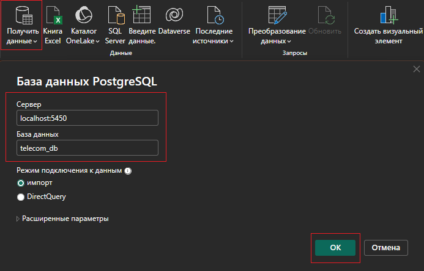

2. Выбираем таблицу с обработанными данными, но вместо "ОК" нажимаем "Преобразовать данные" (откроется окно PowerQuery)
   
   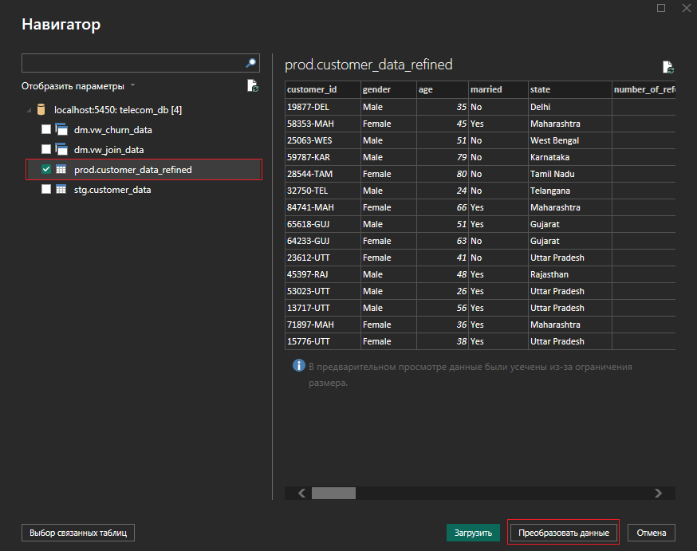

3. В PowerQuery добавляем настраиваемый столбец со следующими параметрами

   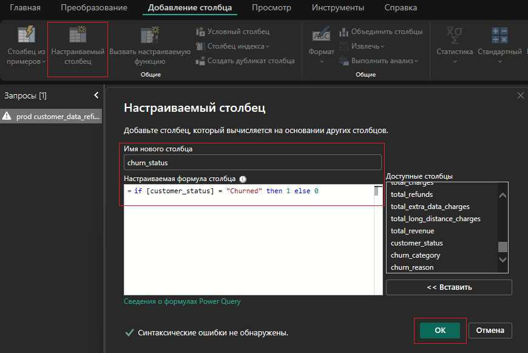

   Не забываем сменить тип данных нового с толбца с "Общий" на "Целое число"

   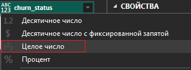

4. Теперь добавляем ещё один настраиваемый столбец

   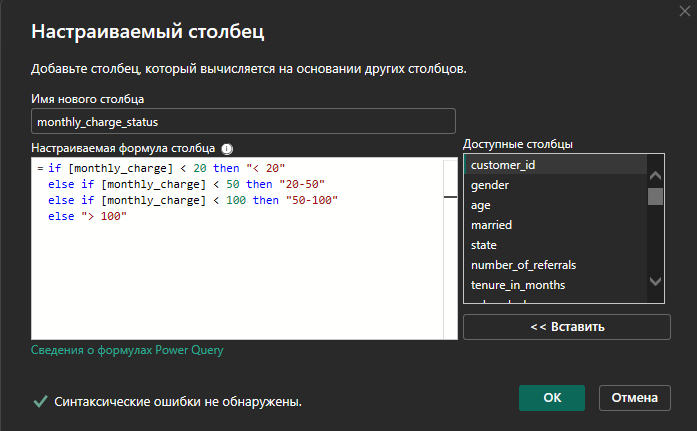

5. При создании отчёта нам понадобится разделение клиентов по возрастным группам. Для этого мы создаём ссылку на основную таблицу `customer_data_refined` и переименуем её в `map_age_group`. Далее удаляем все столбцы, кроме `age`, и удаляем в столбце `age` все дубликаты. В конце добавляем следующий настраиваемый столбец:
   
   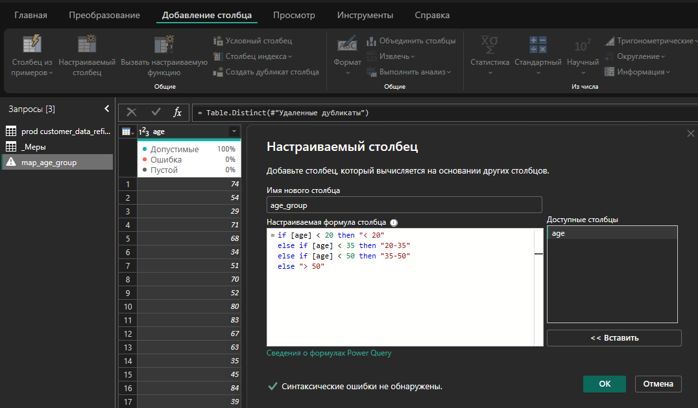

   Чтобы сортировка по группам на графиках в отчёте отображалась корректно, необходимо добавить ещё один настраиваемый столбец:

   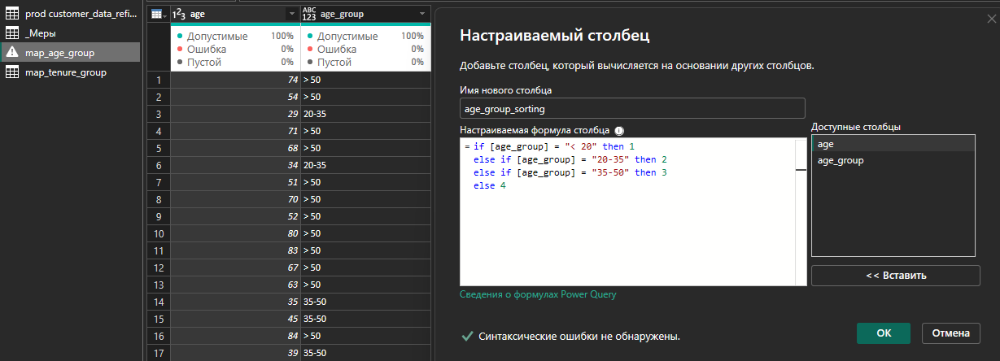

6. Аналогично создадим ссылочную таблицу `map_tenure_group`, чтобы в отчёте разделить клиентов на группы по сроку пользования услугами:

   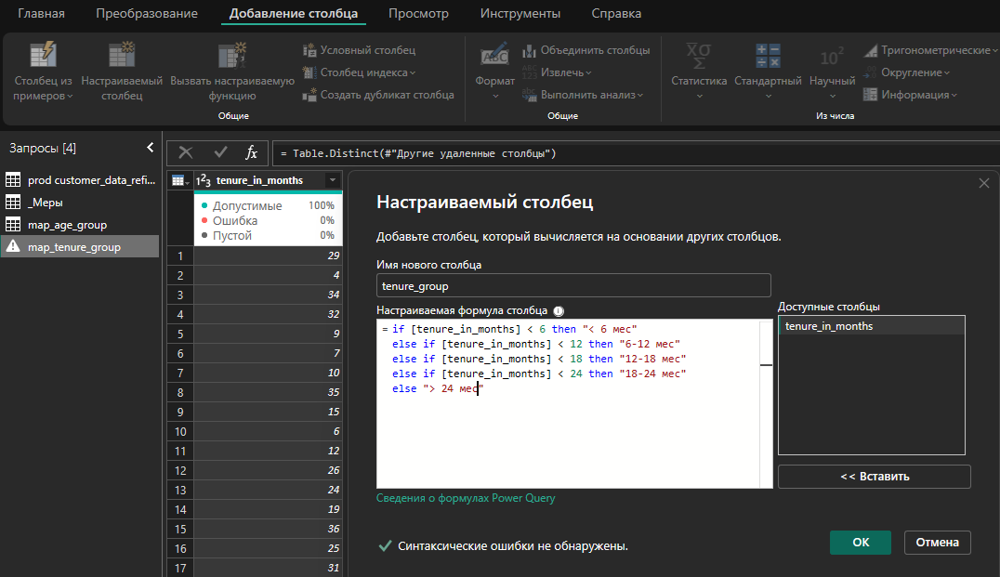

   Добавляем столбец для сортировки:

   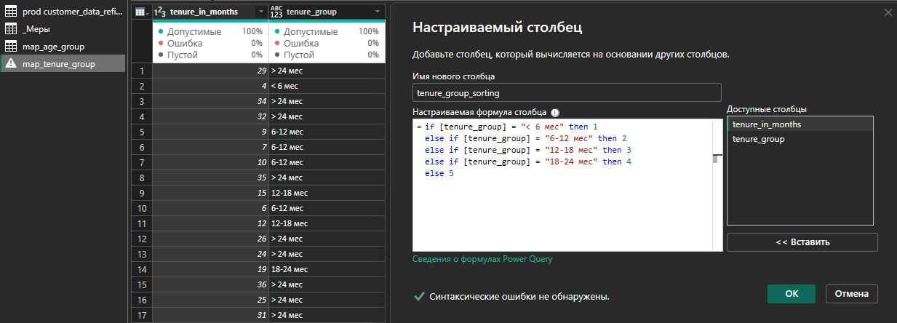

7. Осталось добавить ссылочную таблицу для отчёта по всем типам услуг. Создаём ссылку на основную таблицу `customer_data_refined` и переименуем её в `services`. В этой ссылочной таблице выберите все столбцы с услугами, зажав клавишу Ctrl (в этих столбцах значения равны "Yes" или "No"), после чего на вкладке "Преобразование" нажмите кнопку "Отменить свёртывание столбцов" (Unpivot columns) для выбранных столбцов. Получившиеся столбцы "Атрибут" и "Значение" мы переименуем в "services" и "service_status".

   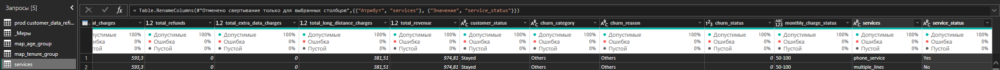

8. После этого на вкладке "Главная" нажимаем кнопку "Закрыть и применить", чтобы вернуться в PowerBI

   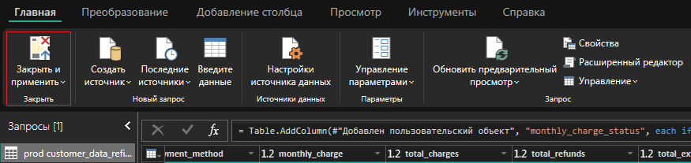

##### Создание мер

Теперь нам нужно создать меры, которые будут представлены в будущем отчёте:

1. На главной странице PowerBI нажимаем кнопку "Введите данные" и добавляем пустую таблицу с именем "_Меры" (это будет папка для хранения мер в нашем отчёте)
   
   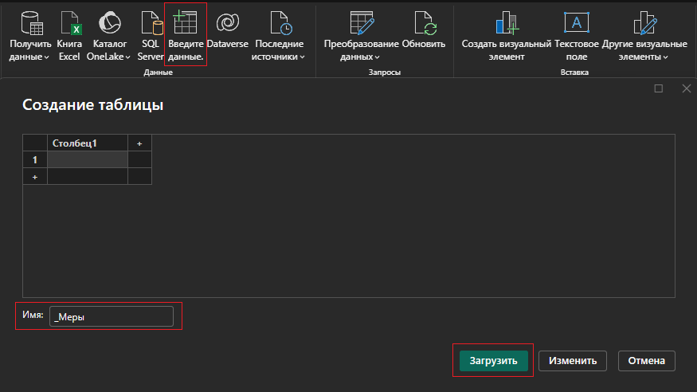

2. Создаём для таблицы "_Меры" (нажав по троеточию) новую меру "Total Customers" (всего клиентов) со следующими параметрами:
   ```
   Total Customers = COUNT('prod customer_data_refined'[customer_id])
   ```

   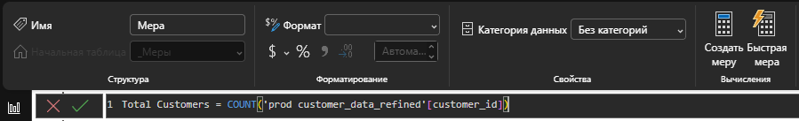

3. Далее создаём ещё одну меру с именем "New Joiners" (новые клиенты) со следующими параметрами:
   ```
   New Joiners = CALCULATE(COUNT('prod customer_data_refined'[customer_id]), 'prod customer_data_refined'[customer_status] = "Joined")
   ```

   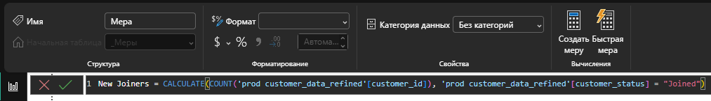

4. Создаём ещё одну меру с именем "Total Churn" (всего отказавшихся) со следующими параметрами:
   ```
   Total Churn = SUM('prod customer_data_refined'[churn_status])
   ```

   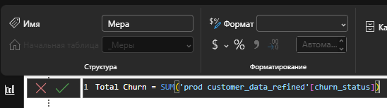

5. И, наконец, создаём ещё одну меру с именем "Churn Rate" (процент оттока) со следующими параметрами:
   ```
   Churn Rate = [Total Churn] / [Total Customers] 
   ```

   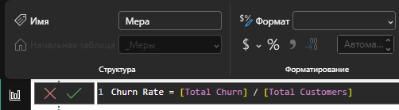

##### Визуализация основного отчёта

Теперь мы можем визуализировать основную часть отчёта используя имеющиеся у нас меры и данные из таблицы. Здесь вы можете проявить креативность и расположить элементы, как вам угодно. Я покажу свой вариант, чтобы вы имели представление, как должен выглядеть итоговый результат.

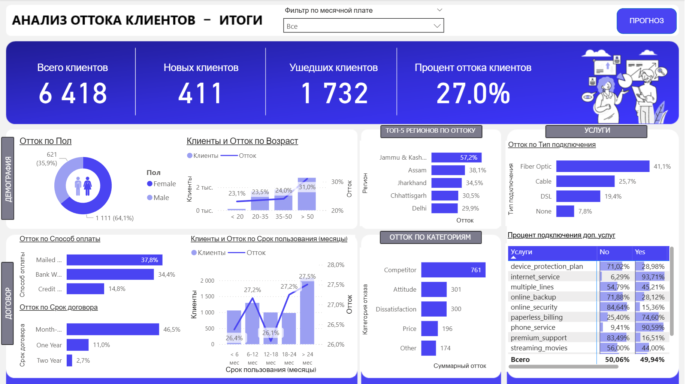

Какие выводы мы можем сделать при взгляде на данный отчёт:
1. Женщины уходят чаще мужчин
2. Чаще уходят пользователи со сроком пользования до года, либо с большим сроком пользования от 18 мес, а также клиенты с краткосрочными договорами (на один месяц)
3. Самая частая причина отказа от услуг - "Конкуренты"

Проанализировав вышесказанное, можно дать следующие рекомендации:
1. Скорректировать рекламные кампании, ориентированные на женскую аудиторию
2. Предлагать новым клиентам более выгодные условия при заключении долгосрочных договоров, а для старых клиентов - разработать программу лояльности
3. Уделить отдельное внимание изучению конкурентов (цены, условия, оборудование), чтобы повысить собственную конкурентоспособность

##### Подключение данных о прогнозе оттока

Данные, полученные в результате работы модели из ноутбука `churn_prediction.ipynb`, необходимо добавить в наш отчёт в PowerBI.

1. Для этого в меню "Получить данные" на главной вкладке отчёта выбираем "Текстовый или CSV файл" (напоминаю, что файл называется `churn_prediction_data.csv` и находится в папке `resources/data`). В PowerQuery нужно будет поменять тип данных в нескольких столбцах (таких как `monthly_charge`) на десятичные числа с локалью "Английский (США)", иначе расчёты в таблице отчёта будут отображены некорректно (как текст).
   
2. Теперь добавим меру для подсчёта прогнозируемого оттока клиентов:
   
   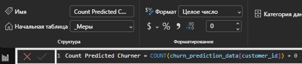

3. Также добавляем меру, которая станет заголовком для одного из элементов отчёта:
   
   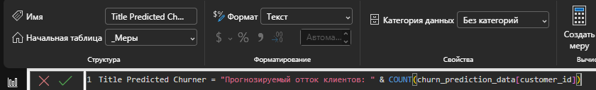

Теперь мы можем скомпоновать готовый прогноз:

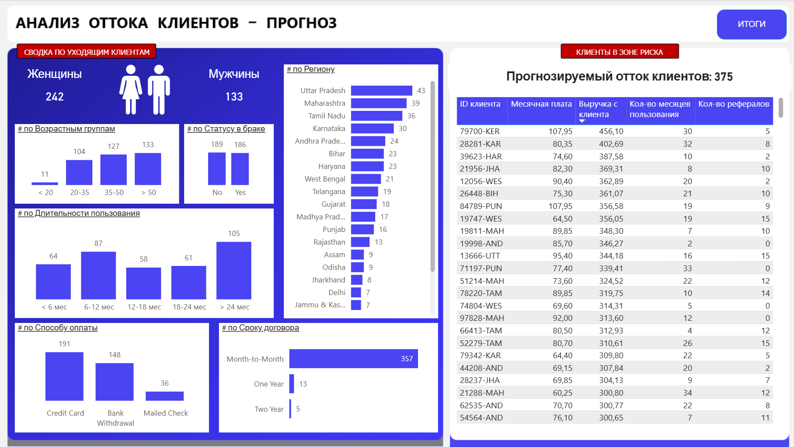

Имея подобные данные, можно начать точечно работать с клиентами, приносящими больше всего выручки или с наибольшей платой в месяц. Можно начать с опросов о качестве обслуживания по телефону или электронной почте, чтобы в дальнейшем разработать персонализированные предложения для потенциально уходящих клиентов. Таким образом можно добиться снижения оттока.