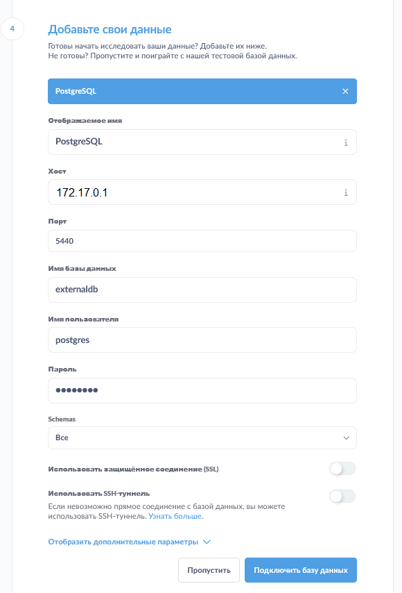
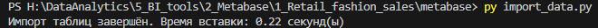

### Описание
Практика аналитики с помощью BI инструмента Metabase.

Контекст: имеется датасет магазина модной одежды, нужно его проанализировать и составить дашборд.

Для запуска требуется Docker (мы будем использовать `docker-compose`) и Python (для импорта данных в PostgreSQL).

Ссылка на датасет: [Kaggle](https://www.kaggle.com/datasets/pratyushpuri/retail-fashion-boutique-data-sales-analytics-2025)

Описание таблицы датасета (находится в папке `metabase/data`):
|Столбец|Описание|Формат данных|
|---|---|---|
|`product_id`|Уникальный идентификатор товара (FB000001-FB002176)|Строка/текст|
|`category`|Категория товара (платье, верхняя одежда, обувь и т. п.)|Строка/текст|
|`brand`|Бренд (Zara, H&M и т. п.)|Строка/текст|
|`season`|Сезон коллекции (весна, лето, осень, зима)|Строка/текст|
|`size`|Размер одежды (XS, S, M, L, XL, XXL, или же Null для аксессуаров)|Строка/текст|
|`color`|Цвет одежды|Строка/текст|
|`original_price`|Изначальная цена товара (в долларах)|Число с точкой (Double/Numeric)|
|`markdown_percentage`|Процент скидки (0% - 59.9%)|Число с точкой (Double/Numeric)|
|`current_price`|Цена с учётом скидки (в долларах)|Число с точкой (Double/Numeric)|
|`purchase_date`|Дата покупки|Дата (без времени)|
|`stock_quantity`|Количество товара (остатки, 0 - 50 шт.)|Число с точкой (Double/Numeric)|
|`customer_rating`|Оценка/рейтинг покупателей (могут быть пропуски)|Число с точкой (Double/Numeric)|
|`is_returned`|Статус возврата товара (True/False)|Логическое (Boolean)|
|`return_reason`|Причина возврата (не подошёл размер, плохое качество, есть повреждения и т. п.)|Строка/текст|

### Подготовка и запуск проекта

#### Шаг 1 - развёртывание и запуск Metabase
1) Нужно склонировать данный проект к себе на ПК.
2) Далее нужно в терминале (например, в терминале Windows PowerShell, Docker или VS Code) перейти в папку `metabase` и запустить команду: 
` docker-compose up -d ` (это запустит все необходимые контейнеры для работы Metabase)
3) После этого можно открыть Metabase в браузере по адресу: http://localhost:3000
4) Далее потребуется заполнить форму первичной настройки: имя администратора, почту, пароль, имя организации. На шаге подключения к БД ввести следующие данные (или пропустить этот шаг и добавить подключение к БД позже):



Примечание: адрес хоста можно узнать командой в терминале ` docker network inspect bridge `, в строке "Gateway"; имя базы данных - `externaldb`, имя пользователя и пароль к БД - `postgres`

#### Шаг 2 - импорт данных из csv файла в PostgreSQL
1) В терминале в той же папке `metabase`, установить нужные зависимости для Python командой: 
    ` pip install -r requirements.txt `

2) Запустить скрипт командой: 
    ` py import_data.py `

    
    

3) Создать в Metabase новый SQL запрос (чтобы привести столбец `purchase_date` к типу даты вместо текста):
    
    ``` 
    ALTER TABLE fashion_boutique_sales
    ALTER COLUMN purchase_date TYPE date
    USING purchase_date::date
    ```

Готово. Можно приступать к работе с данными.