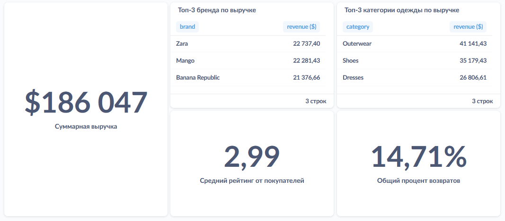

### Общие показатели
Для начала сделаем несколько простых запросов, чтобы поместить на дашборд важные показатели из датасета, такие как: общая выручка, топ-3 брендов/категорий по выручке, средний рейтинг от пользователей, общий процент возвратов.

Общая выручка:

``` 
SELECT
  SUM(current_price) AS revenue
FROM
  fashion_boutique_sales
```

Топ-3 бренда по выручке:

``` 
SELECT
  brand,
  SUM(current_price) AS revenue
FROM
  fashion_boutique_sales
WHERE
  is_returned = 'False'
GROUP BY
  brand
ORDER BY
  revenue DESC
LIMIT 3
```

Топ-3 категории одежды по выручке:

```
SELECT
  category,
  SUM(current_price) AS revenue
FROM
  fashion_boutique_sales
WHERE
  is_returned = 'False'
GROUP BY
  category
ORDER BY
  revenue DESC
LIMIT 3
```

Средний рейтинг от покупателей:

```
SELECT
  AVG(customer_rating) AS avg_rating
FROM
  fashion_boutique_sales
```

Общий процент возвратов (нужно в отображении поменять стиль на "Процент" и умножить на 0.01):

```
SELECT
  100.0 * COUNT(*) FILTER (
    WHERE
      is_returned = 'True'
  ) / COUNT(*) AS pct_of_returns
FROM
  fashion_boutique_sales
```

Результат:



Далее мы разделим дашборд на следующие разделы:
- ABC анализ (по выручке)
- RFM анализ
- Анализ рейтингов
- Анализ возвратов