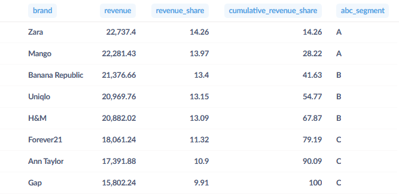
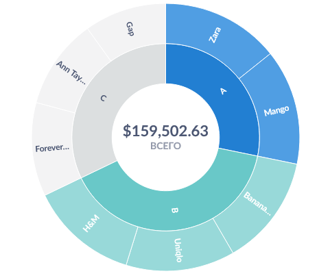
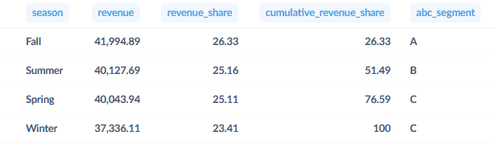
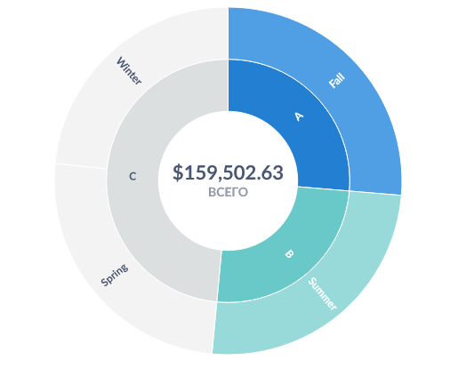
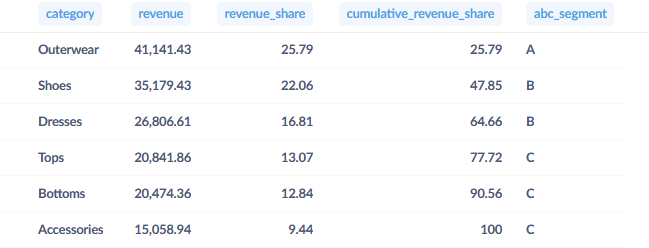
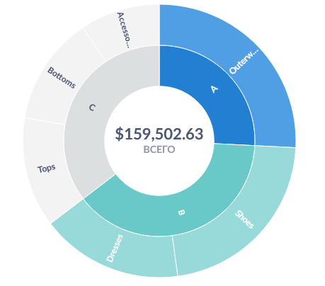
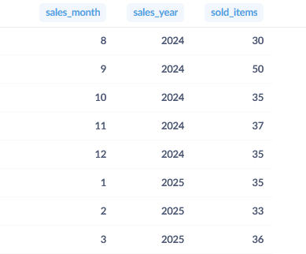
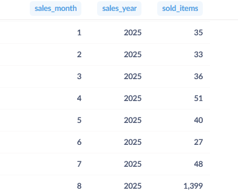

### ABC анализ по выручке
Проведём ABC анализ товаров, сгруппировав их по брендам, сезону коллекции одежды/аксессуаров и категории одежды/аксессуаров. Сумма чеков с учётом скидки (`current_price`) будет именоваться выручкой (`revenue`). Возвраты учитывать не будем.

Посчитав процент выручки каждой категории (`revenue_share`) в группировке и их накопительный итог (`cumulative_revenue_share`), можно будет определить их в ABC сегменты (`ABC_segment`).

Обычно распределение Парето таково, что в категорию А попадают товары, приносящие нам 80% выручки, но в этот раз распределение будет следующее:

- до 40% выручки приносят товары категории А
- следующие 30% приносят товары категории B
- остальное запишем в категорию C

Сперва сделаем группировку по брендам:

``` 
WITH
  grouped_brands AS (
    SELECT
      brand,
      SUM(current_price) AS revenue
    FROM
      fashion_boutique_sales
    WHERE
      is_returned = 'False'
    GROUP BY
      brand
  ),
  cumulative AS (
    SELECT
      *,
      100 * revenue / SUM(revenue) OVER () AS revenue_share,
      100 * SUM(revenue) OVER (
        ORDER BY
          revenue DESC
      ) / SUM(revenue) OVER () AS cumulative_revenue_share
    FROM
      grouped_brands
    ORDER BY
      cumulative_revenue_share ASC
  )
  
SELECT
  *,
  CASE
    WHEN cumulative_revenue_share < 40 THEN 'A'
    WHEN cumulative_revenue_share >= 40
    AND cumulative_revenue_share < 70 THEN 'B'
    ELSE 'C'
  END AS ABC_segment
FROM
  cumulative
```

Результат:



Добавим визуализацию через кольцевую диаграмму (piechart):



Пока что видно, что наибольшую выручку приносят товары брендов Zara и Mango.

Теперь проделаем то же самое, сгруппировав товары по сезону (увеличим условие для сегмента B на 5%, т. к. в выборке будут всего 4 сезона):

``` 
WITH
  grouped_seasons AS (
    SELECT
      season,
      SUM(current_price) AS revenue
    FROM
      fashion_boutique_sales
    WHERE
      is_returned = 'False'
    GROUP BY
      season
  ),
  cumulative AS (
    SELECT
      *,
      100 * revenue / SUM(revenue) OVER () AS revenue_share,
      100 * SUM(revenue) OVER (
        ORDER BY
          revenue DESC
      ) / SUM(revenue) OVER () AS cumulative_revenue_share
    FROM
      grouped_seasons
    ORDER BY
      cumulative_revenue_share ASC
  )
  
SELECT
  *,
  CASE
    WHEN cumulative_revenue_share < 40 THEN 'A'
    WHEN cumulative_revenue_share >= 40
    AND cumulative_revenue_share < 75 THEN 'B'
    ELSE 'C'
  END AS ABC_segment
FROM
  cumulative
```

Результат:



Визуализация:



На первый взгляд, наибольшую выручку показывает осенние и летние коллекции одежды, однако по таблице видно, что разница в долях выручки между сезонами в пределах 3%, что некритично.

И, наконец, сгруппируем товары по их категории (верхняя, платье, обувь, аксессуар и т. п.):

``` 
WITH
  grouped_categories AS (
    SELECT
      category,
      SUM(current_price) AS revenue
    FROM
      fashion_boutique_sales
    WHERE
      is_returned = 'False'
    GROUP BY
      category
  ),
  cumulative AS (
    SELECT
      *,
      100 * revenue / SUM(revenue) OVER () AS revenue_share,
      100 * SUM(revenue) OVER (
        ORDER BY
          revenue DESC
      ) / SUM(revenue) OVER () AS cumulative_revenue_share
    FROM
      grouped_categories
    ORDER BY
      cumulative_revenue_share ASC
  )
  
SELECT
  *,
  CASE
    WHEN cumulative_revenue_share < 40 THEN 'A'
    WHEN cumulative_revenue_share >= 40
    AND cumulative_revenue_share < 70 THEN 'B'
    ELSE 'C'
  END AS ABC_segment
FROM
  cumulative
```

Результат:



Визуализация:



Больше всего выручки принесла верхняя одежда, меньше принесли обувь и платья.

### По поводу XYZ анализа
В теории мы могли бы провести XYZ анализ, посчитав кол-во проданных товаров в разные месяцы, чтобы оценить спрос. Для этого нам нужно рассчитать коэффициент вариации, поделив стандартное отклонение на среднее кол-во продаж в группе (по бренду или категории одежды/аксессуаров).

Но перед этим проверим, как распределены продажи по месяцам:

``` 
WITH
  products AS (
    SELECT
      purchase_date,
      EXTRACT(
        MONTH
        FROM
          purchase_date
      ) AS sales_month,
      EXTRACT(
        YEAR
        FROM
          purchase_date
      ) AS sales_year,
      brand,
      product_id
    FROM
      fashion_boutique_sales
    WHERE
      is_returned = 'False'
  )
  
SELECT
  sales_month,
  sales_year,
  COUNT(product_id) AS sold_items
FROM
  products
GROUP BY
  sales_month,
  sales_year
ORDER BY
  sales_year,
  sales_month
```

Результат:



На первый взгляд, ничего необычного, но...



К сожалению, в августе 2025-го продажи свалены в кучу, что создаёт выброс, несовместимый с нужным нам методом расчёта. Поэтому XYZ анализ не получится применить к данному датасету.

По этой же причине нет смысла строить графики динамики числа продаж или выручки по дням/месяцам, т. к. они будут представлять собой почти прямую линию с резким взлётом в конце.