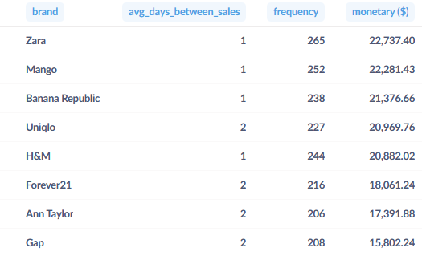
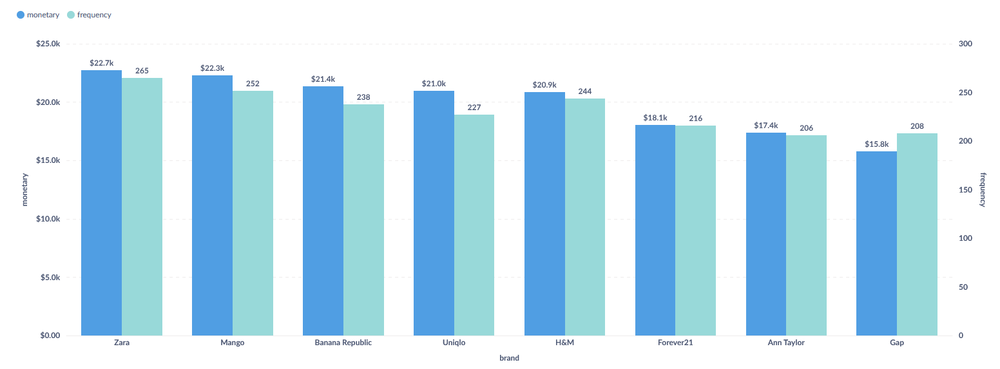
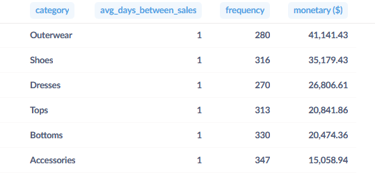
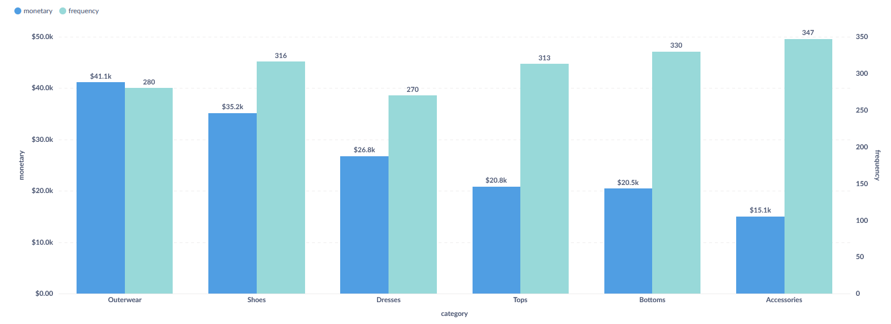

### RFM анализ по брендам и категориям
Проведём RFM анализ товаров, сгруппировав их по брендам и категории одежды/аксессуаров. Возвраты учитывать не будем.

RFM состоит из 3-х частей: 
- `recency` (в нашем случае это будет среднее кол-во дней между продажами или `avg_days_between_sales`) 
- `frequency` (кол-во продаж)
- `monetary` (выручка)

Сперва сделаем группировку по брендам:

``` 
WITH
  rfm_brands AS (
    SELECT
      brand,
      COUNT(product_id) AS frequency,
      SUM(current_price) AS monetary
    FROM
      fashion_boutique_sales
    WHERE
      is_returned = 'False'
    GROUP BY
      brand
  ),
  brand_diffs AS (
    SELECT
      brand,
      purchase_date,
      LAG(purchase_date) OVER (
        PARTITION BY
          brand
        ORDER BY
          purchase_date
      ) AS prev_date
    FROM
      fashion_boutique_sales
    WHERE
      is_returned = 'False'
  )

SELECT
  r.brand,
  ROUND(AVG(d.purchase_date - d.prev_date)) AS avg_days_between_sales,
  r.frequency,
  r.monetary
FROM
  rfm_brands r
  LEFT JOIN brand_diffs d ON r.brand = d.brand
GROUP BY
  r.brand,
  r.frequency,
  r.monetary
ORDER BY
  r.monetary DESC
```

Результат:



Так как среднее кол-во дней между продажами всего 1-2 дня, можно не добавлять этот показатель в визуализацию.

Добавим визуализацию через гистограмму:



Топ-3 по выручке составляют бренды Zara, Mango и Banana Republic.

Теперь проделаем то же самое, сгруппировав товары по категориям одежды:
``` 
WITH
  rfm_categories AS (
    SELECT
      category,
      COUNT(product_id) AS frequency,
      SUM(current_price) AS monetary
    FROM
      fashion_boutique_sales
    WHERE
      is_returned = 'False'
    GROUP BY
      category
  ),
  category_diffs AS (
    SELECT
      category,
      purchase_date,
      LAG(purchase_date) OVER (
        PARTITION BY
          category
        ORDER BY
          purchase_date
      ) AS prev_date
    FROM
      fashion_boutique_sales
    WHERE
      is_returned = 'False'
  )

SELECT
  r.category,
  ROUND(AVG(d.purchase_date - d.prev_date)) AS avg_days_between_sales,
  r.frequency,
  r.monetary
FROM
  rfm_categories r
  LEFT JOIN category_diffs d ON r.category = d.category
GROUP BY
  r.category,
  r.frequency,
  r.monetary
ORDER BY 
  r.monetary DESC
```

Результат:



Так как среднее кол-во дней между продажами везде равно 1, можно не включать этот показатель в визуализацию.

Визуализация:



Выводы получаются те же, что и в ранее проведённом ABC анализе.