### Анализ рейтингов по брендам и категориям
Так как в датасете имеется столбец с пользовательским рейтингом (`customer_rating`), попробуем сделать выводы о том, какие бренды или категории одежды имеют наивысшую оценку среди покупателей. Возвраты учитывать не будем.

Сперва сделаем группировку по брендам, учитывая только те продажи, где пользователи:

```
SELECT
  brand,
  AVG(customer_rating) AS avg_rating,
  COUNT(customer_rating) AS sales_count
FROM
  fashion_boutique_sales
WHERE
  customer_rating IS NOT NULL
GROUP BY
  brand
ORDER BY
  avg_rating DESC,
  sales_count DESC
```

Результат:

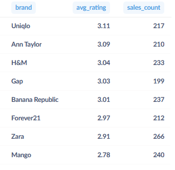

Добавим визуализацию через гистограмму:

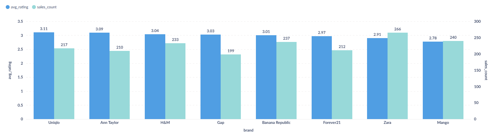

Средний рейтинг среди брендов держится около 3-х баллов, при этом фавориты по выручке (Zara, Mango) находятся в конце списка после сортировки по рейтингу.

Для сравнения включим в запрос даже те продажи, где пользователи не ставили оценок (вместо пустых значений вставим средний рейтинг по бренду):

```
WITH
  filled_ratings AS (
    SELECT
      brand,
      COALESCE(
        customer_rating,
        AVG(customer_rating) OVER (
          PARTITION BY
            brand
        )
      ) AS filled_rating
    FROM
      fashion_boutique_sales
    WHERE
      is_returned = 'False'
  )

SELECT
  brand,
  AVG(filled_rating) AS avg_rating,
  COUNT(*) AS sales_count
FROM
  filled_ratings
GROUP BY
  brand
ORDER BY
  avg_rating DESC,
  sales_count DESC
```

Результат:

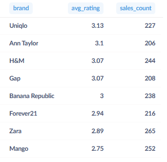

Визуализация:

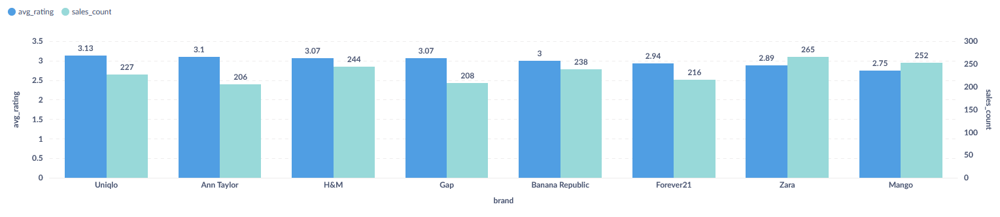

Видно, что число продаж увеличилось из-за включения покупок без оценок, но средний рейтинг остался практически тем же, что было ожидаемо.

Данный способ расчёта и визуализации не даст нам чёткого представления о том, какие оценки покупатели ставят тому или иному бренду.

Тогда попробуем вариант с сегментированием. Разделим оценки покупателей на следующие группы:
- Высокая (от 4,5 до 5 баллов)
- Средняя (от 3 до 4,5 баллов)
- Низкая (менее 3-х баллов)
- Без оценки

Эти группы представим в процентах и сгруппируем по бренду:

```
SELECT
  brand,
  100.0 * COUNT(*) FILTER (WHERE customer_rating >= 4.5) / COUNT(*) AS pct_high_rating,
  100.0 * COUNT(*) FILTER (WHERE customer_rating >= 3 AND customer_rating < 4.5) / COUNT(*) AS pct_mid_rating,
  100.0 * COUNT(*) FILTER (WHERE customer_rating < 3) / COUNT(*) AS pct_low_rating,
  100.0 * COUNT(*) FILTER (WHERE customer_rating IS NULL) / COUNT(*) AS pct_no_rating
FROM 
  fashion_boutique_sales
GROUP BY 
  brand
ORDER BY 
  pct_high_rating DESC
```

Результат:

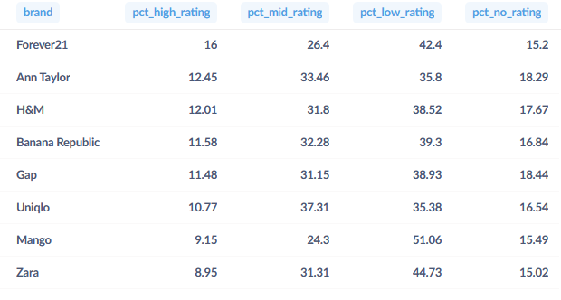

Визуализацию добавим в виде гистограммы с объединением столбцов ("Вид" -> "Объединение - 100%"):

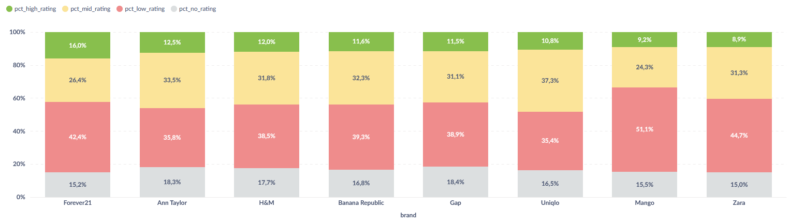

Такая визуализация намного лучше показывает, какие оценки ставят покупатели тем или иным брендам. Отсюда мы можем сделать 3 вывода:
1) Менее 19% покупателей по каждому бренду не ставят оценки
2) В структуре рейтингов наибольшую долю занимают низкие оценки (ниже 3-х баллов)
3) Несмотря на то, что Zara и Mango приносят наибольшую выручку (по результатам расчётов в предыдущих разделах), они на последних местах по доле высоких оценок (выше 4,5 баллов)

Теперь сделаем аналогичные запросы по категориям одежды.

Средний рейтинг по категориям одежды (только с оценками):

``` 
SELECT
  category,
  AVG(customer_rating) AS avg_rating,
  COUNT(customer_rating) AS sales_count
FROM
  fashion_boutique_sales
WHERE
  customer_rating IS NOT NULL
GROUP BY
  category
ORDER BY
  avg_rating DESC,
  sales_count DESC
```
Результат:

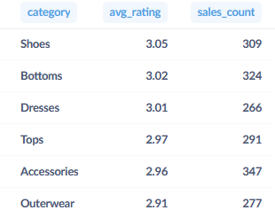

Визуализация:

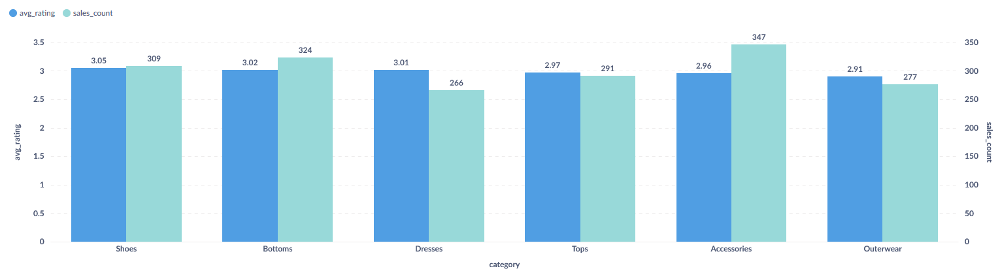

Средний рейтинг по категориям одежды (в том числе без оценок):

```
WITH
  filled_ratings AS (
    SELECT
      category,
      COALESCE(
        customer_rating,
        AVG(customer_rating) OVER (
          PARTITION BY
            category
        )
      ) AS filled_rating
    FROM
      fashion_boutique_sales
    WHERE
      is_returned = 'False'
  )

SELECT
  category,
  AVG(filled_rating) AS avg_rating,
  COUNT(*) AS sales_count
FROM
  filled_ratings
GROUP BY
  category
ORDER BY
  avg_rating DESC,
  sales_count DESC
```

Результат:

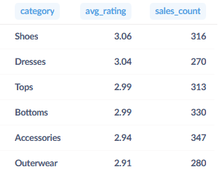

Визуализация:

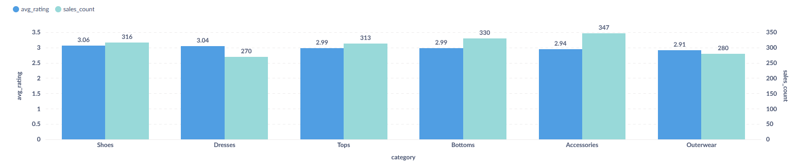

Структура рейтингов по категориям одежды:

``` 
SELECT
  category,
  100.0 * COUNT(*) FILTER (WHERE customer_rating >= 4.5) / COUNT(*) AS pct_high_rating,
  100.0 * COUNT(*) FILTER (WHERE customer_rating >= 3 AND customer_rating < 4.5) / COUNT(*) AS pct_mid_rating,
  100.0 * COUNT(*) FILTER (WHERE customer_rating < 3) / COUNT(*) AS pct_low_rating,
  100.0 * COUNT(*) FILTER (WHERE customer_rating IS NULL) / COUNT(*) AS pct_no_rating
FROM 
  fashion_boutique_sales
GROUP BY 
  category
ORDER BY 
  pct_high_rating DESC

```

Результат:

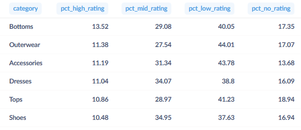

Визуализация:

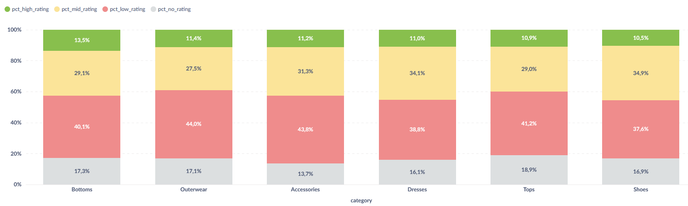

Выводы можно сделать схожие с брендами, разве что с оценками у лидеров по выручке дела обстоят немногим лучше, чем в случае с брендами. Процент покупок без оценки всё ещё ниже 19%.