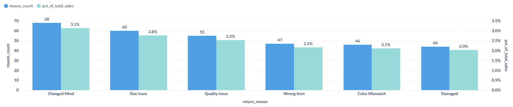
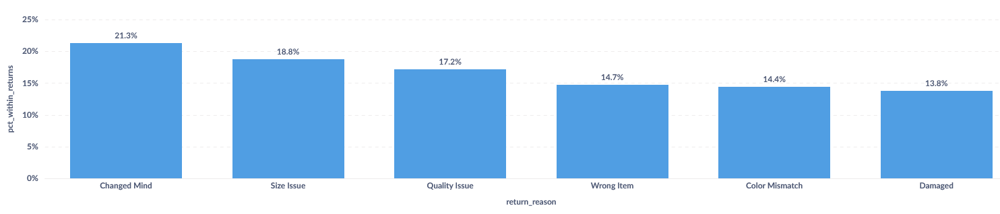
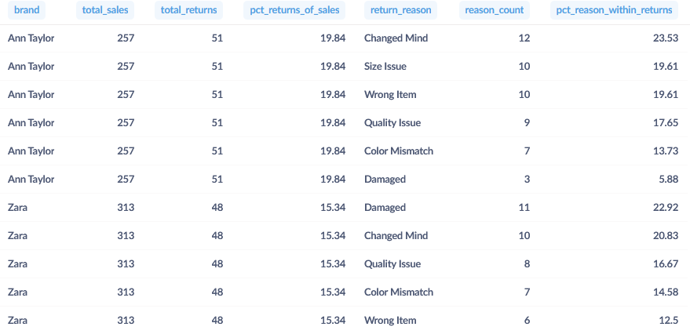
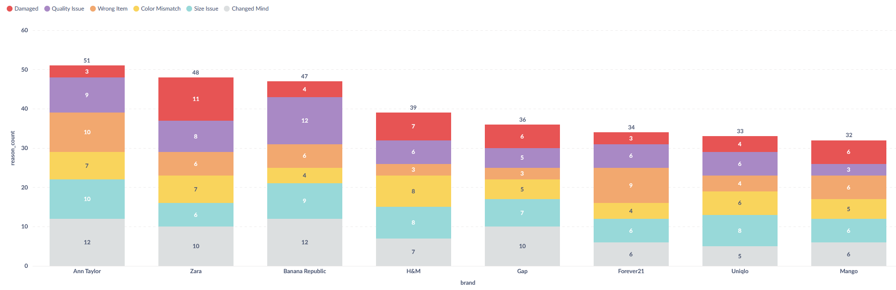
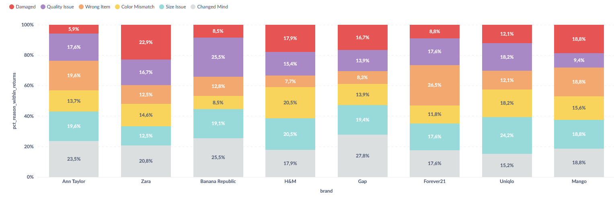
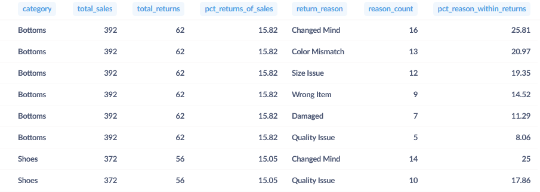
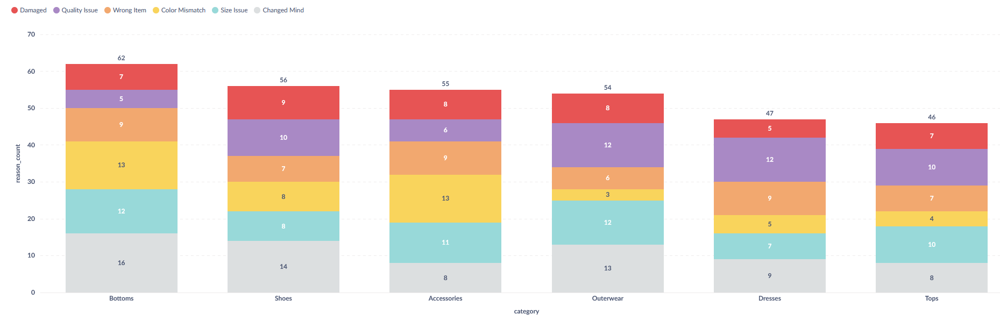
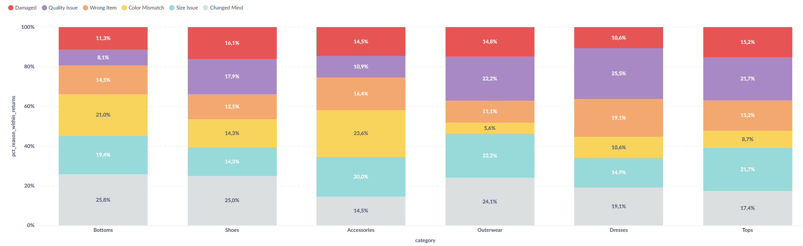

### Общие показатели
Напоследок, проанализируем статистику возвратов, которую мы до сих пор игнорировали. Сначала посмотрим структуру возвратов в целом, затем сделаем группировки по брендам и категориям одежды.

В датасете имеется столбец `is_returned`, отмечающий возвращённые товары, и столбец `return_reason`, в котором указаны причины возврата.

Составим запрос, сегментирующий возвраты по причинам, а также их долю от всех продаж:
```
WITH
  totals AS (
    SELECT
      COUNT(*) AS total_sales,
      COUNT(*) FILTER (
        WHERE
          is_returned
      ) AS total_returns
    FROM
      fashion_boutique_sales
  ),
  reasons AS (
    SELECT
      COALESCE(
        NULLIF(TRIM(return_reason), ''),
        'No reason specified'
      ) AS return_reason,
      COUNT(*) AS reason_count
    FROM
      fashion_boutique_sales
    WHERE
      is_returned
    GROUP BY
      COALESCE(
        NULLIF(TRIM(return_reason), ''),
        'No reason specified'
      )
  )

SELECT
  r.return_reason,
  r.reason_count,
  100.0 * r.reason_count / NULLIF(t.total_returns, 0) AS pct_within_returns,
  100.0 * r.reason_count / NULLIF(t.total_sales, 0) AS pct_of_total_sales
FROM
  reasons r
  CROSS JOIN totals t
ORDER BY
  r.reason_count DESC
```

Результат:


Сначала визуализируем количество возвратов и их долю в продажах:



Затем доли каждого типа возврата в их сумме:



Как видно из графиков, наибольшую долю возвратов составляет причина "Передумал", а наименьшую - "Повреждено", что хорошо, так как в первом случае товар можно продать заново, а во втором - придётся отправлять производителю или списывать.

Теперь составим запрос, который сегментирует причины возвратов по брендам:

```
WITH
  brand_totals AS (
    SELECT
      brand,
      COUNT(*) AS total_sales,
      COUNT(*) FILTER (
        WHERE
          is_returned
      ) AS total_returns
    FROM
      fashion_boutique_sales
    GROUP BY
      brand
  ),
  returns_by_reason AS (
    SELECT
      brand,
      COALESCE(
        NULLIF(TRIM(return_reason), ''),
        'No reason specified'
      ) AS return_reason,
      COUNT(*) AS reason_count
    FROM
      fashion_boutique_sales
    WHERE
      is_returned
    GROUP BY
      brand,
      COALESCE(
        NULLIF(TRIM(return_reason), ''),
        'No reason specified'
      )
  )
  
SELECT
  bt.brand,
  bt.total_sales,
  bt.total_returns,
  100.0 * bt.total_returns / NULLIF(bt.total_sales, 0) AS pct_returns_of_sales,
  rbr.return_reason,
  rbr.reason_count,
  100.0 * rbr.reason_count / NULLIF(bt.total_returns, 0) AS pct_reason_within_returns
FROM
  brand_totals bt
  LEFT JOIN returns_by_reason rbr USING (brand)
ORDER BY
  bt.total_returns DESC,
  rbr.reason_count DESC
```

Результат (только часть таблицы):



Визуализация по кол-ву возвратов:



По числу возвратов лидируют Ann Taylor, Zara и Banana Republic (2 из них входят в топ-3 по выручке). А вот Mango, наоборот, имеет наименьшее число возвратов за всё время продаж (тоже будучи в топ-3 по выручке).

Визуализация по долям возвратов:



Zara показывает наибольшее количество возвратов с причиной "Повреждено", а Banana Republic - с причиной "Проблема с качеством" (более 20%).

Далее формируем аналогичный запрос с группировкой по категориям одежды:
``` 
WITH
  category_totals AS (
    SELECT
      category,
      COUNT(*) AS total_sales,
      COUNT(*) FILTER (
        WHERE
          is_returned
      ) AS total_returns
    FROM
      fashion_boutique_sales
    GROUP BY
      category
  ),
  returns_by_reason AS (
    SELECT
      category,
      COALESCE(
        NULLIF(TRIM(return_reason), ''),
        'No reason specified'
      ) AS return_reason,
      COUNT(*) AS reason_count
    FROM
      fashion_boutique_sales
    WHERE
      is_returned
    GROUP BY
      category,
      COALESCE(
        NULLIF(TRIM(return_reason), ''),
        'No reason specified'
      )
  )
  
SELECT
  ct.category,
  ct.total_sales,
  ct.total_returns,
  100.0 * ct.total_returns / NULLIF(ct.total_sales, 0) AS pct_returns_of_sales,
  rbr.return_reason,
  rbr.reason_count,
  100.0 * rbr.reason_count / NULLIF(ct.total_returns, 0) AS pct_reason_within_returns
FROM
  category_totals ct
  LEFT JOIN returns_by_reason rbr USING (category)
ORDER BY
  ct.total_returns DESC,
  rbr.reason_count DESC
```

Результат (только часть таблицы):



Визуализация по кол-ву возвратов:



Больше всего возвратов у нижней (брючной) одежды, меньше всего у платьев и топов (нательной одежды).

Визуализация по долям возвратов:



Обувь показывает наибольшее количество возвратов с причиной "Повреждено" (16%), а платья - с причиной "Проблема с качеством" (более 20%).

По-хорошему надо рассмотреть все вышеперечисленные метрики в динамике по месяцам, но, как уже было отмечено в разделе "ABC анализ", в данном датасете большая доля продаж свалена в последний месяц, что делает подобные графики нерепрезентативными.