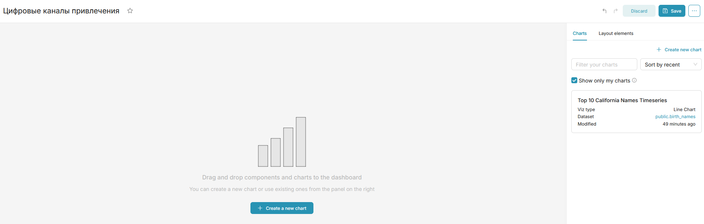

### Описание
Практика построения дашброда с помощью BI инструмента Apache Superset.

Контекст: имеется датасет маркетинговых кампаний, нужно провести когортный анализ и построить дашборд средствами Superset.

Ссылка на датасет: [Google Sheets](https://docs.google.com/spreadsheets/d/1R-mhJ6jxYXO4tbfXM7uATGVX2xFoAiRFHoLRrz7Kr48/edit?usp=sharing)

Для запуска требуется Docker (с применением `docker-compose`).

Описание таблицы датасета (данные сгенерированы):
|Столбец|Описание|Формат данных|
|---|---|---|
|`Channel`|Канал привлечения|Строка/текст|
|`Campaign`|Название рекламной кампании|Строка/текст|
|`CohortMonth`|Месяц когорты (когда привлекли пользователей; с первого по последнее число месяца)|Дата|
|`OrderMonth`|Месяц заказа в когорте (позволяет оценить приток клиентов и заказов в разные месяцы после проведения рекламных кампаний)|Дата|
|`MarketingSpendUSD`|Затраты на маркетинг (в долларах)|Целое число|
|`Clients`|Количество привлечённых клиентов|Целое число|
|`Orders`|Количество оформленных заказов|Целое число|
|`RevenueUSD`|Выручка (в долларах)|Целое число|
|`GrossProfitMargin`|Прибыль/маржа (в долларах)|Целое число|

### Подготовка и запуск проекта

#### Шаг 1 - развёртывание и запуск Superset
1) Нужно клонировать официальный репозиторий Apache Superset ([ссылка](https://github.com/apache/superset)), например, с помощью команды в терминале (Windows PowerShell, Docker или VS Code):
   ` git clone --depth=1  https://github.com/apache/superset.git `
2) Затем нужно перейти в папку с клонированным репозиторием и запустить образ командой: 
   ` docker compose -f docker-compose-light.yml up -d`
3) Образу потребуется время для запуска, после чего можно будет перейти в Superset через браузер по адресу: http://localhost:9001
4) На экране входа вводим стандартные логин/пароль: `admin`

#### Шаг 2 - подключение к датасету
1) На главной странице Superset в разделе Settings -> Database Connections добавляем подключение к датасету по ссылке на [Google Sheets](https://docs.google.com/spreadsheets/d/1R-mhJ6jxYXO4tbfXM7uATGVX2xFoAiRFHoLRrz7Kr48/edit?usp=sharing)

    

2) Создаём новый пустой дашборд и дадим ему имя - "Цифровые каналы привлечения"

    

3) При создании нового Chart добавляем подключенный ранее датасет и проверяем, что все типы данных в столбцах верны (особенно важно для дат)

    

Теперь можно начинать создавать чарты для дашборда.
