### Список метрик
Наш дашборд будет состоять из следующих групп метрик:

1) Метрики по кампаниям
2) Юнит-экономика
3) Когортные метрики

### 1. Метрики по кампаниям
Так как данных в датасете немного, можно делать расчёт метрик прямо на уровне графиков.

Для начала создадим `Chart` с типом `Table` и посчитаем основные метрики по рекламным кампаниям:

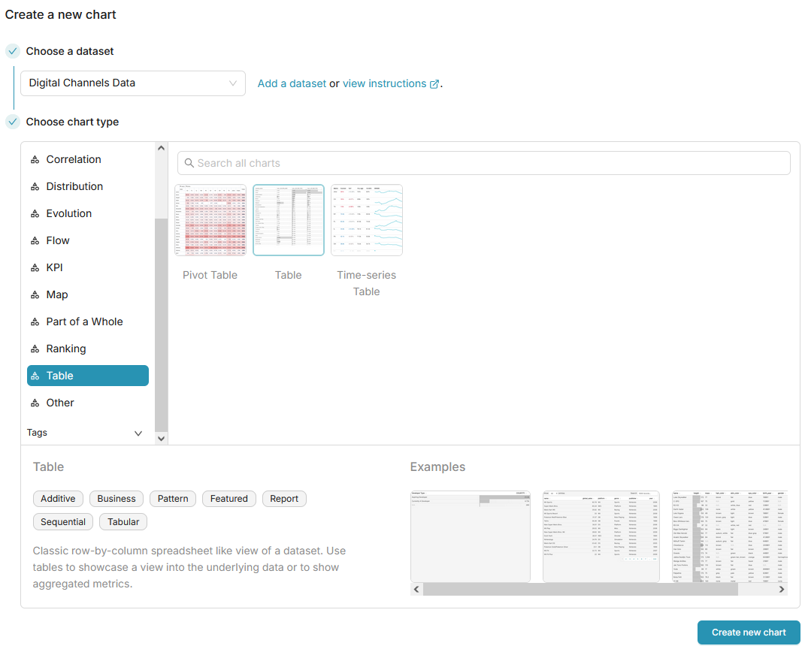

Добавим в `Dimensions` столбцы `Channel`, `Campaign` и `CohortMonth`, после чего создадим метрику по столбцу `Clients` с агрегацией `MAX` (чтобы учесть всех клиентов в разрезе кампании, т. к. данные в таблице представлены в виде когорт):

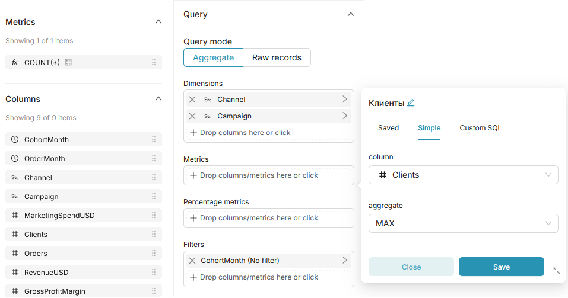

Аналогичным образом добавляем следующие метрики:
1) Выручка - по столбцу `RevenueUSD` с агрегацией `SUM` (нас интересует, сколько выручки принесла компания за весь период)
2) Расходы на маркетинг - по столбцу `MarketingSpendUSD` c агрегацией `MAX` (на кампанию тратились единожды)
3) Маржа - по столбцу `GrossProfitMargin` c агрегацией `SUM` (за весь период)
4) ROMI (Return on Marketing Investment) - добавляем метрику через CustomSQL по формуле:
    ```
    SUM(GrossProfitMargin) / SUM(MarketingSpendUSD)
    ```

    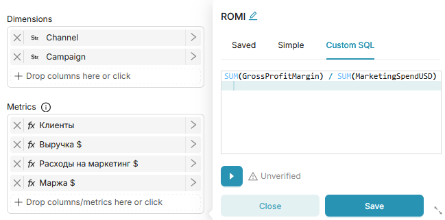

Сохраняем получившуюся таблицу на дашборд и растягиваем, чтобы все столбцы помещались на экран:

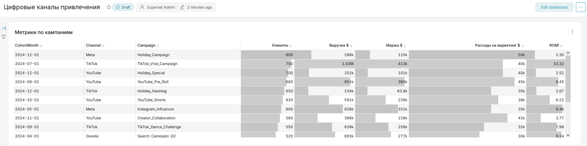

### 2. Юнит-экономика
Создаём на основе предыдущей таблицы новый `Chart`, оставив те же `Dimensions` и одну метрику `Клиенты` (или же создаём полностью новый `Chart`, чтобы случайно не перезаписать предыдущий).

Добавляем новые метрики:
1) Заказы - по столбцу `Orders` с агрегацией `MAX`
2) LTV (Lifetime Value) - выручку за всё время "жизни" клиента, по следующей формуле:
    ```
    SUM(RevenueUSD) / MAX(Clients) OVER 
      (PARTITION BY CohortMonth, Channel, Campaign)
    ```

    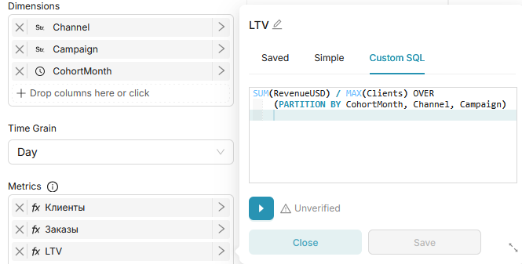

3) LTM (Lifetime Margin) - маржу за всё время "жизни" клиента, по следующей формуле:
    ```
    SUM(GrossProfitMargin) / MAX(Clients) OVER 
      (PARTITION BY CohortMonth, Channel, Campaign)
    ```

    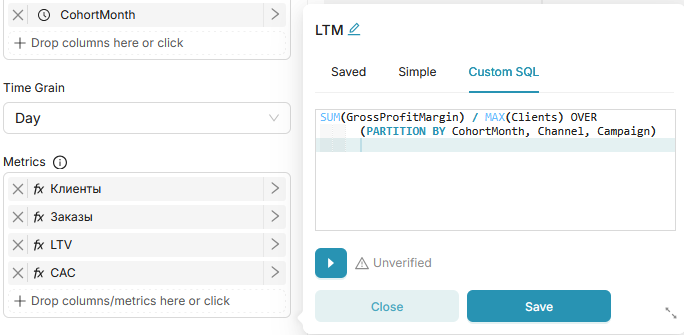

4) CAC (Customer Acquisition Cost) - стоимость привлечения клиента, по следующей формуле:
    ```
    SUM(MarketingSpendUSD) / MAX(Clients) OVER 
      (PARTITION BY CohortMonth, Channel, Campaign)
    ```

    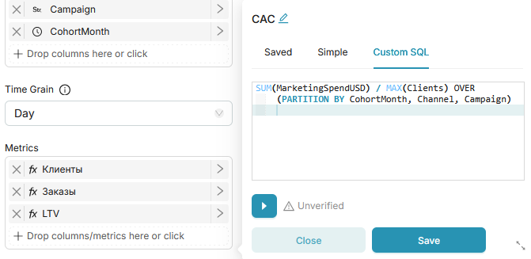

5) LTV/CAC - это отношение выручки к затратам на маркетинг, по упрощенной формуле:
    ```
    SUM(RevenueUSD) / SUM(MarketingSpendUSD)
    ```

    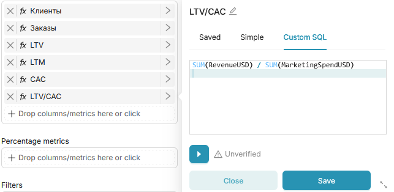

Сохраняем получившуюся таблицу на дашборд:

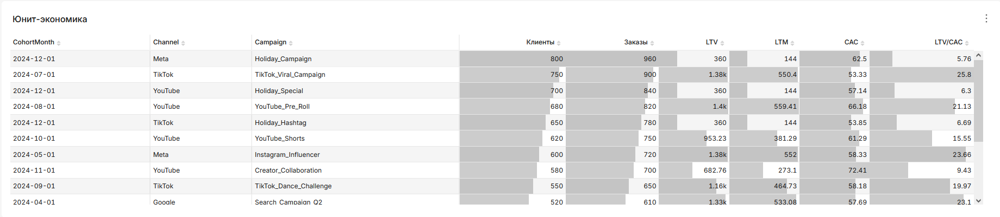

### 3. Когортные метрики

Создадим `Chart` с типом `Pivot Table` (сводная таблица), в столбцы добавим `OrderMonth`, а в строки - `CohortMonth` и `Campaign`.

После этого добавим метрику Клиенты по столбцу датасета `Clients` с агрегацией `MAX`, и поменяем формат дат на вкладке `Customize` на год-месяц.

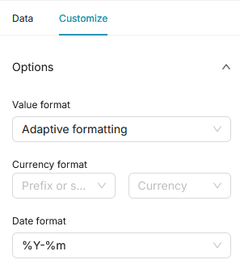

Сохраним получившуюся таблицу на дашборд как "Клиенты по когортам":

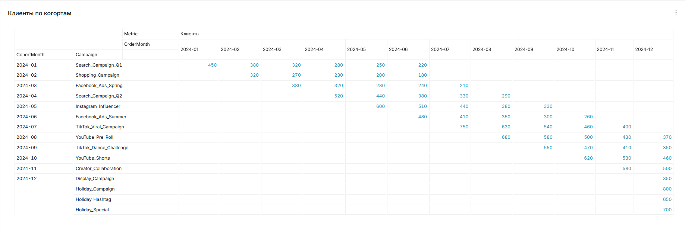

На основе этой таблицы создаём новую и заменяем метрику `Клиенты` метрикой `Возвращаемость` по формуле:

```
SUM(Clients) / MAX(Clients) OVER 
    (PARTITION BY Channel, Campaign, CohortMonth)
```

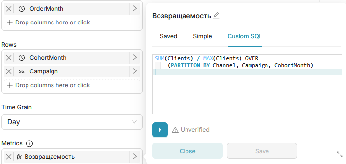

И добавляем таблицу на дашборд:

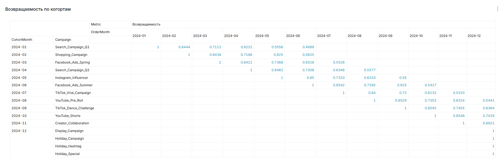

Теперь на основе этой таблицы создаём новый `Chart` и меняем метрику `Возвращаемость` на метрику сдельного LTV по следующей формуле:

```
SUM(RevenueUSD) OVER 
    (PARTITION BY CohortMonth, Campaign 
      ORDER BY OrderMonth)
/
MAX(Clients) OVER 
    (PARTITION BY CohortMonth, Campaign 
      ORDER BY OrderMonth)
```

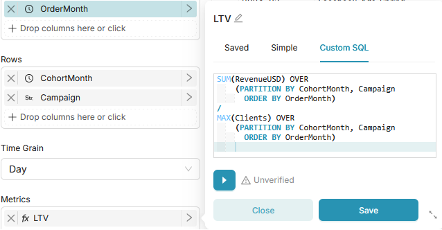

Добавляем таблицу на дашборд:

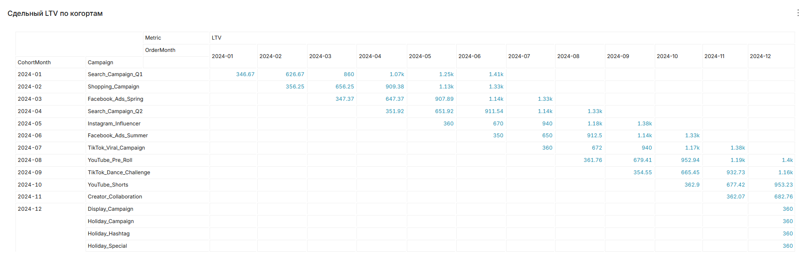

И, наконец, создаём `Chart` для выручки на пользователя по когортам.

Формула для метрики:

```
SUM(RevenueUSD) / SUM(Clients)
```

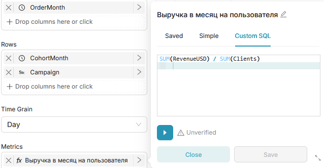

Добавляем таблицу на дашборд:

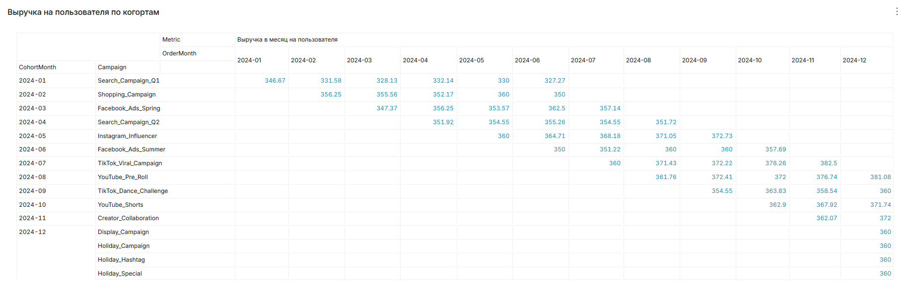

Если оставить таблицы на дашборде как есть, он получится громоздким и неудобным для чтения, поэтому на следующем этапе нам нужно поработать над компоновкой дашборда.