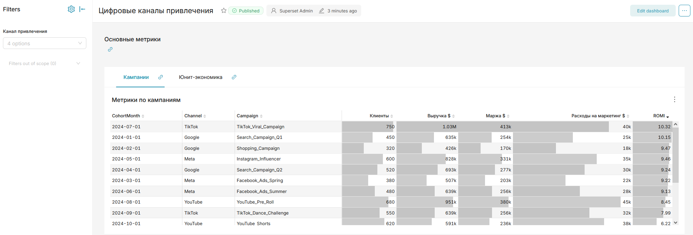
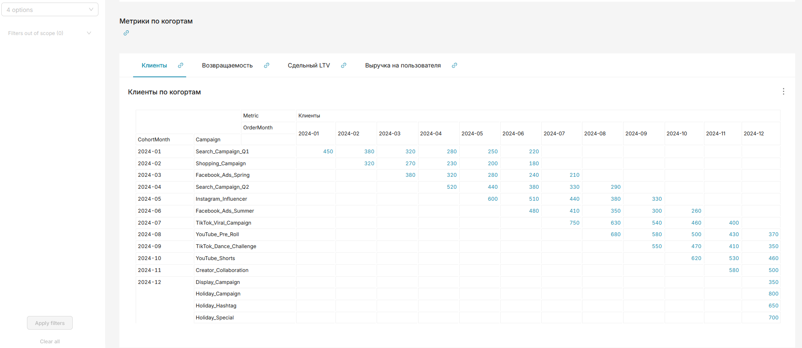

### Компоновка дашборда
С помощью встроенных инструментов Superset, таких как `Header` и `Tabs`, мы можем разместить чарты более компактно. Также можно добавить фильтр по каналу привлечения.

### Итоги по дашборду
По имеющимся на дашборде чартам можно сделать следующие выводы:
1) По метрике ROMI наибольшую эффективность показали каналы TikTok и Google.
2) По соотношению LTV к CAC картина такая же, каналы TikTok и Google показали наибольший результат.
3) Судя по когортным сводкам, у всех кампаний хороший показатель возвращаемости (более 40% за всё время когорты по заказам).
4) При этом канал Google не дал прироста выручки на пользователя со временем, в отличие от TikTok.