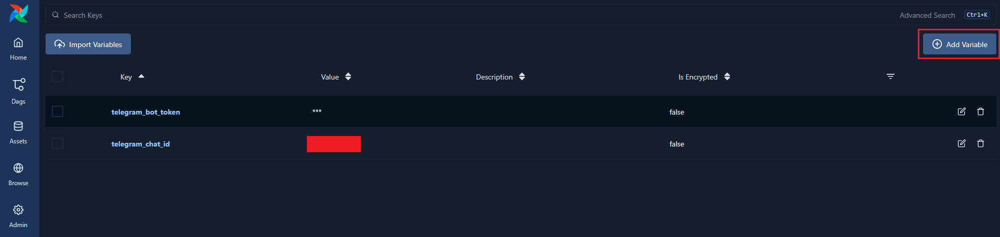

#### Описание
Практика применения Apache Airflow и написания DAG (directed acyclic fraph или направленный ациклический граф).

Контекст: имеется датасет с Kaggle, нужно автоматизировать выгрузку датасета и предоставить краткий EDA (разведочный анализ) в виде сообщения в Telegram.

Для примера возьмём датасет с зарплатами специалистов в области кибербезопасности.

Ссылка на датасет: [Kaggle](https://www.kaggle.com/datasets/varishabatool/cyber-security-salaries-dataset)

Описание таблицы датасета:
|Столбец|Описание|
|---|---|
|`work_year`|Год публикации вакансии|
|`experience_level`|Уровень специалиста (грейд)|
|`employment_type`|Тип найма|
|`job_title`|Название вакансии|
|`salary`|Зарплата|
|`salary_currency`|Валюта, в которой выдаётся зарплата|
|`salary_in_usd`|Зарплата, конвертированная в USD (доллары США)|
|`remote_ratio`|Соотношение удалённая работа/офис (0 - только офис, 100 - полная удалёнка)|
|`company_location`|Страна, в которой расположена компания работодателя|

Для запуска требуется Docker (с применением `docker-compose`).

Также потребуется собственный бот в Telegram (можно создать бесплатно через специального бота: BotFather)

#### Подготовка и запуск (Windows)

1) Скопировать папку `airflow-main` из данного репозитория
2) В папке `airflow-main` в файле `docker-compose.yaml` найдите строку `KAGGLE_USERNAME` и замените её значение на своё имя пользователя в Kaggle (пишется слитно в строке браузера после "kaggle.com")
3) Далее через терминал перейти в папку `airflow-main` и провести сборку и инициализацию образа командой: 
   ` docker compose up airflow-init `
4) Если со временем вывод терминала окончится строкой `airflow-init-1 exited with code 0` без ошибок, значит всё прошло успешно и можно в дальнейшем запускать контейнер Airflow следующей командой:
   ` docker-compose up -d `
5) Теперь можно войти в Airflow через браузер по адресу: http://localhost:8080
6) На странице входа вводим логин/пароль по умолчанию: `airflow`
7) На главной странице Airflow переходим в `Admin` -> `Variables` и создаём 2 переменные (по кнопке Add Variable):
   - Key - `telegram_bot_token` Value - `ваш токен бота в Telegram`
   - Key - `telegram_chat_id` Value - `ваш ID чата Telegram` (можно узнать через бота userinfobot)
    

Готово. Можно запускать DAG. 

#### Запуск DAG и результат работы
1) На главной странице Airflow переходим на вкладку Dags и находим нужный нам под названием `salaries_eda`

    

2) Переходим внутрь данного DAG и запускаем либо через переключатель, либо по кнопке `Trigger`

    

3) Если всё сделано правильно и в переменных были верно указаны ID бота и ID вашего чата, то в результате работы DAG вы получите следующее сообщение в Telegram

    

Таким образом получена возможность автоматически делать выгрузку датасета и получать регулярный отчёт в Telegram.

В дальнейшем можно изменять DAG по своему желанию, например поменять в строке `schedule` расписание выполнения DAG, чтобы он выполнялся ежечасно/ежедневно/ежемесячно (через синтаксис или cron-выражение):

На этом всё. Теперь можно и дальше модифицировать существующий DAG под свои нужды или создавать новые DAG, соблюдая главное условие: в DAG не должно быть циклов (поэтому он и называется ациклическим графом).