#### Описание
В данном проекте демонстрируется пайплайн автоматической выгрузки данных о землетрясениях с публичного API с последующей передачей сначала в Data Lake (Minio S3), откуда данные будут передаваться в Data Warehouse (PostgreSQL) и, в конечном итоге, попадать на витрины данных в BI-систему (Metabase). Процесс автоматизирован с помощью Apache Airflow, все сервисы будут запускаться из Docker контейнеров.

Для запуска контейнеров потребуется Docker (с применением `docker-compose`), а также DBeaver или PGAdmin для создания схем для таблиц; всё остальное будет открываться в браузере.

**[Cсылка на API](https://earthquake.usgs.gov)**

Идея и схема проекта взяты из данного гайда: **[YouTube](https://www.youtube.com/watch?v=MQPHgUQvKnI)**

#### Схема проекта

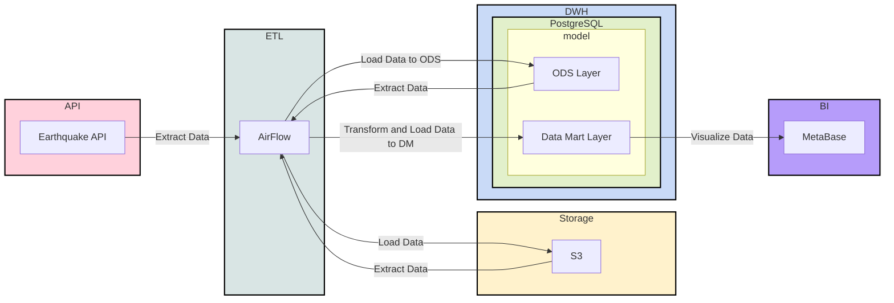

#### Подготовка и запуск (Windows)
1) Скопировать папку `EQ_docker_setup` из данного репозитория
2) Через терминал перейти в папку `EQ_docker_setup` на вашем ПК, далее провести сборку и инициализацию образа командой: 
   ` docker compose up airflow-init `
3) Если со временем вывод терминала окончится строкой `airflow-init-1 exited with code 0` без ошибок, значит сборка образа Airflow прошла успешно и можно в дальнейшем запускать Docker контейнер следующей командой:
   ` docker-compose up -d `
4) Теперь можно войти в Airflow через браузер по адресу: http://localhost:8080 (логин/пароль по умолчанию: `airflow`)
5) В хранилище Minio можно войти по адресу: http://localhost:9000 (логин/пароль по умолчанию: `minioadmin`)
6) В BI-систему Metabase можно перейти по адресу: http://localhost:3000 (нужно будет заполнить форму регистрации, на этапе добавления подключения к БД выберите "добавлю позже")

Теперь, когда все сервисы запущены, можно приступить к их настройке и запуску пайплайна.

#### Создание хранилища в Minio
1) На главной странице Minio или в меню Buckets нажимаем `Create Bucket` и присваиваем ему имя `storage` (обязательно в нижнем регистре)

    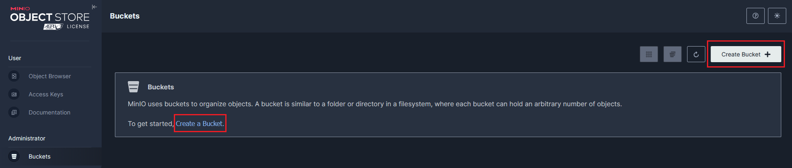

    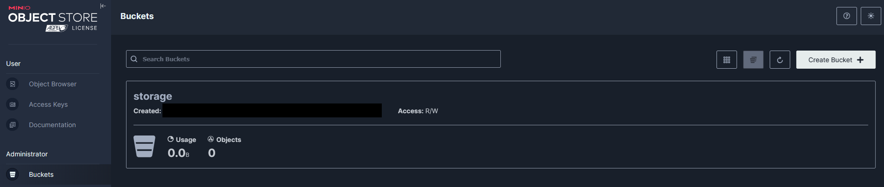
    
2) В меню Access Keys создаём новый ключ доступа к хранилищу (ничего дополнительно выбирать не надо, для наших целей ключ будет общий и бессрочный; полученные `Access Key` и `Secret Key` сохраните отдельно)

    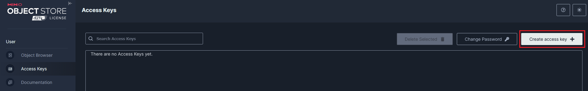

    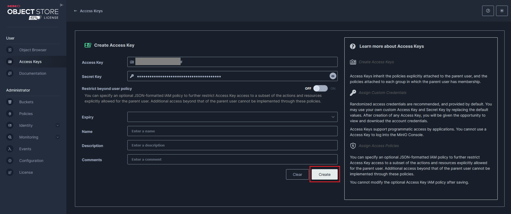

#### Создание схем в Postgres
1) Через DBeaver или PGAdmin создаём новое подключение к контейнеру `postgres_dwh` в Docker (порт - 5462 (так как мы подключаемся вне Docker контейнера; порт 5432 (по умолчанию) может быть занят, если у вас локально установлен PostgreSQL), пароль - `postgres`)

    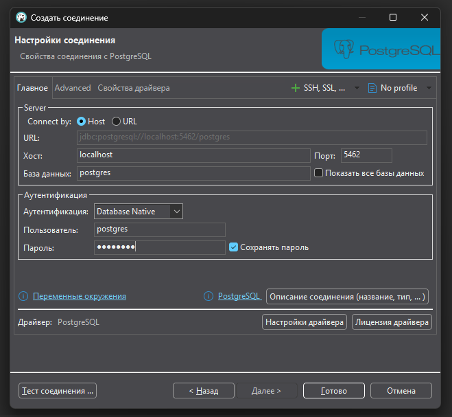

2) Открываем новый SQL редактор для данного подключения и добавляем необходимые схемы
    ```
    CREATE SCHEMA ods;
    CREATE SCHEMA dm;
    CREATE SCHEMA stg;
    ```

    Пояснение: 
      - схема `ods` - operational data storage или слой оперативных данных, которые мы получаем из хранилища Minio S3
      - схема `stg` - слой временных таблиц для передачи в витрины данных
      - схема `dm` - data marts или слой витрин данных, которые будут визуализироваться в Metabase

3) Затем добавляем таблицу для хранения данных о землетрясениях (везде указан тип `varchar` для упрощения, но в идеале нужно поработать над приведением типов на этапе передачи сырых данных из хранилища Minio в Postgres)
    ```
    CREATE TABLE ods.fct_earthquake
    (
        time varchar,
        latitude varchar,
        longitude varchar,
        depth varchar,
        mag varchar,
        mag_type varchar,
        nst varchar,
        gap varchar,
        dmin varchar,
        rms varchar,
        net varchar,
        id varchar,
        updated varchar,
        place varchar,
        type varchar,
        horizontal_error varchar,
        depth_error varchar,
        mag_error varchar,
        mag_nst varchar,
        status varchar,
        location_source varchar,
        mag_source varchar
    )
    ```

4) Также добавляем таблицу подсчёта суммарного кол-ва землетрясений в день (это будет витриной данных в Metabase)
    ```
    CREATE TABLE dm.fct_count_day_earthquake AS 
    SELECT time::date AS date, count(*)
    FROM ods.fct_earthquake
    GROUP BY 1
    ```

5) И, наконец, добавляем таблицу подсчёта средней магнитуды землетрясений в день
    ```
    CREATE TABLE dm.fct_avg_day_earthquake AS
    SELECT time::date AS date, avg(mag::float)
    FROM ods.fct_earthquake
    GROUP BY 1 
    ```

#### Настройка Airflow
1) На главной странице Airflow переходим в меню Admin -> Variables и нажимаем `Add Variable`, чтобы добавить две переменные - для ключа доступа и для секретного ключа хранилища в Minio

    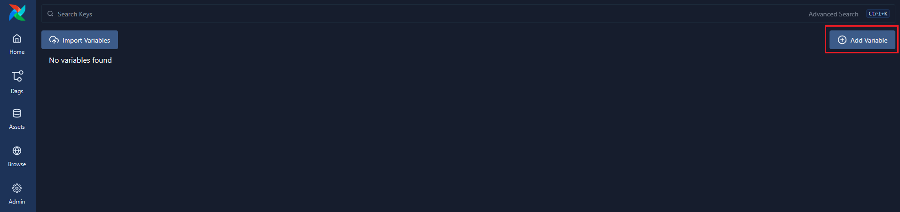

    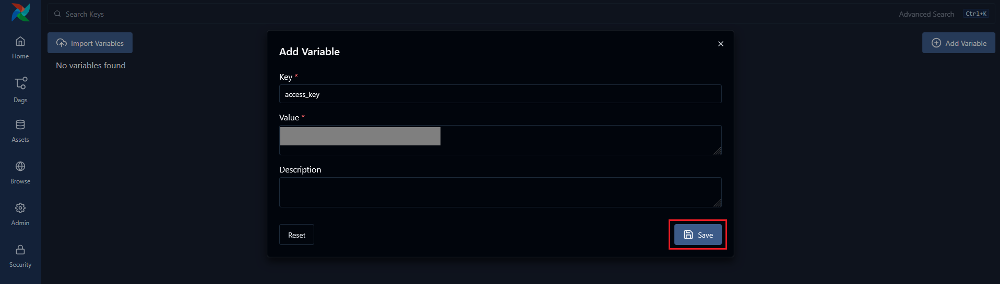

    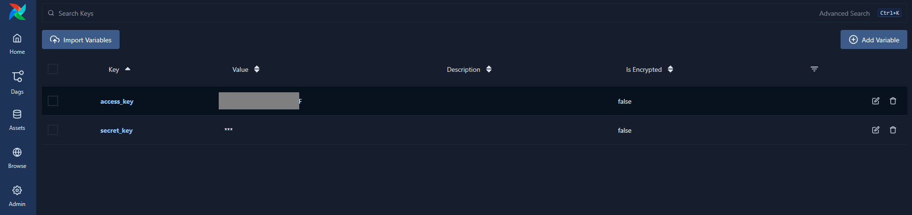

2) Аналогичным образом создаём переменную `pg_password` со значением `postrgres` (как указано в docker-compose файле для сервиса `postgres_dwh`)

3) В меню Admin -> Connections добавляем подлкючение к `postgres_dwh` (порт - 5432 (так как мы подключаемся внутри Docker контейнера), пароль - `postrgres`)

    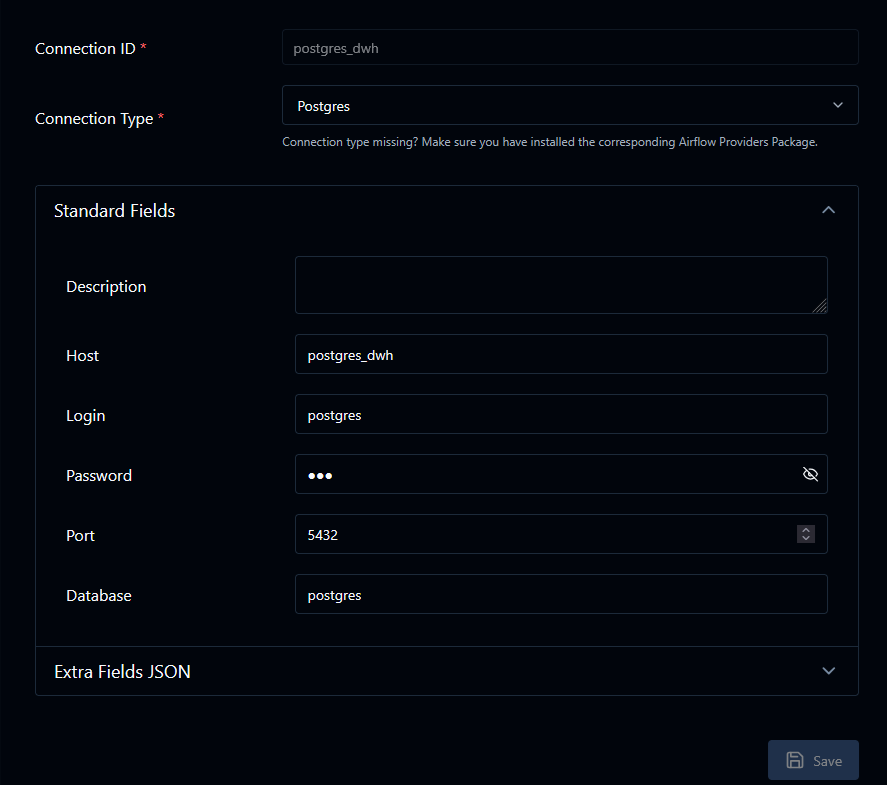

4) Переходим в меню Dags и проверяем, что все DAG добавились в Airflow без ошибок

    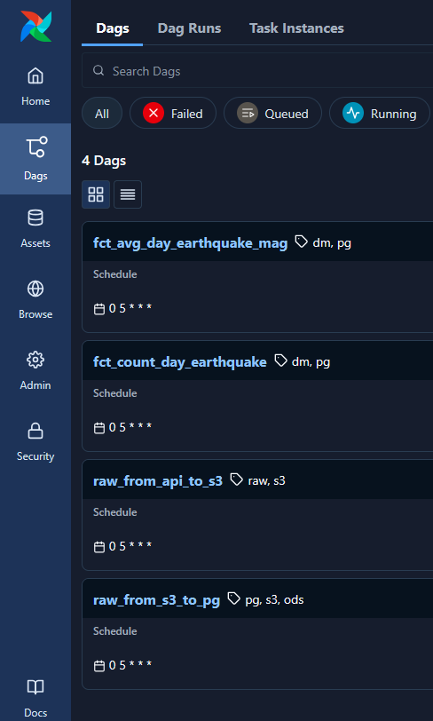

5) Запускаем наши DAG в следующем порядке (подождите, пока DAG пройдёт все шаги без ошибок, предже чем запускать следующий): `raw_from_api_to_s3`, `raw_from_s3_to_pg,` `fct_count_day_earthquake`, `fct_avg_day_earthquake_mag`

Может возникнуть такая проблема: из-за разницы часовых поясов полученный запрос может быть пустым (так как данные за текущий день ещё не появились в API), плюс ждать несколько дней подряд для проверки работы DAG было бы расточительно. Поэтому мы запустим наши DAG задним числом.

Для этого на странице Dags выбираем нужный нам DAG (например `raw_from_api_to_s3`) и нажимаем кнопку `Trigger`

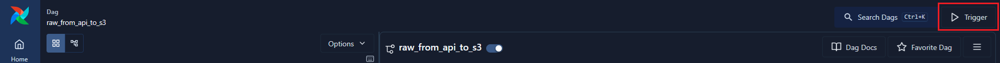

После чего заполняем даты начала и конца выполнения, нажимаем кнопку `Run Backfill`

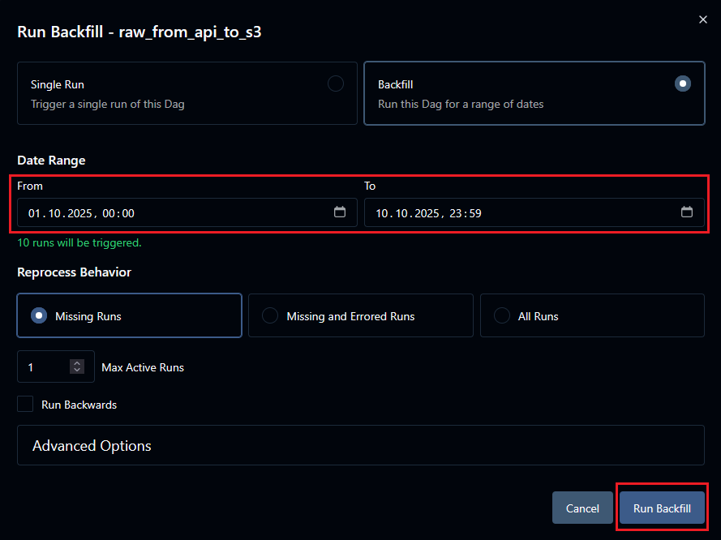

Проделываем то же самое для остальных DAG.

#### Настройка Metabase и добавление витрин
1) На главной странице Metabase переходим в меню "Базы данных", нажимаем кнопку "Добавить базу данных" и заполняем поля в окне подключения (пароль - `postgres`, порт - 5432, так как мы подключаемся внутри контейнера по имени хоста в Docker, а не извне, как было в случае DBeaver)

    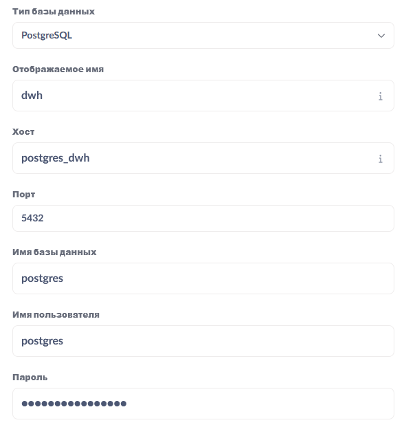

    **Примечание:** Если не хотите, чтобы в Metabase попал слой оперативных данных, а только витрины, при создании подключения выберите только схему `dm`

2) После успешного подключения, выходим из режима администрирования Metabase и переходим к добавленной базе данных `dwh`

    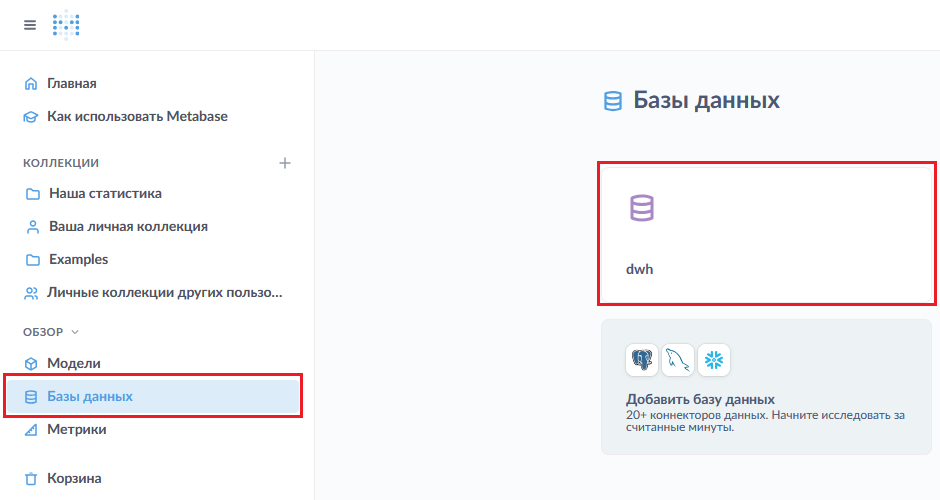

3) Переходим в схему `dm` и теперь мы можем посмотреть наши витрины данных по кол-ву землетрясений и средней магнитуде

    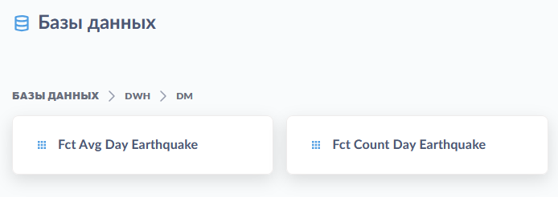

    Содержимое витрин данных:

    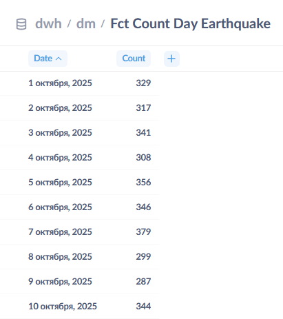

    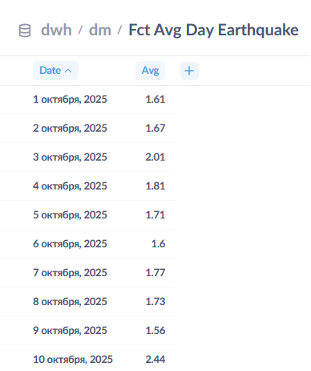

4) Также мы можем посмотреть быструю сводку по нашим данным в схеме `ods`, предлагаемую Metabase из главного меню

    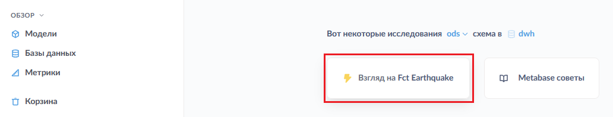

    Результат:

    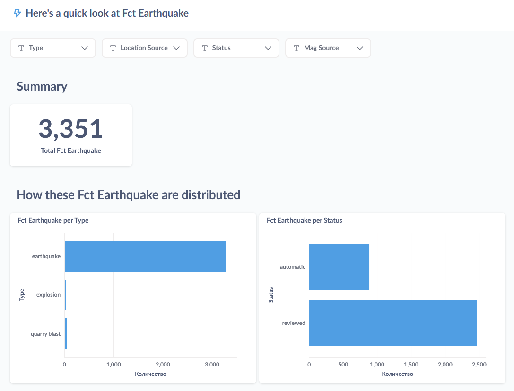

    На основе данных в схеме `ods` можно создавать свои запросы и дашборды. Или же использовать только витрины данных из схемы `dm` (см. примечание к пункту 1).
    
#### Итоги

Теперь у нас имеется полноценный автоматизированный ETL пайплайн, избавляющий от рутинных задач по выгрузке данных из API и последующей передаче в витрины данных в BI систему.

Данный проект можно доработать по некоторым пунктам, например:

- Можно избавиться от Minio и передавать результаты запроса от API напрямую в Postgres, если данные из API достаточно хорошо стандартизированы и подчищаются заранее (получится обычный Data Warehouse)
- Можно доработать приведение типов при передаче сырых данных из Minio в Postgres, т. к. специализированные типы упрощают работу с запросами и занимают меньше памяти
- Можно добавить новые DAG для создания других витрин данных (например, места с наибольшим кол-вом землетрясений или с самой большой магнитудой)
- Можно переписать данный проект под работу с другим API и данными
